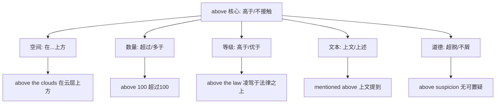
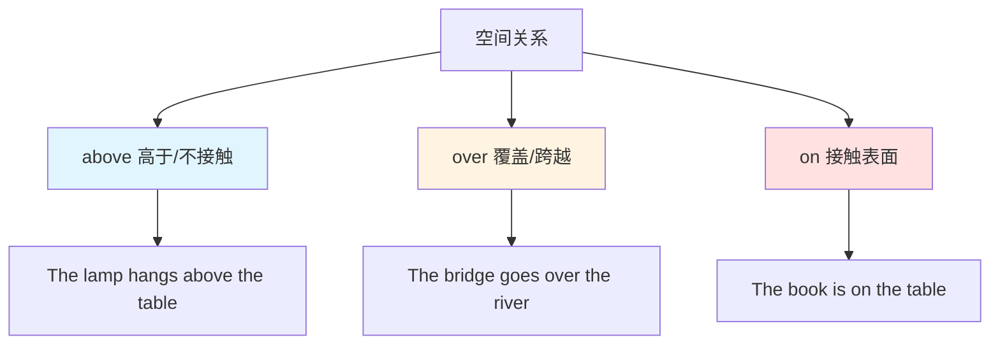
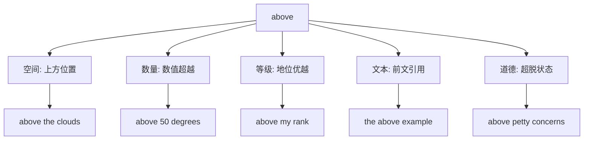
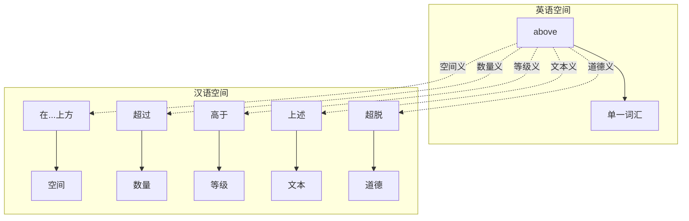

above :: 
<!--ID: 1769502992327-->

# above

## 基础信息

**英文**：above  
**音标**：/əˈbʌv/ (英美通用)  
**中文**：在...上方；超过；高于；上述  
**词性**：介词 (preposition) / 副词 (adverb) / 形容词 (adjective)

---

## 词义演化

**词源起源**：  
源自古英语 *abufan*（在...上方），由 *a-*（在...上）+ *bufan*（在...之上）组成，原始日耳曼语 *ufan*（向上）。最初表示空间上的"高于且不接触"，后通过隐喻扩展到数量、等级、文本引用等抽象领域。

**意义演变路径**：
1. **空间位置**（古英语时期）：表示物理上方且不接触表面  
   → *The plane flew above the clouds.*
2. **数量超越**（中古英语时期）：从空间高度隐喻到数值高度  
   → *above 100*, *above average*
3. **等级优越**（14世纪）：从物理高度隐喻到社会/道德高度  
   → *above suspicion*, *above the law*
4. **文本引用**（15世纪）：指代前文内容（文本空间隐喻）  
   → *as mentioned above*, *the above statement*
5. **习语固化**（17世纪）：形成固定表达  
   → *above all*（最重要的是）, *above board*（光明正大）

---

## 概念分析

### 一词多义（Polysemy）

**核心概念**：高于且不接触  
**语义扩展**：



### 核心习语与功能性用法

| 习语                    | 字面义       | 功能义        | 例句                          |
| --------------------- | --------- | ---------- | --------------------------- |
| **above all**         | 在所有之上     | 最重要的是/首先   | *Above all, be honest.*     |
| **above board**       | 在桌面上方     | 光明正大/公开透明  | *The deal was above board.* |
| **above suspicion**   | 在怀疑之上     | 无可置疑/清白    | *She's above suspicion.*    |
| **above the law**     | 在法律之上     | 凌驾于法律/不受约束 | *No one is above the law.*  |
| **above and beyond**  | 在...之上和之外 | 超出预期/格外努力  | *He went above and beyond.* |
| **get above oneself** | 超过自己      | 自高自大/得意忘形  | *Don't get above yourself.* |
| She is above me       | 她是我的上司    | 在...之上（级别） | She is above me             |

### 上下义关系与对比词

**同类空间介词**：
- **over**：在...上方（可接触或不接触，强调覆盖）
- **on**：在...上面（接触表面）
- **up**：向上方向（动态移动）

**语义对比**：
- **above** 强调高于且不接触（*above the table* - 桌子上方空间）
- **over** 强调覆盖或跨越（*over the table* - 覆盖桌面或跨过桌子）
- **on** 强调接触表面（*on the table* - 在桌面上）

---

## 关系图谱

### 空间介词对比：above vs over vs on



### 多义词概念分支



### 双语映射：above 的多维性



---

## 英汉对比

| 维度 | 英语 above | 汉语对应 |
|------|------------|----------|
| **概念范围** | 单一词汇覆盖空间/数量/等级/文本/道德 | 需要多个词汇：在...上方/超过/高于/上述/超脱 |
| **空间精确性** | 强调"不接触"（above ≠ on） | 汉语"在...上"可能模糊（需要"上方"明确） |
| **隐喻扩展** | 从物理高度到抽象高度（above suspicion = 道德高度） | 汉语用不同词汇表达各领域的"高"（超过/高于/超脱） |

---

## 实际应用

### 场景 1：空间位置（介词）

**英文**：*The helicopter hovered above the building.*  
**中文**：直升机在建筑物上方盘旋。  
**分析**：*above* 表示上方且不接触，汉语用"在...上方"对应。

### 场景 2：数量超越（介词）

**英文**：*Temperatures will rise above 30°C today.*  
**中文**：今天气温将升至30摄氏度以上。  
**分析**：*above* 表示数值超过，汉语用"以上"或"超过"。

### 场景 3：等级地位（介词）

**英文**：*This issue is above my pay grade.*  
**中文**：这个问题超出了我的职权范围。  
**分析**：*above* 表示等级高于，汉语用"超出"或"高于"。

### 场景 4：文本引用（形容词）

**英文**：*Please refer to the above instructions.*  
**中文**：请参考上述说明。  
**分析**：*above* 作形容词表示前文提到的，汉语用"上述"。

### 场景 5：above all（习语）

**英文**：*Above all, remember to stay safe.*  
**中文**：最重要的是，记得注意安全。  
**分析**：*above all* 是固化习语，表示"最重要的是"，汉语需要完整短语。

### 场景 6：above board（习语）

**英文**：*I want this transaction to be completely above board.*  
**中文**：我希望这笔交易完全光明正大。  
**分析**：*above board* 源自赌博（手在桌面上=不作弊），现表示"公开透明"。

### 场景 7：above vs over 对比

**英文 A**：*The picture hangs above the fireplace.* (悬挂在壁炉上方)  
**英文 B**：*She put a blanket over the child.* (用毯子盖住孩子)  
**分析**：*above* 强调位置高于，*over* 强调覆盖动作。

### 场景 8：above suspicion（习语）

**英文**：*Her reputation is above suspicion.*  
**中文**：她的名誉无可置疑。  
**分析**：*above suspicion* 表示道德高度，超越怀疑范围。

---

## 深度洞察

### 核心要点

1. **"不接触"的空间特征**  
   *above* 与 *on* 的核心区别在于是否接触表面。*above* 强调"高于且有距离"（*above the clouds*），而 *on* 强调"接触表面"（*on the table*）。这种空间精确性在汉语中需要通过"上方"vs"上面"来区分。

2. **从物理高度到抽象高度的隐喻**  
   *above* 的隐喻扩展遵循"高度=优越"的认知模式：
   - **数量高度**：above 100（超过100）
   - **等级高度**：above my rank（高于我的级别）
   - **道德高度**：above suspicion（无可置疑）  
   这种系统性隐喻在汉语中需要不同词汇（超过/高于/超脱）来实现。

3. **习语的道德化倾向**  
   *above* 的习语常带有道德或价值判断色彩：
   - *above board*（光明正大）= 道德正直
   - *above suspicion*（无可置疑）= 道德清白
   - *above the law*（凌驾于法律）= 权力傲慢  
   这反映了英语将空间位置隐喻化为道德评价的文化倾向。

---

## 关键要点

### 翻译决策树

```
above + 名词/数字
├─ 空间位置？
│  ├─ 不接触表面 → 在...上方（above the clouds → 在云层上方）
│  └─ 对比 over → over 强调覆盖（over the table → 覆盖桌面）
├─ 数量表达？
│  ├─ 数值 → 超过/以上（above 100 → 超过100）
│  └─ 程度 → 高于（above average → 高于平均）
├─ 等级地位？
│  ├─ 职位 → 高于（above my rank → 高于我的级别）
│  └─ 能力 → 超出（above my ability → 超出我的能力）
├─ 文本引用？
│  ├─ 形容词 → 上述（the above example → 上述例子）
│  └─ 副词 → 上文（mentioned above → 上文提到）
├─ 道德状态？
│  ├─ above suspicion → 无可置疑
│  ├─ above reproach → 无可指责
│  └─ above the law → 凌驾于法律
└─ 固定习语？
   ├─ above all → 最重要的是
   ├─ above board → 光明正大
   ├─ above and beyond → 超出预期
   └─ get above oneself → 自高自大
```

### 记忆口诀

**"高而不触,量级文道"**

- **高而不触**：空间核心义（高于且不接触表面）
- **量**：数量超越（above 100）
- **级**：等级优越（above my rank）
- **文**：文本引用（mentioned above）
- **道**：道德高度（above suspicion）

---

## 使用建议

### 学习策略

1. **掌握"不接触"核心**：理解 *above* 与 *on* 的空间区别
2. **对比 above/over**：*above* 强调位置，*over* 强调覆盖或跨越
3. **记忆高频习语**：*above all*, *above board*, *above suspicion*
4. **注意词性转换**：介词（above the table）、副词（mentioned above）、形容词（the above example）

### 常见错误

❌ **错误**：*The picture is above the wall.*  
✅ **正确**：*The picture is on the wall.*  
**说明**：画挂在墙上是接触表面，用 *on*；如果画悬浮在墙前方，才用 *above*。

❌ **错误**：*The temperature is over 30°C.*（想表达"超过"）  
✅ **正确**：*The temperature is above 30°C.*  
**说明**：表示数值超过用 *above*，*over* 更常用于"超过限制"的语境。

❌ **错误**：*As I said above in the conversation.*  
✅ **正确**：*As I said earlier in the conversation.* 或 *As mentioned above.* (书面)  
**说明**：口语中用 *earlier*，*above* 主要用于书面文本引用。

❌ **错误**：*He thinks he's above than everyone.*  
✅ **正确**：*He thinks he's above everyone.*  
**说明**：*above* 本身是介词，不需要 *than*（*than* 用于比较级）。

❌ **错误**：*The plane flew over the clouds.* (想表达"在云层上方飞行")  
✅ **正确**：*The plane flew above the clouds.*  
**说明**：在云层上方用 *above*，*over* 暗示"穿过/跨越"云层。

---

## 扩展阅读

**相关词汇**：
- [[over]] - 覆盖/跨越（可接触或不接触）
- [[on]] - 接触表面
- [[below]] - 在...下方（above 的反义词）
- [[under]] - 在...下面（over 的反义词）
- [[beyond]] - 超越/在...之外

**对比分析**：
- [[above-over]] - 位置 vs 覆盖
- [[above-below]] - 上下空间对比
- [[on-above]] - 接触 vs 不接触

**主题链接**：
- [[Prepositions]] - 介词系统
- [[Spatial Metaphor]] - 空间隐喻
- [[Moral Metaphor]] - 道德隐喻