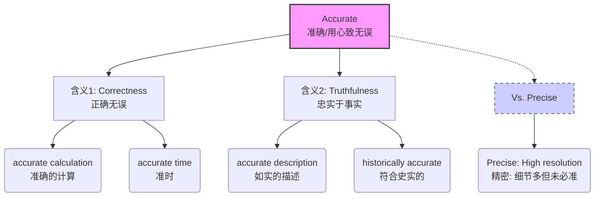

# accurate

> [!info] 基础信息
> - **音标**: /ˈækjərət/
> - **词性**: adj.
> - **含义**: 准确的；精确的；正确无误的

## 词源演化 (Etymology)

源自拉丁语 *accuratus*，由 *ad-* (to) + **cura** (care, 关心/用心) + *-ate* (形容词后缀) 组成。
- **cura** (care) → **cure** (治愈/照料), **curious** (好奇/关心的)。
- **原始含义**: "Prepared with care" (用心准备的/精心制作的)。
- **核心意象**: 因为**用心** (care)，所以没有错误；因为仔细，所以**准确**。
- **演变路径**: 用心做的 (Done with care) → 精致的 (Elaborate) → 准确无误的 (Exact/Correct)。

## 概念分析 (Concept Analysis)

### 1. 核心概念：击中靶心 (Hitting the Bullseye)
Accurate 的核心是**与事实或标准的一致性** (Conformity to truth)。
- 就像射箭：如果箭射中了靶心，就是 **accurate**。
- 它强调的是**结果的正确性** (Freedom from error)。

### 2. 辨析：Accurate vs. Precise

这是科学和工程中最著名的辨析：
- **Accurate (准确)**: 离真值很近 (Close to the true value)。—— **打得准** (在靶心附近)。
- **Precise (精密)**: 每次结果都很接近 (Repeatable/High resolution)。—— **打得稳** (弹着点很集中，但可能偏离靶心)。

| 词汇 | 侧重点 | 汉语对应 | 隐喻 |
| :--- | :--- | :--- | :--- |
| **Correct** | 无错误 | 正确的 | 只要不对就是错 (二元对立) |
| **Accurate** | 贴近事实 | 准确的 | 离靶心最近 (Error is small) |
| **Precise** | 细节丰富/重复性好 | 精密的 | 小数点后位数多 (Resolution is high) |
| **Exact** | 完全吻合 | 确切的 | 丝毫不差 (100% match) |

## 关系图谱 (Relationship Graph)

## 英汉对比 (Comparative Analysis)

- **“准”的维度**:
  - 中文的“准”涵盖了 *accurate* (打得准), *punctual* (守时), *allowed* (批准)。
  - 英文 *accurate* 专指**信息/数据与事实的吻合度**。
- **用心 (Care)**:
  - 词源告诉我们要 *accurate* 必须 *care* (用心)。中文成语“差之毫厘，谬以千里”也暗示了粗心会导致不准。

## 场景应用 (Usage Scenarios)

### 1. 数据/测量 (Data)
> "The figures they produced were not **accurate**."
> 他们提供的数据不**准确** (有误差)。

### 2. 描述/报道 (Representation)
> "Is this an **accurate** description of what happened?"
> 这是对发生之事的**如实**描述吗？

### 3. 钟表 (Time)
> "My watch is not very **accurate**."
> 我的表走得不太**准**。

## 深度洞察 (Deep Insights)

1.  **The Accuracy-Precision Trade-off**:
    - 在机器学习和统计中，有时我们为了追求 *Precision* (更细的粒度) 会牺牲 *Accuracy* (整体的准确率)，反之亦然。但在日常用语中，人们常混用这两个词。
2.  **False Accuracy (虚假准确)**:
    - 举例：说“这块石头重 1.234567 公斤”。虽然数字很 *precise* (小数点后很多位)，但如果秤本身坏了，这个数据就不是 *accurate*。这叫“精确地错误着” (Precisely wrong)。

## 关键要点 (Key Takeaways)

> [!tip] 决策树：用 Accurate 还是 Precise?
> - 强调没有错误，符合事实？→ **Accurate**
> - 强调细节非常多，刻度非常细？→ **Precise**
> - 强调完全一致，一个也不多一个也不少？→ **Exact**

> [!example] 记忆口诀
> **Ad-** 去 **Cura** 关心，
> 用心做事才**精准**。
> 射箭要看靶心处，
> **Accurate** 是离得近。
> **Precise** 只是聚一点，
> 未必真值信得真。
