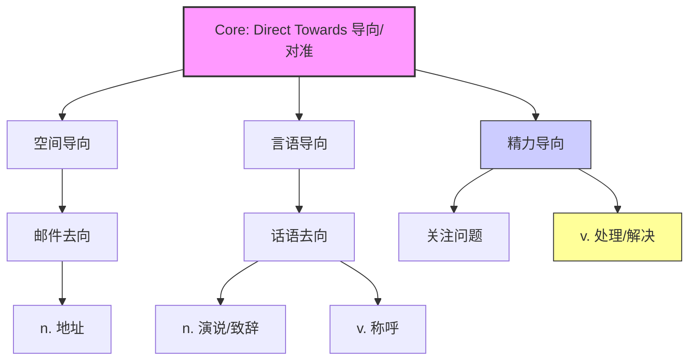

address :: 
<!--ID: 1771725387974-->

# address

> [!abstract] 核心概念
> **address** 的核心词源逻辑是 **“导向/对准 (direct towards)”**。
> 1.  **空间上**：把信件“导向”某人 -> **地址/寄给**。
> 2.  **言语上**：把话语“导向”听众 -> **致辞/演说/称呼**。
> 3.  **行动上**：把精力“导向”问题 -> **处理/解决** (商务/学术高频)。

## 1. 基础信息

- **词性**: Noun / Verb
- **音标**:
    - Noun: /ˈædrɛs/ (英), /ˈædrɛs/ or /əˈdrɛs/ (美)
    - Verb: /əˈdrɛs/ (重音通常在第二音节)
- **基本释义**:
    - (n.) 地址；演说
    - (v.) 写地址；向...致辞；**处理/对付 (问题)**；称呼

## 2. 词义演化

- **词源**: 源自古法语 *adresser*，由 *a-* (to) + *directus* (direct/straight) 组成。
- **演变路径**:
    1.  **变直/导向 (Direct/Straighten)**: 最初指“摆正、瞄准”。
    2.  **导向某人 (Direct to someone)**:
        - 把**话**导向某人 -> **致辞 (Speak to)**。
        - 把**信**导向某人 -> **写地址 (Superscribe)** -> 引申为名词 **地址 (Location)**。
    3.  **导向某事 (Direct attention to something)**:
        - 把**注意力/精力**导向某个难题 -> **着手解决/处理 (Deal with/Tackle)**。
        - *这是现代英语（特别是商务和学术）中最关键的动词用法。*

## 3. 概念图谱

## 4. 英汉对比特征

| 维度 | 英语 (Address) | 汉语 (地址 vs 处理) | 差异分析 |
| :--- | :--- | :--- | :--- |
| **概念整合** | **高度整合**：一个词覆盖“找人”和“做事” | **完全分离**：名词用“地址”，动词用“处理” | 英语视“处理问题”为一种“瞄准/对准”的动作；汉语则强调“处置/理顺”的过程。 |
| **动词频次** | **极高频**：学术/商务首选词 | **多词对应**：解决/探讨/应对 | 在正式写作中，用 *address a problem* 比 *solve* 更严谨，因为它强调“着手应对”的过程，而不一定承诺“彻底解决”。 |
| **发音** | 名动发音常有区别 (名词重音可前，动词重音在后) | 无此特征 | 需注意口语中的重音变化。 |

## 5. 典型场景与用法

### 场景 A：解决问题 (Deal with / Tackle)
**最核心的职场/学术用法**。指认真对待并着手处理。
> "We need to **address** the underlying causes of poverty."
> 我们需要**解决**贫困的根本原因。
> "This article **addresses** the issue of climate change."
> 这篇文章**探讨了**气候变化的问题。

### 场景 B：致辞与交流 (Speak to)
指正式的演讲或说话对象。
> "The President will **address** the nation tonight."
> 总统今晚将向全国**发表电视讲话**。
> "Please **address** your complaints to the manager."
> 请向经理**提出**您的投诉（把投诉**导向**经理）。

### 场景 C：称呼方式 (Call someone)
指用什么头衔去称呼某人。
> "How should I **address** you? Dr. Smith or just John?"
> 我该怎么**称呼**您？史密斯博士还是约翰？

## 6. 深度洞察

1.  **"Address" 不等于 "Solve"**：*Solve* 意味着问题没了（结果导向）；*Address* 意味着你正在正视并努力去搞定它（过程/态度导向）。在写 Proposal 时，用 *address the challenges* 比 *solve* 更得体、更务实。
2.  **"地址"的本质是"方向"**：Address 作为名词（地址）之所以叫 address，是因为它指明了信件的“去向/方向” (direction)。
3.  **正式感**：无论是“致辞”还是“处理”，*address* 都带有一种正式、庄重的色彩。

## 7. 总结与记忆

### 💡 核心口诀
> **名指地址动指对，**
> **写信演说都得配。**
> **最是关键看动词，**
> **瞄准问题去应对。**

### 🌳 决策树
- 是名词？ -> **“地址”** (location) 或 **“演说”** (speech)。
- 是动词 + 人/观众？ -> **“向...致辞”** 或 **“称呼”**。
- 是动词 + 问题/困难？ -> **“处理 / 解决 / 探讨”** (Deal with)。
