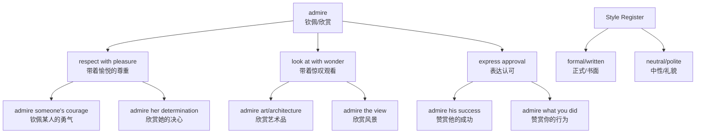

# admire

## 1. 基础信息 (Basic Info)

**Phonetics**:
- /ədˈmaɪər/ (US)
- /ədˈmaɪə/ (UK)

**POS**: Verb

**English Definitions**:
1. To regard with respect, pleasure, approval, or wonder
2. To look at something with enjoyment or appreciation
3. To have a high opinion of someone or something

**Chinese Translations**:
- 钦佩，佩服（表示尊重和仰慕）
- 欣赏，赞赏（表示喜欢和认可）
- 羡慕（表示向往）

---

## 2. 词源与演变 (Etymology & Evolution)

**Origin**: Latin *admirari* → Old French *admirer* → Middle English

**Root Logic**:
- *ad-* (to, towards) + *mirari* (to wonder at, be amazed)
- Core meaning: **"to look at with wonder"**

**Meaning Shifts**:
1. **Original (16th century)**: To wonder at, be amazed by (often with negative connotation of staring)
2. **Shift (17th century)**: Neutral appreciation, looking at with pleasure
3. **Modern**: Respectful approval and high regard

**Key Insight**: The "mir" root connects to *miracle* (奇迹) and *mirror* (镜子) - all related to "wonder" and "looking"

---

## 3. 核心概念图谱 (Concept Graph)



---

## 4. 扩展词汇 (Vocabulary Expansion)

### 近义词 (Synonyms)

| Word | Nuance | Example |
|------|--------|---------|
| **respect** | 强调地位、成就、品质的认可，更正式 | I respect her professional expertise. |
| **appreciate** | 强调理解和感激，常用于抽象事物 | I appreciate your help. |
| **esteem** | 极高评价，非常正式，带有敬意 | He is highly esteemed in academic circles. |
| **look up to** | 口语化，通常用于人，表示仰视 | I've always looked up to my older brother. |
| **idolize** | 过度崇拜，近乎盲目的仰慕 | Teenagers often idolize celebrities. |
| **revere** | 宗教般的崇敬，极其正式 | Many people revere Gandhi as a spiritual leader. |
| **envy** | 带有嫉妒的羡慕 | I envy your ability to stay calm. |

**Register Differences**:
- **Formal**: esteem, revere
- **Neutral**: admire, respect, appreciate
- **Informal**: look up to
- **Negative**: envy, idolize (excessive)

### 反义词 (Antonyms)

| Word | Nuance |
|------|--------|
| **despise** | 强烈的鄙视和厌恶 |
| **disdain** | 轻视，认为不值得关注 |
| **scorn** | 嘲笑和拒绝 |
| **disrespect** | 不尊重 |

### 派生词 (Derivatives)

**Word Family**:
- **admire** (verb) - 钦佩，欣赏
- **admiration** (noun) - 钦佩，赞赏
- **admirable** (adjective) - 令人钦佩的，值得赞赏的
- **admirer** (noun) - 钦佩者，仰慕者（常指爱慕者）
- **admiringly** (adverb) - 钦佩地，赞赏地

**Usage Examples**:
- She speaks of him with **admiration**. (noun)
- His courage was truly **admirable**. (adjective)
- She has many **admirers**. (noun - often romantic)
- He looked at her **admiringly**. (adverb)

---

## 5. 搭配与用法 (Collocations & Usage)

### 高频搭配 (Collocations)

**Verb + Noun**:
- admire someone's courage/determination/perseverance
- admire the view/scenery/landscape
- admire someone's work/achievements/success
- admire someone's honesty/integrity

**Adverb + Admire**:
- greatly admire
- deeply admire
- sincerely admire
- really admire
- secretly admire

**Adjective + Noun (with admiration)**:
- with deep admiration
- with great admiration
- silent admiration
- mutual admiration

**Prepositions**:
- admire someone **for** something
- admire someone **as** something
- admire something **in** someone

### 典型例句 (Examples)

**1. Business Context**:
> "I really admire how you handled that difficult client situation."
> （我真的很欣赏你处理那个难缠客户的方式。）

**2. Daily Conversation**:
> "I admire your courage to speak up in that meeting."
> （我钦佩你在那次会议上发言的勇气。）

**3. Academic/Formal**:
> "Scholars have long admired the sophistication of ancient Greek architecture."
> （学者们长期以来一直钦佩古希腊建筑的精妙。）

**4. Art/Aesthetics**:
> "We stopped to admire the sunset over the ocean."
> （我们停下来欣赏海上的日落。）

**5. Personal Quality**:
> "She's always admired for her integrity and dedication."
> （她总是因正直和奉献精神而受到钦佩。）

---

## 6. 易混淆点与辨析 (Analysis & Confusing Points)

### admire vs. respect

| Aspect | admire | respect |
|--------|--------|---------|
| **Focus** | Personal qualities, achievements | Position, status, rights |
| **Emotion** | Pleasure, warmth | Seriousness, distance |
| **Example** | I admire her creativity. | I respect her authority. |
| **Collocation** | admire someone's courage | respect someone's decision |

**Key Difference**: *Admire* implies emotional engagement; *respect* can be more detached.

### admire vs. appreciate

| Aspect | admire | appreciate |
|--------|--------|-----------|
| **Meaning** | Look up to with pleasure | Understand value, be grateful |
| **Direction** | Upward (looking at something higher) | Neutral (recognizing value) |
| **Example** | I admire his dedication. | I appreciate your help. |
| **Use with people** | Common | Less common (appreciate someone's help) |

**Key Difference**: *Admire* is about elevation; *appreciate* is about recognition.

### admire vs. envy

| Aspect | admire | envy |
|--------|--------|------|
| **Emotion** | Positive, happy for others | Negative, wanting what others have |
| **Collocation** | admire someone's success | envy someone's success |
| **Follow-up** | "I want to be like them" | "Why not me?" |

**Key Difference**: *Admire* = inspired; *envy* = resentful.

### Cultural Note

**Western vs. Chinese Context**:
- In English, "admire" is often used casually: "I admire your confidence."
- In Chinese context, "钦佩" (qīnpèi) feels stronger and more formal.
- Be careful not to over-translate the intensity - "admire" in English can be quite mild.

### Pronunciation Note

- **No pronunciation shift** between meanings
- Always stressed on second syllable: /əd-**MAI**-ər/
- Related words maintain stress pattern: *AD-mi-ra-tion*, *AD-mi-ra-ble*

---

## 7. 总结与记忆 (Summary & Memory)

### 口诀 (Mnemonic)

**"Ad-mire = Add Wonder"**
- *ad* (add) + *mir* (wonder/mirror) = "Add wonder when you look at something"
- Think: "I look in the **mirror** with **wonder** when I **admire** myself" (though usually we admire others!)

**Or: "ADMIRE = Appreciate + Delight + More + Inspire + Respect + Elevate"**

### 决策树 (Decision Tree)

```
你想表达对某人/某物的正面评价？
│
├─ 情感强烈，仰视 → admire
│   例: I admire her courage.
│
├─ 正式场合，地位认可 → respect
│   例: I respect your decision.
│
├─ 理解价值，表达感激 → appreciate
│   例: I appreciate your help.
│
├─ 口语化，仰视某人 → look up to
│   例: I look up to my mentor.
│
└─ 带有嫉妒 → envy
    例: I envy your skills.
```

### Quick Usage Check

✅ **Correct**:
- I admire your perseverance. (钦佩你的毅力)
- We stopped to admire the view. (停下来欣赏风景)
- She is widely admired for her kindness. (因善良而广受钦佩)

❌ **Incorrect**:
- I admire to help you. (Wrong: admire is transitive, needs direct object)
- I am admiring of him. (Wrong: use "I admire him" or "I feel admiration for him")

### Memory Tip

**Remember the 3 A's**:
1. **A**pproval (认可)
2. **A**ppreciation (欣赏)
3. **A**we (惊叹)

When you feel these three, you **admire**.

---

## 📚 Related Notes

- [[respect]]
- [[appreciate]]
- [[envy]]
- [[esteem]]
- [[Vocabulary Expansion Strategies]]

---

**Created**: 2026-02-27
**Source**: Deep vocabulary analysis
**Next Review**: 2026-03-06 (Spaced Repetition)
**Mastery Level**: 🟡 Learning

---

# Related
![[Backlinks.base]]
