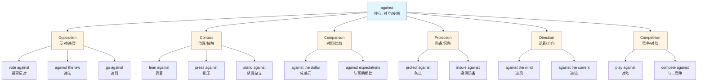
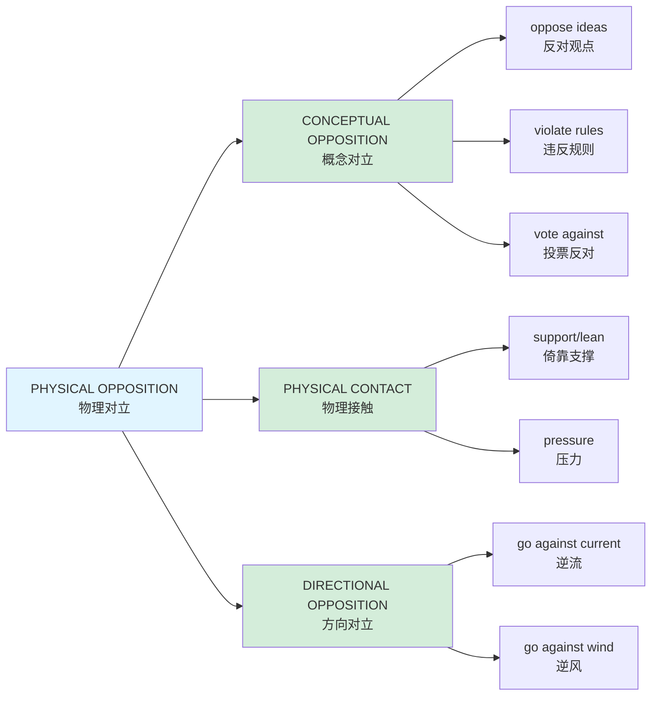

# against

## Basic Information

**Pronunciation**: /əˈɡenst/ or /əˈɡeɪnst/ (preposition)

**Chinese**: 反对、倚靠、对照、防备、逆着、与...竞争、违背、相对于

**Part of Speech**: Preposition (occasionally conjunction)

**Frequency**: ★★★★★ (One of the most common prepositions in English)

---

## Semantic Evolution

### Etymology

**Origin**: Middle English *ageynes*, from Old English *ongeagn* (opposite, against)

**Root breakdown**:
- *on-* (on) + *gegn* (straight, direct) → "directly opposite"

**Historical development**:
1. **12th century**: Physical opposition (facing, opposite to)
2. **13th century**: Hostile opposition (in opposition to)
3. **14th century**: Contact/touching (leaning against)
4. **15th century**: Comparison (in contrast to)
5. **16th century**: Prevention/protection (as protection from)
6. **Modern**: Extended to competition, violation, direction

**Evolution path**: Physical opposition → Hostile opposition → Contact → Comparison → Prevention → Competition → Abstract opposition

---

## Conceptual Analysis

### Polysemy Branches

**1. Opposition / Hostility** (反对、违背)
- Definition: In opposition to; opposed to
- Example: "She voted against the proposal."
- Chinese: 她投票反对这项提议。

**2. Physical Contact / Support** (倚靠、紧靠)
- Definition: In contact with; touching (usually for support)
- Example: "He leaned against the wall."
- Chinese: 他靠着墙。

**3. Comparison / Contrast** (对照、与...相比)
- Definition: In comparison with; as compared to
- Example: "The dollar strengthened against the euro."
- Chinese: 美元兑欧元走强。

**4. Protection / Prevention** (防备、预防)
- Definition: As a defense or protection from
- Example: "Vaccination protects against disease."
- Chinese: 疫苗预防疾病。

**5. Direction / Movement** (逆着、迎着)
- Definition: In the opposite direction to
- Example: "We were sailing against the wind."
- Chinese: 我们逆风航行。

**6. Competition / Confrontation** (与...竞争、对阵)
- Definition: In competition with; opposing in contest
- Example: "Brazil played against Germany in the final."
- Chinese: 巴西队在决赛中对阵德国队。

**7. Exchange Rate** (兑换、汇率)
- Definition: In relation to (currency exchange)
- Example: "The pound fell against the dollar."
- Chinese: 英镑兑美元下跌。

**8. Legal / Formal** (违反、触犯)
- Definition: In violation of; contrary to
- Example: "This is against the law."
- Chinese: 这是违法的。

### Hypernymy & Hyponymy

**Hypernyms** (上位关系):
- Opposition relation (对立关系)
- Spatial relation (空间关系)
- Comparative relation (比较关系)

**Hyponymys** (下位关系 - by context):
- **Physical opposition**: face against, stand against
- **Conceptual opposition**: vote against, argue against
- **Contact relation**: lean against, press against
- **Protective relation**: insure against, guard against
- **Competitive relation**: play against, compete against
- **Directional relation**: go against, run against
- **Legal relation**: offend against, sin against

### Synonym Network

**Context-dependent synonyms**:

| Context | Synonyms |
|---------|----------|
| Opposition | opposed to, anti, contrary to |
| Contact | touching, resting on, leaning on |
| Comparison | compared to, in contrast with, versus |
| Protection | protected from, safe from, immune to |
| Competition | versus, opposing, competing with |
| Direction | counter to, opposite to, in reverse to |
| Legal | in violation of, contrary to, breaking |

---

## Mermaid Relationship Graph

### Polysemy Branching



### Conceptual Metaphor Mapping



---

## Cross-Lingual Comparison

| Dimension | English | Chinese | Analysis |
|-----------|---------|---------|----------|
| **Conceptual Unity** | HIGH: One word for opposition, contact, comparison, direction | LOW: Separate words (反对, 倚靠, 对照, 逆着) | English has remarkable polysemy here |
| **Spatial Metaphor** | "against" can mean both opposition (facing) AND contact (touching) | Clear distinction: 对立 vs 接触 | Chinese separates these concepts |
| **Grammatical Category** | Preposition only | Mixture: 反对, 倚靠, 对照 | Chinese uses verbs more freely |
| **Frequency** | Extremely high (top 50 words) | Individual words less frequent | "Against" appears in many contexts |
| **Metaphor Direction** | Physical → Abstract (contact → support, opposition → disagreement) | Similar metaphorical extensions | Both use spatial metaphors for abstract relations |
| **Idiomatic Usage** | Rich: "against all odds", "up against", "over against" | Fewer fixed phrases | English has more idiomatic complexity |
| **Currency Expression** | "against the dollar" is standard | "兑美元" uses different structure | English treats currency comparison as opposition |

**Key Insight**: English "against" represents **conceptual unity through spatial metaphor**. What unites "leaning against a wall" and "voting against a proposal" is the metaphor of **opposition/relationship** - either physical or conceptual.

---

## Practical Usage Examples

### Scenario 1: Political/Social Opposition

**Context**: Debate on policy
**English**: "Many citizens spoke against the new tax law."
**Chinese**: 许多市民发言反对这项新税法。
**Key phrase**: *speak against* (发言反对)
**Pattern**: [verb] + against + [proposal/law/idea]

### Scenario 2: Physical Support

**Context**: Describing position
**English**: "She leaned her bicycle against the fence."
**Chinese**: 她把自行车靠在栅栏上。
**Key phrase**: *lean against* (倚靠)
**Pattern**: [object] + against + [supporting surface]

### Scenario 3: Competition

**Context**: Sports
**English**: "Our team is playing against the champions tomorrow."
**Chinese**: 我们队明天对阵冠军队。
**Key phrase**: *play against* (对阵/与...比赛)
**Pattern**: [compete/play] + against + [opponent]

### Scenario 4: Protection

**Context**: Insurance/Health
**English**: "This insurance protects you against fire and theft."
**Chinese**: 这种保险保护你免受火灾和盗窃的损失。
**Key phrase**: *protect against* (保护免受/防备)
**Pattern**: [protect/insure] + against + [threat]

### Scenario 5: Direction

**Context**: Movement
**English**: "It's hard to swim against the current."
**Chinese**: 逆流游泳很困难。
**Key phrase**: *against the current* (逆流)
**Pattern**: [movement] + against + [natural force]

### Scenario 6: Comparison

**Context**: Financial
**English**: "The euro fell against the dollar yesterday."
**Chinese**: 欧元昨天兑美元下跌了。
**Key phrase**: *fall against* (兑...下跌)
**Pattern**: [currency] + [rise/fall] + against + [another currency]

### Scenario 7: Legal/Formal

**Context**: Rules and regulations
**English**: "Discrimination against women is illegal."
**Chinese**: 对女性的歧视是违法的。
**Key phrase**: *discrimination against* (对...的歧视)
**Pattern**: [violation/discrimination] + against + [person/group]

### Scenario 8: Contrast

**Context**: Academic writing
**English**: "Against expectations, the company's profits increased."
**Chinese**: 与预期相反，公司利润增长了。
**Key phrase**: *against expectations* (与预期相反)
**Pattern**: against + [expectations/predictions/norms]

---

## Deep Insights

### 1. The Spatial Foundation of Abstract Opposition

**Observation**: All abstract uses of "against" have spatial foundations.

**Physical → Conceptual mapping**:
- **Physical**: Two people standing facing each other (opposition)
- **Physical**: One object touching another for support (contact)
- **Abstract**: Two ideas in conflict (conceptual opposition)
- **Abstract**: One person relying on another (support)

**Example**:
```
Physical: "The ladder is against the wall" (contact)
Abstract: "The evidence is against him" (metaphorical pressure/opposition)
```

**Chinese contrast**: Chinese separates these spatial and conceptual domains with different words.

### 2. The Paradox of "Against" - Both Hostile AND Supportive

**The duality**:
- **Negative**: "fight against", "vote against" (opposition)
- **Positive**: "lean against", "protection against" (support/protection)

**Explanation**: Both come from the same root concept of **relationship through proximity**. 

- When you're "against" someone in debate, you're in **opposing relation**
- When a ladder is "against" a wall, it's in **supportive relation**

**Key insight**: The core meaning is **RELATIONSHIP**, not hostility. Context determines whether it's opposition or support.

### 3. The English Preference for Prepositional Complexity

**Observation**: English uses prepositions like "against" to express complex relationships, while Chinese often uses verb compounds.

**Examples**:

| English | Chinese | Structural difference |
|---------|---------|----------------------|
| protect against | 防护 | noun + verb |
| compete against | 与...竞争 | preposition phrase + verb |
| lean against | 倚靠 | compound verb |
| compare against | 对照 | verb + object |

**Implication**: English speakers think in terms of **spatial relations** (prepositions), while Chinese speakers think in terms of **actions** (verbs).

### 4. The Currency Convention - Conceptualizing Exchange as Opposition

**Fascinating usage**: "The dollar against the euro"

**Why "against"?**:
- Exchange is conceptualized as **competition** or **comparison**
- Two currencies are in a **relative relationship**
- One's gain is the other's loss (zero-sum framing)

**Chinese**: "美元兑欧元" (dollar *exchanged with* euro)

**Cultural difference**: English frames exchange as oppositional; Chinese frames it as reciprocal.

---

## Key Takeaways

### Decision Tree for Translation

```
Is it about:
├─ Opposition/disagreement?
│  └─ Use: 反对 / 违背 / 不同意
│
├─ Physical contact/support?
│  └─ Use: 倚靠 / 紧靠 / 接触
│
├─ Comparison/contrast?
│  └─ Use: 对照 / 与...相比 / 相对于
│
├─ Protection/prevention?
│  └─ Use: 防备 / 预防 / 免受
│
├─ Direction (opposite to)?
│  └─ Use: 逆着 / 迎着 / 反方向
│
├─ Competition/confrontation?
│  └─ Use: 与...竞争 / 对阵 / 对抗
│
├─ Legal/violation?
│  └─ Use: 违反 / 触犯 / 不符合
│
└─ Exchange rate?
   └─ Use: 兑 / 相对于
```

### Memory Mnemonics

**English etymology approach**:
- "AGAINST" = "ON + GAINST" (straight)
- Think: "directly ON the other side, in a STRAIGHT line of opposition"

**Conceptual approach**:
- Core meaning: **RELATIONSHIP** (opposition OR contact)
- Key: Context determines positive/negative

**Mnemonic phrase**: "AGAINST creates a relationship - either CONFRONTING (face against face) or SUPPORTING (back against wall)."

### Critical Collocations to Master

**High-frequency patterns** (in order of importance):

1. **vote against** (投票反对)
2. **protect against** (防止/保护免受)
3. **compete against** (与...竞争)
4. **play against** (对阵)
5. **lean against** (倚靠)
6. **against the law** (违法)
7. **go against** (违背)
8. **against the wind/current** (逆风/逆流)
9. **against expectations** (与预期相反)
10. **rise/fall against** (currency) (兑...上涨/下跌)

---

## Advanced Usage Patterns

### Academic Register

**Pattern**: "In contrast to / as opposed to / against the background of"

**Examples**:
- "Against the backdrop of globalization, local cultures face challenges."
- "The hypothesis was tested against the control group."

**Formal alternatives**: "versus", "as opposed to", "in contrast with"

### Legal/Formal

**Pattern**: "In violation of / contrary to / against the provisions of"

**Examples**:
- "Actions against company policy will result in termination."
- "This constitutes discrimination against protected groups."

### Idiomatic Expressions

**1. "Against all odds"** (排除万难)
- "Against all odds, she succeeded."
- Chinese: 尽管困难重重，她还是成功了。

**2. "Up against"** (面对/遭遇)
- "We're up against a tough deadline."
- Chinese: 我们面临紧迫的截止日期。

**3. "Over against"** (与...相对/对比)
- "Over against his theory, we have practical experience."
- Chinese: 与他的理论相对的是，我们有实践经验。

**4. "Have something against someone"** (对某人有意见/不满)
- "Do you have something against him?"
- Chinese: 你对他有什么意见吗？

**5. "Be against something"** (反对)
- "I'm against the idea."
- Chinese: 我反对这个想法。

---

## Common Errors & How to Avoid Them

### Error 1: Omitting "against" with certain verbs

❌ "She voted the proposal." (Missing 'against')
✅ "She voted against the proposal."

❌ "The fence protects us wind." (Missing 'against')
✅ "The fence protects us against the wind."

**Rule**: Certain verbs REQUIRE "against" (vote against, protect against, insure against).

### Error 2: Wrong preposition choice

❌ "He leaned on the wall." (OK, but "against" is more precise for support)
✅ "He leaned against the wall."

**Difference**: "On" suggests on top of; "against" suggests vertical support.

### Error 3: Confusion with "versus"

**Usage difference**:
- "Against" = broader (opposition, contact, comparison, protection)
- "Versus" = narrower (mainly competition or legal cases)

❌ "The dollar strengthened versus the euro." (Less common)
✅ "The dollar strengthened against the euro." (Standard)

### Error 4: Chinese mapping confusion

**Contextual mapping errors**:

❌ "Against the wall" → 墙壁反对
✅ "Against the wall" → 靠着墙

❌ "Protect against disease" → 保护反对疾病
✅ "Protect against disease" → 预防疾病

**Rule**: Never translate "against" as "反对" without considering context.

---

## Related Word Family

### Preposition Family: Spatial Relations

| Preposition | Chinese | Relationship Type |
|-------------|---------|-------------------|
| **against** | 倚靠/反对 | Contact/opposition |
| **toward** | 朝向 | Direction |
| **away from** | 远离 | Separation |
| **along** | 沿着 | Parallel movement |
| **across** | 横过 | Traversal |

**Comparison**: "Against" is unique in expressing **both opposition and contact**.

### Verb + Against Collocations

| Verb + Against | Chinese | Context |
|----------------|---------|---------|
| **vote against** | 投票反对 | Political |
| **fight against** | 对抗/斗争 | Conflict |
| **compete against** | 与...竞争 | Competition |
| **protect against** | 防护 | Prevention |
| **insure against** | 投保防备 | Insurance |
| **guard against** | 防范 | Security |
| **warn against** | 警告不要 | Advice |
| **argue against** | 争辩反对 | Debate |
| **discriminate against** | 歧视 | Social |
| **offend against** | 冒犯/违反 | Legal/Social |

---

## Comparative Frequency Analysis

### Corpus Data (Approximate)

| Usage Type | Frequency | Example |
|------------|-----------|---------|
| **Opposition (反对)** | 35% | "vote against", "fight against" |
| **Contact/Support (倚靠)** | 20% | "lean against", "press against" |
| **Competition (竞争)** | 15% | "play against", "compete against" |
| **Protection (防备)** | 10% | "protect against", "insure against" |
| **Direction (方向)** | 10% | "against the wind", "against the current" |
| **Comparison (对照)** | 5% | "against the dollar", "against expectations" |
| **Legal (违法)** | 5% | "against the law", "against regulations" |

**Key insight**: **Opposition** is the most common sense, but the word's versatility makes all senses important.

---

## Cultural Notes

### Individualism vs Collectivism in Language

**English**: "I'm against this idea" (individual stance)
**Chinese**: "我不太同意这个想法" (softer, less confrontational)

**Observation**: English speakers state opposition more directly with "against".

### Sports Metaphor

**English**: "Life is against us" (opposition metaphor from competition)
**Chinese**: "命运不公" (fate metaphor, not competition)

**Implication**: English conceptualizes obstacles as **opponents** in a competition.

### Legal Precision

**English**: "Against the law" implies clear violation
**Chinese**: "违法" or "不合法"

**Nuance**: "Against" in legal contexts implies **clear opposition to written rules**.

---

## Summary

**against** is one of the most **polysemous and versatile** prepositions in English, expressing:

1. **Opposition** (反对) - most common
2. **Contact/Support** (倚靠)
3. **Competition** (与...竞争)
4. **Protection** (防备)
5. **Direction** (逆着)
6. **Comparison** (对照)
7. **Legal violation** (违反)
8. **Exchange rate** (兑换)

**Core meaning**: **Relationship through opposition or contact**

**Key insight**: The word unites **hostility** (opposition) and **support** (contact) through the concept of **relationship**. Context determines the nature of the relationship.

**Translation strategy**: Never default to "反对". Always determine the relational type first.

**Learning focus**: Master the **verb collocations** (vote against, protect against, lean against) rather than memorizing isolated definitions.

---

**Created**: 2026-02-14
**Word**: against
**Difficulty**: ★★★★☆ (Advanced due to polysemy)
**Priority**: Critical (top 50 most common words)

---
# Related
![[Backlinks.base]]
