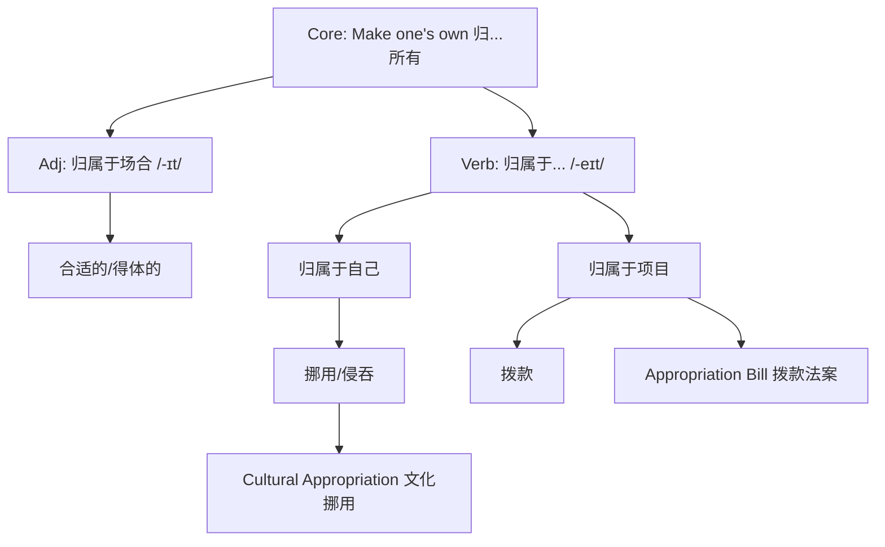

# appropriate

## 1. 基础信息 (Basic Info)

- **词性**: Adjective / Verb
- **音标**:
    - **Adjective**: /əˈproʊpriət/ (末尾弱读，短促 /-ɪt/)
    - **Verb**: /əˈproʊprieɪt/ (末尾重读，长音 /-eɪt/)
- **释义**:
    - **adj.** 适当的，恰当的 (suitable or proper in the circumstances)
    - **v.** 挪用，私占 (take for one's own use without permission)
    - **v.** 拨款 (devote money to a special purpose)

## 2. 词源与演变 (Etymology & Evolution)

- **词源**: 源自拉丁语 *appropriare* -> *ad-* (to) + *proprius* (one's own/proper)。
- **核心逻辑**: **"Make one's own" (归...所有)**。
- **演变路径**:
    1.  **形容词路径**: 特指“专属于某个场合的” -> 像属于这个环境一样自然 -> **得体的/合适的**。
    2.  **动词路径 (私)**: 把别人的东西“归为己有” -> **挪用/侵吞**。
    3.  **动词路径 (公)**: 把资金“归属于某个项目” -> **拨款**。

## 3. 核心概念图谱 (Concept Graph)

## 4. 扩展词汇 (Vocabulary Expansion)

### 近义词 (Synonyms)
- **Suitable**: 最通用，指符合某种目的或场合。(*A suitable candidate*)
- **Proper**: 强调符合社会规范、道德或礼节。(*Proper behavior*)
- **Fitting**: 强调和谐、恰如其分。(*A fitting tribute*)
- **Apt**: 强调精准、切题（常指言语/比喻）。(*An apt remark*)

### 反义词 (Antonyms)
- **Inappropriate**: 不适当的 (通用)
- **Improper**: 不得体的 (违背规范)
- **Unsuitable**: 不合适的 (不匹配)

### 派生词 (Derivatives)
- **Appropriation** (n.): 挪用；拨款；文化挪用
- **Appropriateness** (n.): 适当性
- **Inappropriately** (adv.): 不适当地

## 5. 搭配与用法 (Collocations & Usage)

### 高频搭配 (Collocations)
- **adj. + Noun**:
    - *appropriate action* (适当的行动)
    - *appropriate behavior* (得体的举止)
    - *appropriate response* (恰当的回应)
- **Verb + Noun**:
    - *appropriate funds* (拨款)
    - *appropriate land/property* (征用土地/财产)

### 典型例句 (Examples)
- **社交场景 (Adj)**:
    > "It is not **appropriate** to wear jeans to a formal wedding."
    > 穿牛仔裤参加正式婚礼是不**得体的**。
- **商务/法律 (Verb - 拨款)**:
    > "The government **appropriated** $5 million for emergency relief."
    > 政府为紧急救援**拨了**500万美元。
- **社会议题 (Verb - 挪用)**:
    > "The artist was accused of **appropriating** indigenous designs."
    > 该艺术家被指控**挪用**原住民的设计。

## 6. 易混淆点与辨析 (Analysis & Confusing Points)

- **发音决定词性**:
    - 看到 *appropriate*，先判断词性。
    - **形容词**读 /-ɪt/ (短)。
    - **动词**读 /-eɪt/ (长)。
- **Appropriate vs. Suitable**:
    - *Suitable* 侧重于“匹配” (Fit)。
    - *Appropriate* 侧重于“得体” (Socially acceptable/Right for the context)。
- **Cultural Appropriation**:
    - 这是一个特定的社会学术语，指强势文化群体未经许可使用弱势文化的元素，带有贬义。

## 7. 总结与记忆 (Summary & Memory)

### 💡 口诀 (Mnemonic)
> **形容得体读作 it，**
> **动词挪用读作 ate。**
> **本意皆为归所有，**
> **拨款私占看语境。**

### 🌳 决策树 (Decision Tree)
- 读 /-ɪt/？ -> **“得体的”** (Adj)。
- 读 /-eɪt/ + 钱/公物？ -> **“挪用”** (私) 或 **“拨款”** (公)。
- 词组 *Cultural Appropriation*？ -> **“文化挪用”**。
