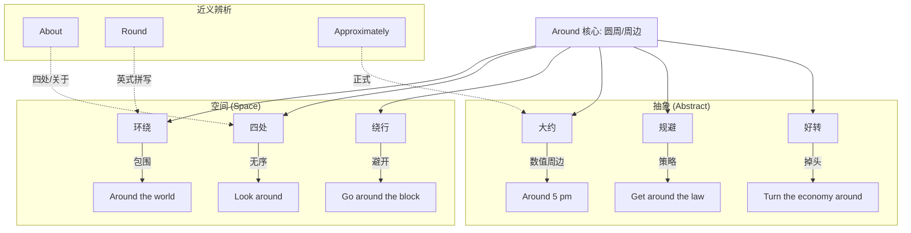

around :: 
<!--ID: 1771404671270-->

# around

## 1. 基础信息

*   **发音**: /əˈraʊnd/
*   **词性**: prep. (介词) / ad. (副词)
*   **核心含义**:
    *   **环绕/周围** (On every side; surrounding)
    *   **到处/四处** (In various places; here and there)
    *   **大约** (Approximately)
    *   **绕过/避开** (Avoiding something by going past it)

## 2. 词义演化

*   **词源**: 源自 *a-* (on) + *round* (circle)。最初指“在圆圈中”或“成圆形”。
*   **演变逻辑**: 
    1.  物理上的**环绕/包围** (围着圆圈)。
    2.  引申为**无固定方向的运动** (转圈圈 -> 到处走)。
    3.  进一步虚化为**模糊的范围** (大约在某个数值的圆圈内 -> 大约)。
    4.  策略上的**迂回** (不直走穿过 -> 绕过去 -> 避开/解决)。
*   **核心图式**: **圆周运动** (Circular Motion) 或 **模糊的周边区域** (Vague Vicinity)。

## 3. 概念分析

### 核心语义场

1.  **物理环绕 (Encirclement)**: 360度的包围。
    *   *The earth revolves **around** the sun.* (地球绕着太阳转。)
2.  **随机分布 (Random Distribution)**: 没有明确方向的“四处”。
    *   *Stop looking **around**.* (别四处乱看。)
    *   *Leave clothes lying **around**.* (把衣服到处乱扔。)
3.  **数值模糊 (Approximation)**: 在某个点的“周边”。
    *   *It costs **around** $50.* (大概50美元。)
4.  **功能性迂回 (Bypass/Solution)**: 绕过障碍物或问题。
    *   *Get **around** the rules.* (钻空子/规避规则。)
    *   *Work **around** the problem.* (变通解决/绕过问题工作。)

### 核心习语与功能搭配

*   **turn around**: 转身；(生意/局势) 好转/扭亏为盈。
*   **mess around**: 捣乱；虚度光阴；(与某人) 鬼混。
*   **show someone around**: 带某人参观。
*   **all the way around**: 甚至可以指逻辑上的“反之亦然” (the other way around)。

## 4. 关系图谱

## 5. 英汉对比特征

| 维度 | English (around) | Chinese (周围/到处/大约) | 差异分析 |
| :--- | :--- | :--- | :--- |
| **空间感** | 强调动态的"圈"或"区域" | "周围"偏静态，"到处"偏分布 | *Stop bossing me around* (别对我指手画脚/呼来喝去) 中的 *around* 传达了一种把人团团转的控制感，中文很难直译这个动态意象。 |
| **功能性** | 极强的动词搭配能力 (Phrasal Verbs) | 需用不同动词表达 (逛/转/混) | *Hang around, mess around, stick around, play around* —— 这些动词短语的核心都在于 *around* 提供的“无目的、持续存在”的含义。 |
| **介词/副词混用** | 灵活切换 | 词性固定 | *Is he around?* (他在附近吗/他在吗？) 这里的 *around* 表示“在场/存在”，中文通常直接说“在不在”。 |

## 6. 场景例句

### 场景 A：日常交流 (Tone: Casual)
*   **English**: "I'll be **around** if you need me."
*   **Chinese**: "如果你需要我，我就在**附近/这边**。"
*   **解析**: 这里的 *around* 是一种模糊的“在场感” (availability)，比 "I am here" 更随意、不紧迫。

### 场景 B：解决问题 (Tone: Problem-solving)
*   **English**: "There's no way **around** it; we have to pay the fine."
*   **Chinese**: "这事儿**躲不掉/没法绕过去**，我们必须交罚款。"
*   **解析**: *Way around* 形象地表达了“避开障碍的路径”。

### 场景 C：状态描述 (Tone: Narrative)
*   **English**: "Things are finally turning **around** for him."
*   **Chinese**: "他的情况终于**好转/有起色**了。"
*   **解析**: *Turn around* 本意是掉头，引申为从坏方向转向好方向。

## 7. 深度洞察

1.  **"在场"的隐喻**: *Around* 常用来表示“存在”或“活着”。
    *   *I'll stick around.* (我会多待会儿。)
    *   *When I'm no longer around...* (当我不在人世之后...)
2.  **Around vs. Round**:
    *   在美式英语中，*around* 是主流，*round* 通常只作名词/形容词 (a round table)。
    *   在英式英语中，*round* 常作为介词/副词替代 *around* (walk round the park)。
    *   但在“大约” (*around 50*) 和“四处” (*look around*) 的义项上，两者通常通用，美式更偏好 *around*。
3.  **About vs. Around**:
    *   在表示“四处”时 (*run around/about*)，*around* 更有“画圈/包围”的几何感，*about* 更侧重“无序/这里那里”。
    *   在表示“大约”时，*around* 更强调“上下浮动”，*about* 更强调“接近”。

## 8. 关键要点 (Takeaways)

### 决策树：何时使用 around？
*   是做圆周运动或包围吗？ -> YES -> **Around**
*   是漫无目的地在各处吗？ -> YES -> **Around** (Run around)
*   是想说“大概、左右”吗？ -> YES -> **Around** (Around 5 o'clock)
*   是想说“避开”某个问题吗？ -> YES -> **Get/Work around**
*   是想说“人还在，没走”吗？ -> YES -> **Be/Stick around**

### 记忆口诀
**Around** 含义画个圈，
**周围**环绕在身边。
数值**大约**上下浮，
**四处**游荡也包含。
遇到困难能**绕过**，
局势**好转**天地宽。
