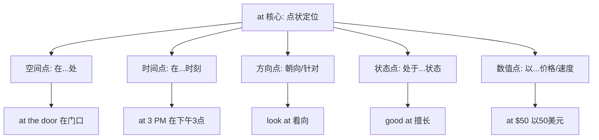
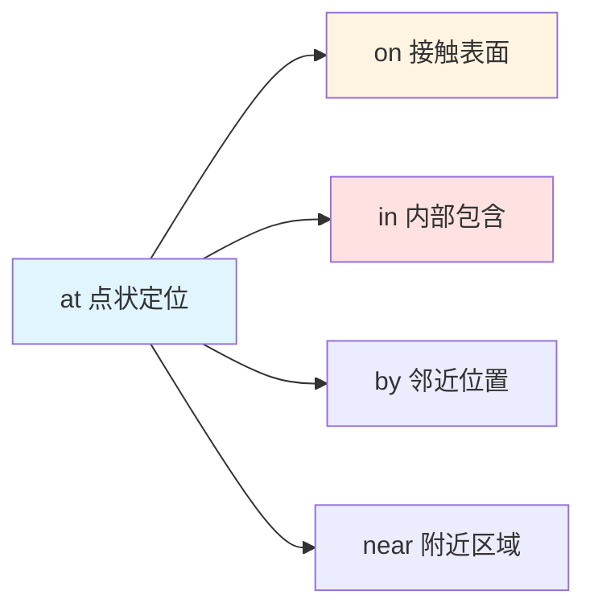
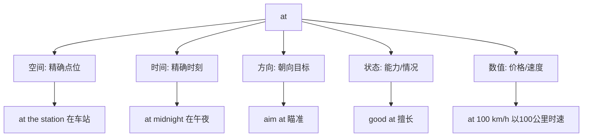
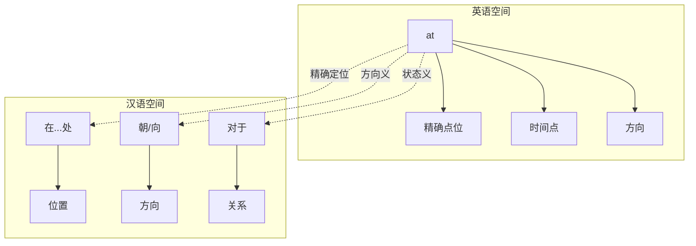

at :: 
<!--ID: 1769502992471-->


# at

## 基础信息

**英文**：at  
**音标**：/æt/ (英美通用)  
**中文**：在...处；朝向；对于  
**词性**：介词 (preposition)

---

## 词义演化

**词源起源**：  
源自古英语 *æt*，原始日耳曼语 *at*（在...处），印欧语系 *ad-*（朝向）。最初表示精确的空间点位，后通过隐喻扩展到时间点、目标方向、抽象状态等领域。

**意义演变路径**：
1. **空间点位**（公元前5世纪）：表示精确的位置点  
   → *at the door*, *at the corner*
2. **时间点**（古英语时期）：从空间点隐喻到时间点  
   → *at 3 o'clock*, *at noon*
3. **方向目标**（中古英语时期）：表示动作的指向  
   → *look at*, *aim at*, *throw at*
4. **状态能力**（16世纪）：表示在某方面的状态或能力  
   → *good at*, *bad at*, *expert at*
5. **价格速度**（17世纪）：表示数值的精确点  
   → *at $10*, *at 60 mph*

---

## 概念分析

### 一词多义（Polysemy）

**核心概念**：点状定位（精确的点）  
**语义扩展**：



### 核心习语与功能性用法

| 习语 | 字面义 | 功能义 | 例句 |
|------|--------|--------|------|
| **good at** | 在...处好 | 擅长 | *She's good at math.* |
| **look at** | 看在...处 | 看向/考虑 | *Look at this!* |
| **at all** | 在全部处 | 根本/完全 | *I don't like it at all.* |
| **at least** | 在最少处 | 至少 | *At least try it.* |
| **at once** | 在一次处 | 立刻/同时 | *Do it at once.* |
| **at hand** | 在手处 | 在附近/即将到来 | *Help is at hand.* |

### 上下义关系

**上义词**：preposition（介词）  
**同类词**：
- **on**：接触表面（on the table）
- **in**：内部包含（in the room）
- **by**：邻近关系（by the river）

**语义对比**：
- **at** 强调精确点位（*at the corner* - 在拐角处）
- **on** 强调接触表面（*on the corner* - 在拐角上方）
- **in** 强调内部空间（*in the corner* - 在角落里）

---

## 关系图谱

### 介词网络：空间关系对比



### 多义词概念分支



### 双语映射：at vs 在



---

## 英汉对比

| 维度 | 英语 at | 汉语对应 |
|------|---------|----------|
| **概念范围** | 单一词汇覆盖空间点/时间点/方向/状态 | 需要多个词汇：在...处/朝/对/以 |
| **精确度** | 强调"点状"精确性（at 3:00 = 精确3点） | 汉语可省略介词（3点见 = 在3点见） |
| **方向性** | 固化为动词搭配表达方向（look at, aim at） | 汉语用独立方向动词（看向、瞄准） |

---

## 实际应用

### 场景 1：空间点位

**英文**：*I'll meet you at the entrance.*  
**中文**：我在入口处见你。  
**分析**：*at* 表示精确点位，汉语用"在...处"对应。

### 场景 2：时间点

**英文**：*The meeting starts at 9 AM sharp.*  
**中文**：会议9点整开始。  
**分析**：*at* 强调精确时间点，汉语常省略介词。

### 场景 3：方向目标

**英文**：*Don't point at people—it's rude.*  
**中文**：不要指着人——这很不礼貌。  
**分析**：*point at* 表示方向，汉语用"指着"（动词+着）。

### 场景 4：能力状态（习语）

**英文**：*He's really good at solving problems.*  
**中文**：他真的很擅长解决问题。  
**分析**：*good at* 是固化习语，表示能力，汉语用"擅长"对应。

### 场景 5：价格数值

**英文**：*These shoes are on sale at $50.*  
**中文**：这些鞋子以50美元的价格打折。  
**分析**：*at* 表示精确价格点，汉语用"以...价格"。

### 场景 6：at all（强调）

**英文**：*I don't understand this at all.*  
**中文**：我完全不理解这个。  
**分析**：*at all* 用于否定句强调"根本/完全"，汉语需要副词。

---

## 深度洞察

### 核心要点

1. **"点"的隐喻扩展**  
   *at* 的核心是"精确的点"，从空间点（at the door）扩展到时间点（at noon）、目标点（aim at）、状态点（good at）。这种扩展体现了英语介词将抽象概念"点状化"的能力。

2. **与 on/in 的三维空间对比**  
   - **at**：零维点（at the corner - 拐角这个点）
   - **on**：二维面（on the table - 桌面这个面）
   - **in**：三维体（in the box - 盒子这个空间）  
   这种区分在汉语中需要通过不同词汇或语境实现。

3. **动词搭配的固化**  
   *at* 与动词的搭配高度固化（look at, laugh at, aim at），形成"动词+at+对象"的稳定结构。汉语则倾向于用单一方向动词（看向、嘲笑、瞄准），体现了汉语的动词中心特征。

---

## 关键要点

### 翻译决策树

```
at + 名词/时间
├─ 空间位置？
│  ├─ 精确点位 → 在...处（at the station → 在车站）
│  └─ 建筑物/机构 → 在（at school → 在学校）
├─ 时间表达？
│  ├─ 精确时刻 → 在...时（at 3 PM → 3点）
│  └─ 特殊时刻 → 在（at noon → 在中午）
├─ 方向动作？
│  ├─ look at → 看向
│  ├─ point at → 指向
│  ├─ aim at → 瞄准
│  └─ laugh at → 嘲笑
├─ 能力状态？
│  ├─ good at → 擅长
│  ├─ bad at → 不擅长
│  └─ expert at → 精通
├─ 数值表达？
│  ├─ 价格 → at $10 → 以10美元
│  └─ 速度 → at 60 mph → 以60英里时速
└─ 固定习语？
   ├─ at all → 根本/完全
   ├─ at least → 至少
   ├─ at once → 立刻
   └─ at hand → 在附近/即将到来
```

### 记忆口诀

**"点定时空,向能价速"**

- **点定**：精确点位是核心（at the door）
- **时空**：时间点和空间点（at 3 PM, at home）
- **向**：方向目标（look at, aim at）
- **能**：能力状态（good at）
- **价速**：价格和速度（at $10, at 60 mph）

---

## 使用建议

### 学习策略

1. **掌握"点"的核心概念**：理解 *at* 强调精确点位的本质
2. **对比 on/in/at**：通过三维空间模型区分（点/面/体）
3. **记忆高频搭配**：*good at*, *look at*, *at least* 等固定用法
4. **注意汉语省略**：时间表达中汉语常省略介词（3点见 vs at 3 PM）

### 常见错误

❌ **错误**：*I'm good in math.*  
✅ **正确**：*I'm good at math.*  
**说明**：表示能力用 *good at*，不用 *in*。

❌ **错误**：*Look on the picture.*  
✅ **正确**：*Look at the picture.*  
**说明**：表示视线方向用 *look at*，*on* 表示接触表面。

❌ **错误**：*I arrived at home.*  
✅ **正确**：*I arrived home.* 或 *I got home.*  
**说明**：*home* 作副词时不需要介词，但 *at school/at work* 需要。

❌ **错误**：*The meeting is on 3 PM.*  
✅ **正确**：*The meeting is at 3 PM.*  
**说明**：精确时刻用 *at*，日期用 *on*（on Monday）。

---

## 扩展阅读

**相关词汇**：
- [[on]] - 接触表面关系
- [[in]] - 内部包含关系
- [[by]] - 邻近位置
- [[to]] - 方向移动

**对比分析**：
- [[at-on-in]] - 三维空间介词对比
- [[Prepositions of Place]] - 地点介词系统

**主题链接**：
- [[Prepositions]] - 介词系统
- [[Spatial Metaphor]] - 空间隐喻
- [[Phrasal Verbs]] - 动词短语