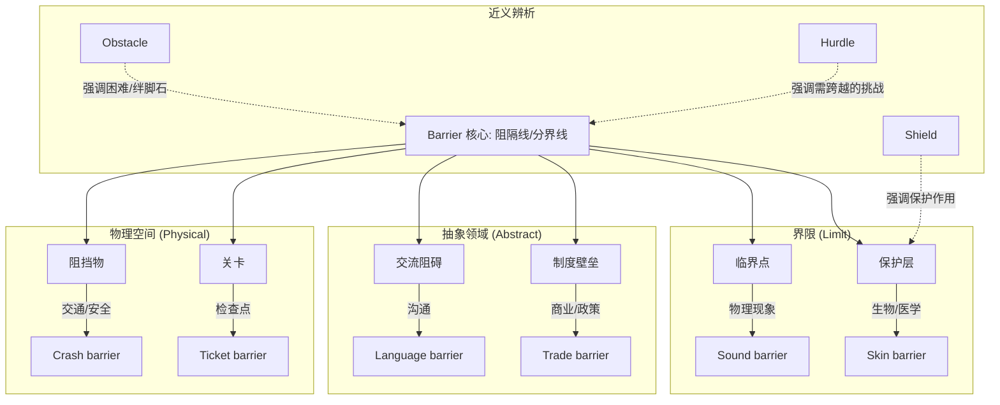

barrier  :: 
<!--ID: 1771404671279-->

# barrier

## 1. 基础信息

*   **发音**: /ˈbæriər/ (US), /ˈbariə(r)/ (UK)
*   **词性**: n. (名词)
*   **核心含义**:
    *   障碍物，屏障 (阻挡通行的物体)
    *   界限，壁垒 (贸易、文化等方面的阻碍)
    *   关卡，检票口

## 2. 词义演化

*   **词源**: 源自古法语 *barriere*，词根是 *barre* (bar, rod/stake 杆，棒)。
*   **演变逻辑**: 最初指用木棍或栅栏围起来的防御工事或关卡 -> 演变为任何阻挡通行或进程的物体 -> 引申为抽象的阻碍 (如语言障碍、贸易壁垒)。
*   **核心图式**: **横亘在中间的阻挡线** (A line that separates or blocks)。

## 3. 概念分析

### 核心语义场

1.  **物理阻挡 (Physical Blockage)**: 真实的墙、栅栏、栏杆。
    *   *Crash barrier* (防撞护栏), *Flood barrier* (防洪堤)。
2.  **抽象阻碍 (Abstract Hindrance)**: 阻止交流、进步或加入的因素。
    *   *Language barrier* (语言障碍), *Trade barriers* (贸易壁垒), *Barrier to entry* (准入门槛)。
3.  **界限与突破 (Limit & Breakthrough)**: 一个难以逾越的临界点。
    *   *Sound barrier* (音障), *Pain barrier* (极限痛苦界限)。

### 核心习语与功能搭配

*   **break down barriers**: 打破隔阂/消除障碍 (常用于消除偏见或促进沟通)。
*   **barrier to entry**: (商业/经济) 市场准入壁垒。
*   **protective barrier**: 保护层 (如皮肤屏障 *skin barrier*)。

## 4. 关系图谱

## 5. 英汉对比特征

| 维度 | English (barrier) | Chinese (障碍/屏障) | 差异分析 |
| :--- | :--- | :--- | :--- |
| **侧重点** | 强调"隔断" (Separation) | "障碍"强调"难行"，"屏障"强调"保护" | *Barrier* 既可以是坏事(阻碍)，也可以是好事(保护层，如防晒霜是 UV barrier)。 |
| **动词搭配** | break / cross / lower | 清除 / 跨越 / 构筑 | 英文常用 *break down* (打破) 来描述消除抽象隔阂。 |
| **视觉意象** | 一道横杠或一堵墙 | 挡路石或遮蔽物 | *Sound barrier* (音障) 在中文里是个物理学术语，而在英文里更像一道看不见的墙。 |

## 6. 场景例句

### 场景 A：跨文化交流 (Tone: Social/Cultural)
*   **English**: "Music transcends cultural **barriers**."
*   **Chinese**: "音乐能超越文化的**隔阂/界限**。"
*   **解析**: 这里不翻译为"障碍"，因为 barrier 在此指的是人与人之间的疏离感或界限。

### 场景 B：商业竞争 (Tone: Professional)
*   **English**: "High capital requirements act as a **barrier to entry** for new startups."
*   **Chinese**: "高资本要求构成了新创企业的**市场准入壁垒**。"
*   **解析**: *Barrier to entry* 是固定术语，指阻止竞争者进入市场的因素。

### 场景 C：个人成长 (Tone: Motivational)
*   **English**: "Fear is often the biggest **barrier** to success."
*   **Chinese**: "恐惧往往是通往成功最大的**绊脚石/阻碍**。"
*   **解析**: 这里的 barrier 近义于 obstacle。

## 7. 深度洞察

1.  **双重性 (Duality)**: Barrier 是中性的。虽然常指负面的"阻碍" (blocking progress)，但在生物学和安全领域，它是正面的"保护层" (protection)。例如 *skin barrier* (皮肤屏障) 受损会导致过敏，这里的 barrier 是必须要维护的防线。
2.  **Obstacle vs. Barrier**:
    *   **Obstacle** (障碍物): 通常指路中间的一块石头，你可以绕过去 (go around)。
    *   **Barrier** (壁垒): 通常是一道延伸的墙或线，把两个区域隔开，你必须打破它 (break through) 或跨越它 (cross)。
3.  **看不见的墙**: *Sound barrier* (音障) 是一个物理学隐喻，形容速度达到临界点时的巨大阻力。现在也常用来比喻心理上的极限。

## 8. 关键要点 (Takeaways)

### 决策树：何时使用 barrier？
*   是保护内部不受外部侵害的层吗？ -> YES -> 使用 **Barrier** (如 Skin barrier)
*   是两个群体或区域之间的分隔线吗？ -> YES -> 使用 **Barrier** (如 Language barrier)
*   是路中间的一个具体阻挡物体吗？ -> YES -> 使用 **Obstacle** 或 **Obstruction**
*   是需要跳过的比赛栏架或小困难吗？ -> YES -> 使用 **Hurdle**

### 记忆口诀
**Barrier** 是一道墙，
隔断两边不通畅。
贸易文化成**壁垒**，
皮肤防撞作**屏障**。
打破界限 **break down**，
音障突破响当当。
