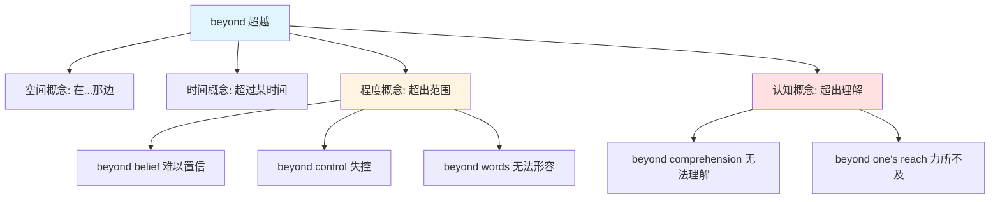

# Beyond

## 基础信息

**英文**: beyond  
**音标**: 美 /bɪˈjɑːnd/ 英 /bɪˈjɒnd/  
**中文**: 超越；在……之外；超出  
**词性**: 介词 (prep.) / 副词 (adv.) / 名词 (n.)

## 词义演化

**词源起源**:  
Beyond 源自古英语 **begeondan**，由两部分组成：
- **be-** (by): 表示"在……旁边"，指示位置
- **geondan** (yond): 意为"那边"，作为介词使用

这个组合在日耳曼语系中并不常见，是英语特有的构词。相关词汇包括 **yon**（那边，方言）和 **yonder**（那边，远处）。

**意义演变路径**:
1. **古英语时期**: "在……另一边，从更远的地方"（空间概念）
2. **14世纪晚期**: 扩展为"比……更远"（比较概念）
3. **1530年代**: 发展出"超出……的范围"（抽象概念）
4. **1812年**: 引申为"超出（某人的）理解"（认知边界）

从具体的空间位置 → 抽象的范围界限 → 能力/理解的边界，体现了英语从具体到抽象的典型演化模式。

## 概念分析

### 一词多义

Beyond 具有多个相关但不同的概念层次：

**1. 空间概念**（物理距离）
- 在……的那一边
- 在……之外
- 在更远处

**2. 时间概念**（时间延续）
- 迟于；超过（某个时间点）
- 在……之后

**3. 范围/程度概念**（抽象边界）
- 超出（能力、理解、范围）
- 为……所不能及
- 多于；胜过

**4. 排除概念**（否定/疑问句）
- 除……之外

**5. 哲学概念**（名词用法）
- 来世；彼岸
- 未知的远方

### 核心习语与功能性用法

**1. beyond belief** - 难以置信  
*The beauty of the landscape was beyond belief.*  
（风景之美令人难以置信。）

**2. beyond doubt** - 毫无疑问  
*Her talent is beyond doubt.*  
（她的才华毫无疑问。）

**3. beyond one's control** - 超出某人的控制  
*The situation is now beyond our control.*  
（局势现已超出我们的控制。）

**4. beyond words** - 无法用言语形容  
*She was touched beyond words.*  
（她感动得无法用言语形容。）

**5. beyond compare** - 无与伦比  
*Her performance was beyond compare.*  
（她的表演无与伦比。）

**6. beyond one's reach** - 力所不及；难以企及  
*The dream seemed beyond his reach.*  
（这个梦想似乎是他难以企及的。）

**7. go beyond** - 超越；超出  
*She went beyond the call of duty.*  
（她超越了职责范围。）

**8. beyond the pale** - 出格的；不可接受的  
*His behavior was beyond the pale.*  
（他的行为太出格了。）

**9. the back of beyond** - 极偏远的地方  
*They live in the back of beyond.*  
（他们住在极偏远的地方。）

### 上下义关系

**上义词（更广泛的概念）**:
- exceed（超过）
- surpass（超越）
- transcend（超越，更哲学化）

**下义词（更具体的概念）**:
- beyond comprehension（超出理解）
- beyond recognition（面目全非）
- beyond repair（无法修复）

**同义词**:
- past（过了，侧重时间）
- over（在……之上，侧重空间）
- above（超出，侧重程度）
- outside（在……之外，侧重范围）

## 关系图谱



## 英汉对比

| 维度 | 英语 beyond | 汉语对应 |
|------|-------------|----------|
| **词性灵活性** | 介词/副词/名词三用 | 需要不同词汇：超越（动词）、超出（动词）、之外（方位词）、远处（名词） |
| **概念范围** | 单一词汇覆盖空间、时间、抽象概念 | 需要根据语境选择：超过、超出、超越、在……之外、除……之外 |
| **习语化程度** | 高度习语化（beyond belief, beyond words等） | 汉语多用完整短语表达：难以置信、无法用言语形容 |

**核心差异**:
- **英语特征**: beyond 是一个高度抽象化的词，从具体空间延伸到抽象概念，体现英语的概念整合能力
- **汉语特征**: 需要根据具体语境选择不同词汇（超过/超出/超越/之外），体现汉语的语境依赖性

## 实际应用

### 场景1：空间与时间
*The mountains lie beyond the valley, and we won't arrive until beyond midnight.*  
（群山位于山谷的那一边，我们要到午夜之后才能到达。）

**分析**: 第一个 beyond 表示空间位置，第二个表示时间延续。

### 场景2：能力与理解
*This mathematical problem is beyond me, but it's not beyond her capabilities.*  
（这道数学题超出了我的能力，但没有超出她的能力范围。）

**分析**: beyond + 人称代词，表示"超出某人的理解/能力"。

### 场景3：习语表达
*The destruction caused by the earthquake was beyond description, leaving the city changed beyond recognition.*  
（地震造成的破坏无法形容，使这座城市面目全非。）

**分析**: 两个习语 beyond description（无法形容）和 beyond recognition（面目全非）。

### 场景4：排除用法
*I know nothing beyond what you've told me.*  
（除了你告诉我的，我什么都不知道。）

**分析**: 在否定句中，beyond 表示"除……之外"。

## 深度洞察

1. **从具体到抽象的认知路径**: Beyond 的演化体现了人类认知从空间概念（在那边）到时间概念（超过某时）再到抽象概念（超出理解）的典型路径。这种"空间隐喻"是语言发展的普遍规律。

2. **边界意识的语言表达**: Beyond 本质上是一个"边界词"，它预设了一个参照点（boundary），然后指向超出这个边界的区域。英语用单一词汇表达这种边界超越，而汉语需要根据边界类型（空间/时间/能力）选择不同词汇。

3. **习语化的文化意义**: Beyond 的大量习语（beyond belief, beyond words 等）反映了英语文化中对"超越性"的重视——超越常规、超越预期、超越理解，这与西方文化中的个人主义和探索精神相呼应。

## 关键要点

### 翻译决策树

```
遇到 beyond 时：
├─ 是否涉及空间位置？
│  └─ 是 → 翻译为"在……那边/之外"
├─ 是否涉及时间？
│  └─ 是 → 翻译为"超过/在……之后"
├─ 是否涉及能力/理解？
│  └─ 是 → 翻译为"超出……的能力/理解"
├─ 是否在否定/疑问句中？
│  └─ 是 → 翻译为"除……之外"
└─ 是否为固定习语？
   └─ 是 → 查询习语对应的汉语表达
```

### 记忆口诀

**Beyond 三层意**：
- **空间远**（在那边）
- **时间晚**（超过时）
- **程度深**（超出界）

**习语记忆法**：
- **beyond + 抽象名词** = 超出该抽象概念的范围
  - beyond belief（超出信念 = 难以置信）
  - beyond words（超出言语 = 无法形容）
  - beyond control（超出控制 = 失控）
  - beyond doubt（超出怀疑 = 毫无疑问）

**用法提示**：
- beyond + 人称代词（me/you/him）→ 超出某人的理解/能力
- beyond + 时间点 → 在……之后
- beyond + 地点 → 在……那边
- 否定句/疑问句中的 beyond → 除……之外
