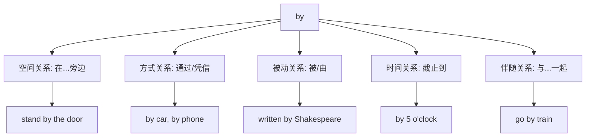

# by 词汇分析

## 基础信息
- **英文**: by
- **词性**: 介词/副词
- **音标**: /baɪ/
- **中文**: 通过；在...旁边；被；由；凭借

## 词义演化
"by" 来自古英语 "bī"，意为 "near, beside, around, about, beyond, before, by"。原始日耳曼语 "*bi-" 表示 "near, at, around"。在古英语中，这个词就已经具有多种用法，随着时间推移，其意义逐渐扩展。

## 概念分析

### 一词多义现象
"by" 是典型的多义词，在不同语境中表达不同概念：

1. **位置关系**：在...旁边
2. **方式手段**：通过，凭借
3. **被动语态**：被，由
4. **时间关系**：截止到，不迟于
5. **伴随关系**：与...一起

### 上下义关系
- **上义词**：preposition（介词）
- **下义词**：spatial relation（空间关系）、temporal relation（时间关系）、instrumental（工具性）

### 同义词/近义词
- **位置**: beside, near, next to
- **方式**: through, via, by means of
- **被动**: by means of, via

## 关系图谱



## 英汉对比

| 特征 | 英语 (by) | 汉语 (通过/在...旁边) |
|------|-----------|------------------------|
| **灵活性** | 一词多义，语境依赖性强 | 不同概念用不同词汇表达 |
| **简洁性** | 单个词涵盖多重含义 | 需要不同词汇精确表达 |
| **语法功能** | 介词、副词双重功能 | 概念区分更明确 |

## 实际应用

### 场景1：表示位置
- **English**: She stood by the window.
- **中文**: 她站在窗边。
- **分析**: "by" 表示"在...旁边"的空间关系

### 场景2：表示方式
- **English**: He traveled by train.
- **中文**: 他乘火车旅行。
- **分析**: "by" 表示交通工具的方式概念

### 场景3：被动语态
- **English**: The book was written by Dickens.
- **中文**: 这本书是狄更斯写的。
- **分析**: "by" 引出动作的执行者

### 场景4：时间界限
- **English**: Please finish by Friday.
- **中文**: 请在周五之前完成。
- **分析**: "by" 表示截止时间

## 深度洞察

1. **概念融合**: "by" 体现了英语中介词的高度抽象性，一个词可以同时表达空间、方式、时间等多种关系，这与汉语倾向于用不同词汇精确表达不同概念形成对比。

2. **语法功能**: "by" 在被动语态中的使用体现了英语的形态变化特点，而中文更多依靠词汇手段表达被动意义。

3. **文化内涵**: "by" 的多功能性反映了英语注重简洁表达的文化倾向，通过单一词汇的不同搭配实现丰富的语义功能。

## 关键要点

### 决策树
```
遇到"by" → 
├─ 位置关系？ → 在...旁边
├─ 方式手段？ → 通过，凭借  
├─ 被动标记？ → 被，由
├─ 时间界限？ → 截止到
└─ 伴随关系？ → 与...一起
```

### 记忆口诀
**"by"字多义巧记**：
- 空间旁边by
- 方式凭借by  
- 被动由by引
- 时间截止by

## 词源衍生句组

- **by** (介词) → The work was completed **by** him.
- **by** (副词) → Come **by** tomorrow.
- **by** (前缀) → **By**product (副产品)