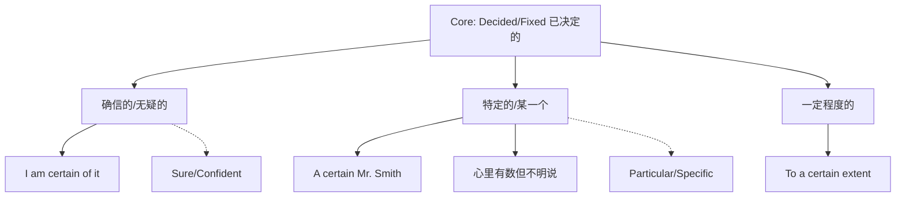

# certain

## 1. 基础信息 (Basic Info)

- **词性**: Adjective / Pronoun
- **音标**: /ˈsɜːrtn/ (美音常吞掉中间的 /t/，听起来像 "ser-n")
- **释义**:
    - **adj. (Predicative 表语)**: 确信的，无疑的 (having no doubt; sure)
    - **adj. (Attributive 定语)**: 某一个，特定的 (specific but not named)
    - **adj. (Attributive 定语)**: 轻微的，某种程度的 (some; to a limited degree)
    - **pron.**: 某些 (some members of a group)

## 2. 词源与演变 (Etymology & Evolution)

- **词源**: 源自拉丁语 *certus* (determined, resolved, fixed, settled)，是 *cernere* (to distinguish, decide) 的过去分词。
- **核心逻辑**: **"Decided/Fixed" (已决定的/定下来的)**。
- **演变路径**:
    1.  **已决定的 -> 确定的 (Sure/Inevitability)**: 事情已经定下来了，所以是“必然的”或“确信的”。(*It is certain that...*)
    2.  **特定的 (Specific)**: 虽然我没说名字，但我心里已经“定下来”是指哪一个了。(*A certain person*)
    3.  **某种程度的 (Degree)**: 划定了一个界限，虽然不完全，但在“一定”范围内是确定的。(*To a certain extent*)

## 3. 核心概念图谱 (Concept Graph)

## 4. 扩展词汇 (Vocabulary Expansion)

### 近义词 (Synonyms)
- **Sure**: 最口语化，侧重主观感觉。(*I'm sure.*)
- **Confident**: 侧重自信、有把握。(*Confident of success.*)
- **Positive**: 语气最强，强调“绝对没错”。(*I'm positive he was there.*)
- **Particular**: 侧重“特指”，与 *certain* (某一个) 在此义项上相近。
- **Inevitable**: 侧重客观上“不可避免的”。

### 反义词 (Antonyms)
- **Uncertain**: 不确定的，多变的。
- **Doubtful**: 怀疑的，拿不准的。
- **Unsure**: 缺乏信心的。

### 派生词 (Derivatives)
- **Certainly** (adv.): 当然；无疑地。
- **Certainty** (n.): 确定性；必然的事。
- **Uncertainty** (n.): 不确定性。

## 5. 搭配与用法 (Collocations & Usage)

### 高频搭配 (Collocations)
- **Be certain of/about**: 对...有把握。
    - *I am not certain about the date.*
- **Make certain**: 确保，弄清楚 (同 *make sure*)。
    - *Make certain that the door is locked.*
- **A certain**: 某一个；某种。
    - *A certain amount of risk* (一定程度的风险)
    - *A certain charm* (某种独特的魅力)
- **For certain**: 肯定地，确切地。
    - *I can't say for certain.*

### 典型例句 (Examples)
- **确信 (Subjective Certainty)**:
    > "I am **certain** that we will succeed."
    > 我**确信**我们会成功。
- **特指/某一个 (Specific but unnamed)**:
    > "She refused to discuss **certain** details of the contract."
    > 她拒绝讨论合同中的**某些**细节。
- **程度 (Degree)**:
    > "There is a **certain** elegance in her style."
    > 她的风格中带有**某种**优雅。
- **礼貌的模糊 (Polite Vagueness)**:
    > "**Certain** people might disagree with you."
    > **某些**人（暗示特定的人，不想点名）可能会不同意你的看法。

## 6. 易混淆点与辨析 (Analysis & Confusing Points)

- **Certain vs. Sure**:
    - **位置**: *Certain* 可以作定语 (a certain man)，*Sure* 通常不这样用 (不能说 a sure man*)。
    - **语气**: *Certain* 比 *Sure* 更正式，语气更强。
- **"A certain" 的妙用**:
    - 当你想说“某个人/某件事”，心里很清楚是谁，但**故意不明说**时，用 *a certain*。
    - 例：*A certain person we both know...* (我们都认识的那谁...)
- **"To a certain extent"**:
    - 这是一个万能的“废话文学”短语，用于表示“在某种程度上”，写作文时很好用。

## 7. 总结与记忆 (Summary & Memory)

### 💡 口诀 (Mnemonic)
> **定语表“某”不用名，**
> **表语“确信”心自清。**
> **程度“一定”有界限，**
> **拉丁本意是“决定”。**

### 🌳 决策树 (Decision Tree)
- 在名词前 (A ~ person)？ -> **“某一个/特定的”** (Specific)。
- 在系动词后 (I am ~)？ -> **“确信的”** (Sure)。
- 搭配 (To a ~ extent)？ -> **“一定程度的”** (Degree)。
