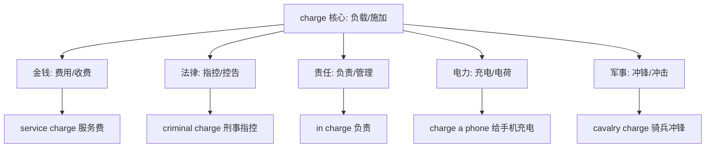
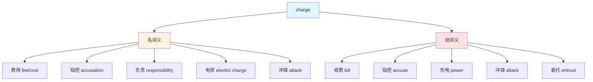
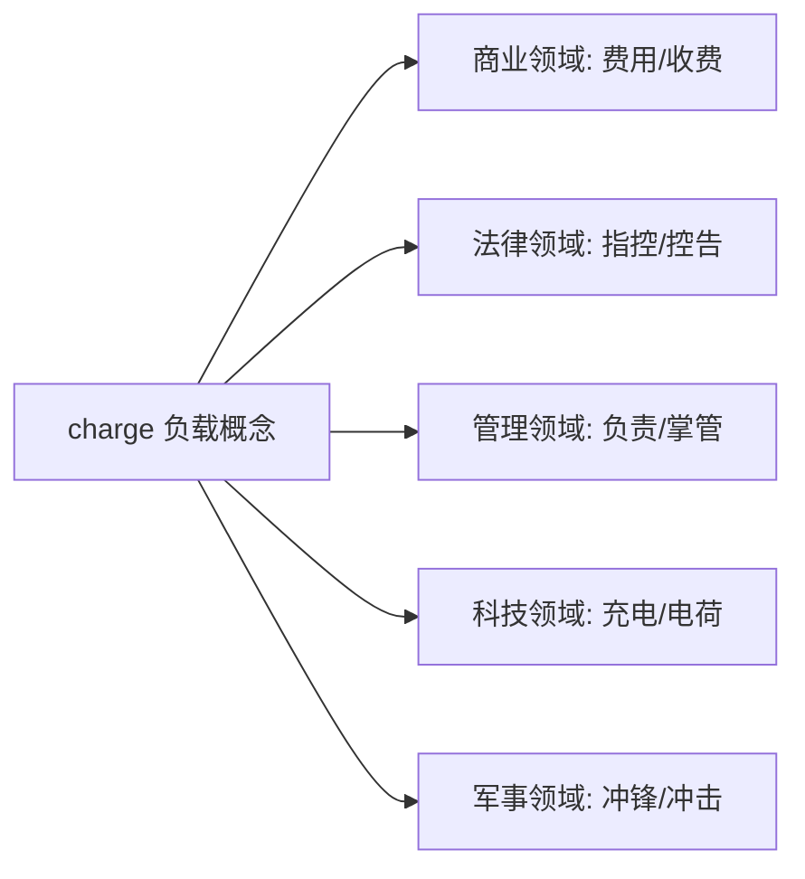
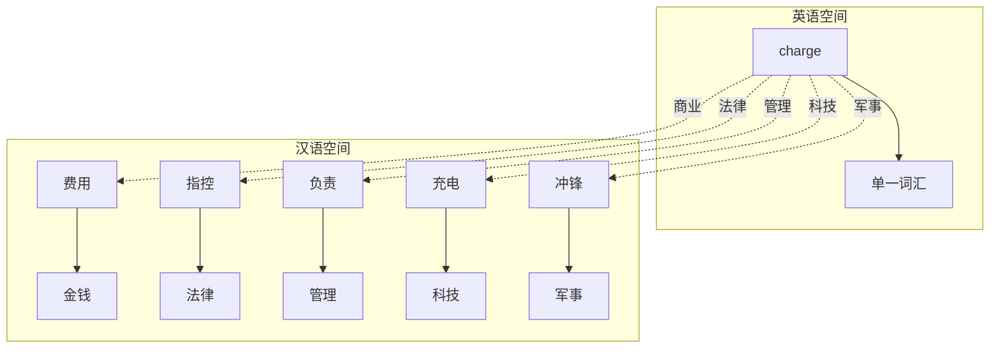

charge :: 
<!--ID: 1769502992364-->

# charge

## 基础信息

**英文**：charge  
**音标**：/tʃɑːdʒ/ (英) /tʃɑːrdʒ/ (美)  
**中文**：费用；指控；负责；充电；冲锋  
**词性**：名词 (noun) / 动词 (verb)

---

## 词义演化

**词源起源**：  
源自古法语 *charger*（装载、负担），拉丁语 *carricare*（装载货车），源自 *carrus*（车）。最初表示"给车装载货物"，后通过隐喻扩展到金钱负担（费用）、法律负担（指控）、责任负担（负责）、电力负载（充电）、军事冲击（冲锋）等多个领域。

**意义演变路径**：
1. **物理装载**（13世纪）：给车辆装载货物  
   → *charge a wagon with goods*
2. **金钱负担**（14世纪）：施加费用或成本  
   → *charge a fee*, *service charge*
3. **法律指控**（14世纪）：施加罪名或责任  
   → *criminal charge*, *charge someone with theft*
4. **责任委托**（15世纪）：赋予职责或管理权  
   → *in charge of*, *take charge*
5. **电力负载**（19世纪）：给电池装载电能  
   → *charge a battery*, *electric charge*
6. **军事冲锋**（16世纪）：骑兵快速冲击  
   → *cavalry charge*, *charge at the enemy*

---

## 概念分析

### 一词多义（Polysemy）

**核心概念**：负载、施加力量  
**语义扩展**：



### 核心习语与功能性用法

| 习语 | 字面义 | 功能义 | 例句 |
|------|--------|--------|------|
| **in charge (of)** | 在负责里 | 负责/主管 | *Who's in charge here?* |
| **take charge** | 拿负责 | 接管/掌控 | *She took charge of the project.* |
| **free of charge** | 没有费用 | 免费 | *Delivery is free of charge.* |
| **charge it to** | 把费用记到 | 记账/赊账 | *Charge it to my account.* |
| **get a charge out of** | 从...得到冲击 | 感到兴奋 | *I get a charge out of skiing.* |
| **press charges** | 施加指控 | 提起诉讼 | *She decided to press charges.* |

### 同义词与近义词

**名词义**：
- **fee**（费用）：更正式，通常指专业服务费
- **cost**（成本）：更广泛，指任何花费
- **accusation**（指控）：更正式的法律用语
- **responsibility**（责任）：更抽象的责任概念

**动词义**：
- **bill**（收费）：强调开账单
- **accuse**（指控）：更直接的指控动作
- **attack**（攻击）：更广泛的攻击概念
- **power**（充电）：现代口语中的替代词

---

## 关系图谱

### 多义词概念网络



### 语义域分布



### 双语映射：charge 的多义性



---

## 英汉对比

| 维度 | 英语 charge | 汉语对应 |
|------|-------------|----------|
| **概念范围** | 单一词汇覆盖5大语义域（金钱/法律/管理/科技/军事） | 需要5个不同词汇：费用/指控/负责/充电/冲锋 |
| **隐喻路径** | 从"负载"扩展到抽象领域（责任=负担，指控=施加罪名） | 汉语用具体动词或名词直接表达各领域概念 |
| **词性灵活性** | 名词/动词双重身份，无需形态变化 | 汉语需要不同词汇或结构（收费/费用，指控/控告） |

---

## 实际应用

### 场景 1：商业费用（名词）

**英文**：*There's a $5 service charge for credit card payments.*  
**中文**：信用卡支付有5美元的服务费。  
**分析**：*charge* 作名词表示费用，汉语用"费用"或"费"对应。

### 场景 2：商业收费（动词）

**英文**：*How much do you charge for a haircut?*  
**中文**：理发你们收多少钱？  
**分析**：*charge* 作动词表示收费，汉语用"收"对应。

### 场景 3：法律指控（名词）

**英文**：*He was arrested on charges of fraud.*  
**中文**：他因欺诈指控被捕。  
**分析**：*charge* 表示法律指控，汉语用"指控"或"罪名"。

### 场景 4：法律控告（动词）

**英文**：*The police charged him with murder.*  
**中文**：警方指控他谋杀。  
**分析**：*charge someone with* 表示控告某人某罪，汉语用"指控"。

### 场景 5：管理负责（习语）

**英文**：*She's in charge of the marketing department.*  
**中文**：她负责市场部。  
**分析**：*in charge of* 是固化习语，表示负责，汉语用"负责"。

### 场景 6：科技充电（动词）

**英文**：*I need to charge my phone before we leave.*  
**中文**：我们出发前我需要给手机充电。  
**分析**：*charge* 表示充电，汉语用"充电"对应。

### 场景 7：军事冲锋（动词）

**英文**：*The cavalry charged at the enemy lines.*  
**中文**：骑兵向敌军阵线冲锋。  
**分析**：*charge at* 表示冲锋，汉语用"冲锋"或"冲向"。

### 场景 8：免费（习语）

**英文**：*Admission is free of charge for children under 12.*  
**中文**：12岁以下儿童免费入场。  
**分析**：*free of charge* 是固化习语，表示免费，汉语用"免费"。

---

## 深度洞察

### 核心要点

1. **"负载"隐喻的多域扩展**  
   *charge* 的核心是"施加负载"，从物理装载扩展到：
   - **金钱负载**：费用是经济负担
   - **法律负载**：指控是罪名负担
   - **责任负载**：负责是职责负担
   - **电力负载**：充电是能量负载
   - **军事冲击**：冲锋是力量施加  
   这种多域扩展体现了英语隐喻的系统性和生产力。

2. **汉语的领域特定性**  
   英语用单一词汇 *charge* 覆盖5个语义域，汉语则为每个领域分配专门词汇（费用/指控/负责/充电/冲锋）。这反映了汉语词汇系统的领域分化特征，每个词汇在特定领域内语义明确。

3. **习语的管理功能固化**  
   *in charge*、*take charge* 等习语已成为管理领域的核心表达，脱离了"负载"的字面义。汉语需要完整动词短语（负责、接管）才能对应这些管理功能，体现了英语介词短语的功能化倾向。

---

## 关键要点

### 翻译决策树

```
charge (名词/动词)
├─ 商业语境？
│  ├─ 名词 → 费用（service charge → 服务费）
│  └─ 动词 → 收费（charge $10 → 收10美元）
├─ 法律语境？
│  ├─ 名词 → 指控/罪名（criminal charge → 刑事指控）
│  └─ 动词 → 指控/控告（charge with → 指控...罪）
├─ 管理语境？
│  ├─ in charge → 负责
│  ├─ take charge → 接管/掌控
│  └─ charge of → 负责...
├─ 科技语境？
│  ├─ 名词 → 电荷（electric charge → 电荷）
│  └─ 动词 → 充电（charge phone → 给手机充电）
├─ 军事语境？
│  ├─ 名词 → 冲锋（cavalry charge → 骑兵冲锋）
│  └─ 动词 → 冲锋（charge at → 向...冲锋）
└─ 固定习语？
   ├─ free of charge → 免费
   ├─ in charge of → 负责
   ├─ take charge → 接管
   └─ press charges → 提起诉讼
```

### 记忆口诀

**"负载生五域,费控责电冲"**

- **负载**：核心义是施加负载
- **五域**：覆盖5个语义域
- **费**：商业领域（费用/收费）
- **控**：法律领域（指控/控告）
- **责**：管理领域（负责/掌管）
- **电**：科技领域（充电/电荷）
- **冲**：军事领域（冲锋/冲击）

---

## 使用建议

### 学习策略

1. **掌握核心"负载"概念**：理解所有义项都源于"施加负载"
2. **按语义域分类记忆**：商业/法律/管理/科技/军事五大领域
3. **记忆高频习语**：*in charge*, *free of charge*, *take charge*
4. **注意词性转换**：同一语境下名词/动词义的对应关系

### 常见错误

❌ **错误**：*I'm charging of this project.*  
✅ **正确**：*I'm in charge of this project.*  
**说明**：表示负责用固定搭配 *in charge of*，不能直接用动词 *charge*。

❌ **错误**：*The battery is full charged.*  
✅ **正确**：*The battery is fully charged.*  
**说明**：副词用 *fully*，不是 *full*。

❌ **错误**：*He was charged for murder.*  
✅ **正确**：*He was charged with murder.*  
**说明**：指控罪名用 *charge with*，不用 *for*。

❌ **错误**：*There is no charge of this service.*  
✅ **正确**：*There is no charge for this service.* 或 *This service is free of charge.*  
**说明**：费用用 *charge for*，或用习语 *free of charge*。

❌ **错误**：*I need to charge my battery with electricity.*  
✅ **正确**：*I need to charge my battery.*  
**说明**：充电直接用 *charge*，不需要说明 *with electricity*（冗余）。

---

## 扩展阅读

**相关词汇**：
- [[fee]] - 费用（更正式）
- [[cost]] - 成本（更广泛）
- [[accuse]] - 指控（更直接）
- [[responsibility]] - 责任（更抽象）
- [[power]] - 充电（现代口语）

**词组搭配**：
- [[in-charge]] - 负责管理
- [[service-charge]] - 服务费
- [[press-charges]] - 提起诉讼

**主题链接**：
- [[Polysemy]] - 一词多义
- [[Business Vocabulary]] - 商业词汇
- [[Legal Terms]] - 法律术语
- [[Management Terms]] - 管理术语