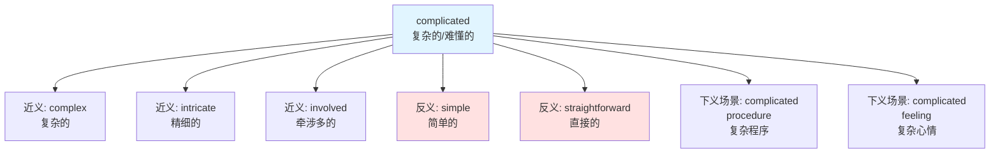
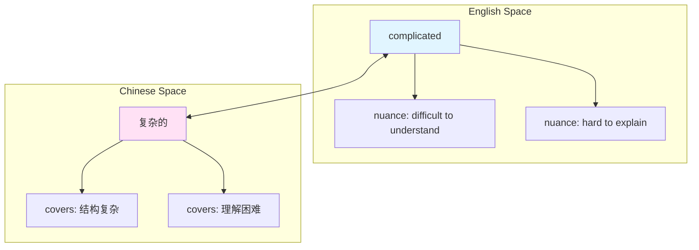
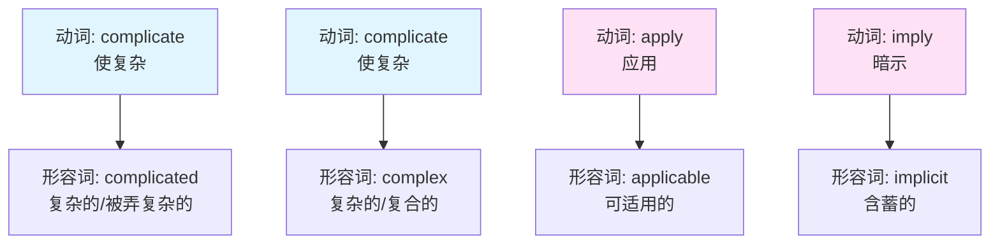

# complicated

## 基础信息

| 项目 | 内容 |
|------|------|
| **英文** | complicated |
| **音标** | /ˈkɒmplɪkeɪtɪd/ |
| **词性** | 形容词 |
| **中文** | 复杂的、难懂的、错综的 |

## 概念分析

### 一词多义

1. **复杂的、难懂的** - difficult to understand or explain
   - *a complicated problem* (复杂的问题)
2. **错综的、纠结的** - involving many closely related parts
   - *complicated relationships* (复杂的关系)

### 同义词网络

| 词 | 细微差别 |
|-----|----------|
| **complex** | 多部分互联（中性） |
| **complicated** | 难以理解（偏负面） |
| **intricate** | 精细复杂（偏正面） |
| **convoluted** | 过于曲折（贬义） |
| **sophisticated** | 高度复杂（正面） |

### 反义词

- simple（简单的）
- straightforward（直接的）
- uncomplicated（不复杂的）

## 关系图谱



### 英汉概念映射



## 英汉对比

| 特征 | 英语 | 汉语 |
|------|------|------|
| **语义细分** | complex（结构） vs complicated（理解难度） | 复杂的（统称） |
| **褒贬色彩** | 可褒可贬 | 偏中性 |
| **搭配限制** | 常与 problem, situation, matter 搭配 | 可与更多名词搭配 |

## 实际应用

### 场景 1：技术问题

> **English**: The debugging process was complicated by multiple concurrent issues.
>
> **中文**: 调试过程因多个并发问题而变得**复杂**。

### 场景 2：人际关系

> **English**: They have a complicated relationship after the breakup.
>
> **中文**: 分手后，他们的关系变得**很复杂**。

### 场景 3：情感表达

> **English**: It's complicated - I can't explain in a few words.
>
> **中文**: 情况**很复杂**，几句话说不清楚。

## 深度洞察

### 1. 英语的语义精细度

英语区分 **complex**（多部分互联，中性）和 **complicated**（难理解，偏负面），而汉语"复杂的"一词覆盖两个概念。

```
complex system = 复杂的系统（结构复杂）
complicated system = 复杂的系统（难以理解）
```

### 2. 隐性褒贬差异

- **complicated** 常暗示"难处理"
- **complex** 则更客观描述"多组件"
- 汉语"复杂的"通过语境判断褒贬

### 3. 文化语境

英语在描述感情状态时常用 **"It's complicated"**（如 Facebook 关系状态），已成为固定表达，汉语对应说法"很复杂"使用频率较低。

## 关键要点

### 选用决策树

```
需要表达"复杂"?
├── 描述结构复杂？
│   └── 用 complex（中性）
├── 强调难理解/难处理？
│   └── 用 complicated（偏负面）
└── 描述精细复杂？
    └── 用 intricate（正面）
```

### 记忆口诀

```
结构复杂用 complex
理解困难 complicated
精巧细致 intricate
直截了反 opposite
```

## 词源衍生

### 词根：plic (fold, 折叠)



**同根词族**：
- **complicate** (v.) - 使变复杂
- **complication** (n.) - 并发症、复杂情况
- **complex** (adj.) - 复杂的（更中性）
- **complexity** (n.) - 复杂性

### 衍生句组（理解转换）

> She tried to **explain** the theory, but it became too **complicated** to understand.
>
> 她试图**解释**这个理论，但它变得太**复杂**而难以理解。

> The **complicated** situation led to several **complications**.
>
> 这种**复杂**的局面导致了诸多**并发症**。

---

📝 **Notes created**: 2026-01-06
🔗 **Related**: [[complex]], [[intricate]], [[Vocabulary]]
