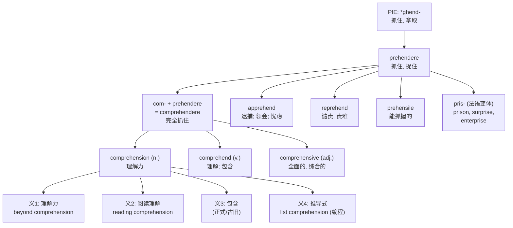

# comprehension

## 1. 基础信息 (Basic Info)

**音标**：英 /ˌkɒmprɪˈhenʃn/ 美 /ˌkɑːmprɪˈhenʃn/

**词性与释义**：

- **n.** [U] the ability to understand something, or the act of understanding — 理解力，领悟力
- **n.** [U] the act of including or containing — 包含，包括（较古旧/正式）
- **n.** [C/U] (British English, Education) an exercise testing students' understanding of written or spoken language — 阅读/听力理解（练习）
- **n.** (Computing) a concise syntax for constructing collections — 推导式（如 Python 的 list comprehension）

---

## 2. 词源与演变 (Etymology & Evolution)

**起源**：15世纪中期，经古法语 *comprehénsion* 进入英语，直接源自拉丁语 **comprehensionem**（主格 *comprehensio*），意为"抓住、理解"。

**词根拆解**：
- **com-**（完全地，thoroughly）— 强调前缀
- **prehendere**（抓住，to seize）→ 来自 **prae-**（在前面）+ ***-hendere**（抓取），PIE 词根 ***ghend-**（抓住、拿取）

**核心隐喻**：comprehension 的字面义是"完全抓住"（to grasp completely）。从物理上的"抓住"到心智上的"理解"，这一隐喻在英语中极为常见——我们说 *grasp an idea*、*catch the meaning*、*seize the point*，都是同一个"抓住 = 理解"的认知隐喻。

**语义演变时间线**：
- **15世纪中期**：理解的行为或事实（act of understanding）
- **1540年代**：包含的行为（act of including）
- **1590年代**：心智的理解能力（mental faculty of understanding）
- **1921年**：教育领域的"阅读理解"练习（reading comprehension exercise）
- **现代**：计算机科学中的"推导式"（list/dict/set comprehension）

---

## 3. 核心概念图谱 (Concept Graph)



---

## 4. 扩展词汇 (Vocabulary Expansion)

### 近义词 (Synonyms)

| 近义词 | 差异说明 |
|--------|---------|
| **understanding** | 最通用的同义词，口语书面均可，语域中性；comprehension 更正式、更学术 |
| **grasp** | 强调"抓住要点"的瞬间感，常用于 *have a good grasp of*；comprehension 更强调持续的理解能力 |
| **apprehension** | 作"理解"义时非常正式且罕见，更常见义为"忧虑"或"逮捕"；与 comprehension 同根但语义分化 |
| **perception** | 侧重"感知、洞察"，强调通过感官或直觉获得认识；comprehension 侧重通过思维的深入理解 |
| **insight** | 强调"深刻洞见"，指穿透表面看到本质；comprehension 更强调全面理解 |
| **cognition** | 学术术语，指整个认知过程；comprehension 是 cognition 的一个子过程 |

### 反义词 (Antonyms)

- **incomprehension** — 不理解，无法领会
- **confusion** — 困惑，混乱
- **ignorance** — 无知，不了解
- **bewilderment** — 迷惑，茫然

### 派生词 (Derivatives)

| 派生词 | 词性 | 含义 |
|--------|------|------|
| **comprehend** | v. | 理解，领悟；包含 |
| **comprehensive** | adj. | 全面的，综合的；广泛的 |
| **comprehensible** | adj. | 可理解的，能懂的 |
| **incomprehensible** | adj. | 不可理解的，费解的 |
| **incomprehension** | n. | 不理解，无法领会 |
| **comprehensively** | adv. | 全面地，彻底地 |

### prehend- 词根家族

| 同根词 | 构词逻辑 | 含义 |
|--------|---------|------|
| **apprehend** | ad-(朝向) + prehend(抓) | 逮捕；领会；忧虑 |
| **apprehension** | — | 逮捕；领悟；忧虑 |
| **reprehend** | re-(反) + prehend(抓) | 谴责，责难 |
| **reprehensible** | — | 应受谴责的 |
| **prehensile** | prehens + -ile | 能抓握的（如猴尾） |
| **prison** | pris-(法语变体) | 监狱（被抓住的地方） |
| **surprise** | sur-(从上方) + prise(抓) | 惊讶（从上方突然被抓住） |
| **enterprise** | enter-(之间) + prise(抓) | 企业；进取心（在机会间抓取） |
| **comprise** | com-(一起) + prise(抓) | 包含，由…组成 |

---

## 5. 搭配与用法 (Collocations & Usage)

### 高频搭配 (Collocations)

**"理解力"义**：
- beyond comprehension — 超出理解范围，不可理喻
- past / above comprehension — 无法理解
- reading / listening comprehension — 阅读/听力理解
- comprehension skills / ability — 理解能力
- lack of comprehension — 缺乏理解
- aid / facilitate comprehension — 帮助/促进理解
- test / assess comprehension — 测试/评估理解力
- deep / full / thorough comprehension — 深入/全面/透彻的理解

**教育语境**：
- comprehension exercise / test / quiz — 理解练习/测试/小测
- comprehension passage — 阅读理解文章
- comprehension questions — 理解题

**编程语境**：
- list comprehension — 列表推导式
- dict comprehension — 字典推导式
- set comprehension — 集合推导式

### 典型例句 (Examples)

1. **日常/正式**：The sheer scale of the disaster was beyond human *comprehension*.（灾难的规模之大超出了人类的理解范围。）

2. **教育**：Students were given a *comprehension* test based on a short passage about climate change.（学生们做了一个关于气候变化短文的阅读理解测试。）

3. **学术**：Research shows that vocabulary size is strongly correlated with reading *comprehension* ability.（研究表明，词汇量与阅读理解能力密切相关。）

4. **商务**：To ensure *comprehension* across all teams, the memo was translated into three languages.（为确保所有团队都能理解，备忘录被翻译成了三种语言。）

5. **编程**：In Python, a list *comprehension* provides a concise way to create lists from existing iterables.（在 Python 中，列表推导式提供了一种从现有可迭代对象创建列表的简洁方式。）

---

## 6. 易混淆点与辨析 (Analysis & Confusing Points)

### comprehension vs. understanding

两者在"理解"义上高度重叠，但语域不同。*Understanding* 是日常最常用的词，口语书面皆宜，还可表示"谅解、默契"（如 *mutual understanding*）；*comprehension* 更正式、更学术，常出现在教育测试（reading comprehension）和正式文本中，且有"包含"的古义。日常对话中说 "I have no comprehension of..." 会显得过于正式，通常说 "I don't understand..."。

### comprehension vs. apprehension

两者同根（prehend- = 抓），但语义大幅分化。*Comprehension* 专注于"理解"；*apprehension* 虽然也有"领会"义，但在现代英语中最常见的含义是"忧虑、担心"（anxiety）和"逮捕"（arrest）。用 *apprehension* 表示"理解"属于非常正式的用法，容易引起歧义。

### comprehension vs. comprehensive

词性不同但常混淆。*Comprehension*（n.）= 理解力；*comprehensive*（adj.）= 全面的、综合的。注意 *comprehensive* 并不意味着"可理解的"——那是 *comprehensible*。

### 编程中的 comprehension

在 Python 等编程语言中，*comprehension* 指一种简洁的集合构建语法（如 `[x**2 for x in range(10)]`）。这一用法源自数学集合论中的"集合构建符号"（set-builder notation），与日常"理解"义无关，而是取 comprehension 的古义"包含、涵盖"——即用一个表达式"包含"所有满足条件的元素。

---

## 7. 总结与记忆 (Summary & Memory)

### 口诀 (Mnemonic)

> **"com（完全）+ prehend（抓住）→ 完全抓住 → 理解"**
> 想象你伸出双手，把一个复杂的概念**完全抓住**（comprehend），牢牢握在手心——这就是 comprehension。同根词 prison（监狱）= 被抓住的地方，surprise（惊讶）= 从上方突然被抓住。**抓住 = 理解**，这是英语中最核心的认知隐喻之一。

### 决策树 (Decision Tree)

```
想表达"理解"？
├── 日常口语/通用 → understanding
├── 正式/学术/教育测试 → comprehension
├── 强调"抓住要点" → grasp
├── 强调"感知/洞察" → perception
├── 强调"深刻洞见" → insight
└── 学术/认知科学术语 → cognition

comprehension 的语境？
├── 理解力/理解能力 → "beyond comprehension"
├── 教育测试 → "reading/listening comprehension"
├── 编程 → "list/dict comprehension"
└── 包含 (古旧/正式) → 现代英语中罕用

prehend- 家族怎么记？
├── com-(完全) + prehend → comprehend 理解
├── ap-(朝向) + prehend → apprehend 逮捕/领会/忧虑
├── re-(反) + prehend → reprehend 谴责
├── sur-(从上) + prise → surprise 惊讶
├── com-(一起) + prise → comprise 包含
└── pris- → prison 监狱
```
