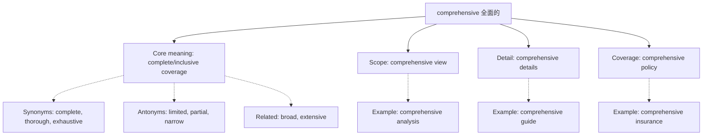

## Basic Info
- **English**: comprehensive /ˌkɒmprɪˈhensɪv/
- **Chinese**: 全面的 (quánmiàn de) / 完全的 (wánquán de) / 综合的 (zònghé de)
- **Parts of Speech**: adjective
- **Primary Meanings**: inclusive, complete, thorough, covering all aspects

## Semantic Evolution
The word "comprehensive" derives from Latin "comprehensivus", from "comprehendere" (to grasp completely). The root combines "com-" (together) and "prehendere" (to seize/grasp), originally meaning "able to grasp or understand completely". The meaning has remained relatively stable, focusing on completeness and inclusiveness.

## Conceptual Analysis

### Polysemy (Multiple Related Meanings)
- **Scope**: covering all aspects (comprehensive study)
- **Detail**: thorough and extensive (comprehensive details)
- **Inclusion**: all-encompassing (comprehensive insurance)
- **Understanding**: able to comprehend widely (comprehensive mind)

### Synonymy and Related Terms
- **Synonyms**: complete, thorough, extensive, exhaustive, all-inclusive
- **Antonyms**: limited, partial, narrow, incomplete, superficial
- **Near-synonyms**: broad, wide-ranging, holistic (with subtle differences)

## Mermaid Relationship Graph

## Cross-linguistic Comparison Table
| Aspect | English "comprehensive" | Chinese Equivalents | Notes |
|--------|-------------------------|-------------------|-------|
| **Connotation** | Positive, thorough | 正面 (zhèngmiàn) | Similar positive valence |
| **Scope** | Broad application | Context-dependent | Chinese uses different terms based on context |
| **Nuance** | Emphasizes completeness | Emphasizes totality | Slight conceptual difference |
| **Usage** | Adjective only | Flexible usage | Chinese allows more grammatical flexibility |

## Usage Examples

1. **Academic Context**: "The book provides a comprehensive overview of modern physics." → "这本书全面概述了现代物理学。"
2. **Insurance Context**: "We offer comprehensive health insurance coverage." → "我们提供全面的健康保险覆盖。"
3. **Study Context**: "This was a comprehensive study of the problem." → "这是一项对该问题的综合研究。"

## Deep Insights

1. **Cultural/Linguistic Gap**: English "comprehensive" emphasizes the process of "grasping together" while Chinese "全面的" emphasizes the spatial metaphor of "all sides".
2. **Semantic Precision**: English "comprehensive" implies systematic inclusion of all relevant parts, while Chinese equivalents may emphasize the extent of coverage.
3. **Register Differences**: "Comprehensive" has formal-academic usage that maps well to Chinese academic terminology.

## Key Takeaways

### Decision Tree for Translation
- **If describing coverage/scope**: → 全面的 (quánmiàn de)
- **If describing understanding/ability**: → 综合的 (zònghé de) 
- **If describing completeness**: → 完全的 (wánquán de)
- **If in academic context**: → 全面的 or 综合的 depending on nuance

### Memory Mnemonic
**"Comprehensive = Com-prehend-all"**: Remember the etymology - "com" (together) + "prehend" (grasp) = "grasp together completely".

## Etymology Derivation
- Latin "comprehensivus" ← "comprehendere" (to grasp completely)
- Evolution: comprehendere (grasp together) → comprehensivus (able to grasp completely) → comprehensive
- Shows semantic consistency from Latin to modern English