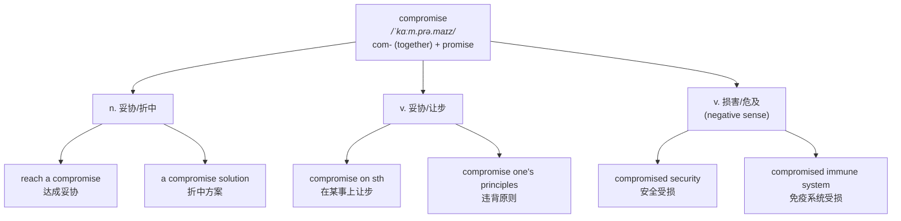

# compromise

## 1. 基础信息 (Basic Info)

| Item | Detail |
|------|--------|
| **Phonetics** | /ˈkɑːm.prə.maɪz/ (US); /ˈkɒm.prə.maɪz/ (UK) |
| **POS** | **n.** & **v.** |
| **Syllables** | com-pro-mise (3 syllables) |

**English Definitions:**
- **n.** An agreement reached by each side making concessions.
- **n.** A middle ground between two extremes.
- **v.** To reach an agreement by mutual concession.
- **v.** To expose something to danger or lower standards (negative sense).

**Chinese Translations:**
- 妥协，折中，让步
- 妥协方案，折中办法
- 损害，危及，连累（贬义）

---

## 2. 词源与演变 (Etymology & Evolution)

**Origin**: Late Middle English (early 15th century), from Latin *compromittere* — *com-* (together) + *promittere* (to promise).

**Literal meaning**: "To make a mutual promise" — originally a legal term where both parties in a dispute agreed in advance to accept the decision of an arbitrator.

**Meaning Shift**:
1. **Legal → General** (15c→17c): From a formal arbitration pledge to any mutual agreement through concession.
2. **Neutral → Negative** (19c): Extended to mean "to expose to danger or suspicion" — as in compromising one's principles, reputation, or security. This negative sense implies yielding something valuable.

**Root Logic**: "Mutual promise" → both sides give something up → the resulting middle ground.

---

## 3. 核心概念图谱 (Concept Graph)



---

## 4. 扩展词汇 (Vocabulary Expansion)

### 近义词 (Synonyms)

| Word              | Nuance          | Register        |
| ----------------- | --------------- | --------------- |
| **concession**    | 强调单方面的让步，不一定是双方 | Formal          |
| **settlement**    | 正式解决争端的结果       | Formal / Legal  |
| **middle ground** | 中间立场，比喻性表达      | Neutral         |
| **trade-off**     | 侧重"用A换B"的权衡取舍   | Business / Tech |
| **accommodation** | 为迁就对方而做的调整      | Formal          |

**Key Distinction**: *Compromise* implies **both sides** give something up; *concession* is usually **one-sided**.

### 反义词 (Antonyms)

| Word | Context |
|------|---------|
| **intransigence** | 拒绝妥协的强硬态度 |
| **stand / holdout** | 坚持不退让 |
| **confrontation** | 正面对抗而非让步 |

### 派生词 (Derivatives)

| Form | Word | Example |
|------|------|---------|
| adj. | **compromising** | compromising position (尴尬的处境) |
| adj. | **uncompromising** | uncompromising stance (不妥协的立场) |
| n. | **compromiser** | 善于折中的人 |
| adv. | **uncompromisingly** |毫不妥协地 |

---

## 5. 搭配与用法 (Collocations & Usage)

### 高频搭配 (Collocations)

| Pattern | Collocation | Chinese |
|---------|-------------|---------|
| verb + n. | **reach / arrive at / come to** a compromise | 达成妥协 |
| verb + n. | **make** a compromise | 做出让步 |
| adj. + n. | **acceptable / workable** compromise | 可接受的折中方案 |
| adj. + n. | **ugly / messy** compromise | 不得已的妥协 |
| v. + prep. | compromise **on** quality / safety | 在质量/安全上打折扣 |
| v. + n. | compromise one's **integrity / principles** | 损害正直/违背原则 |
| v. + n. | compromise **national security** | 危害国家安全 |

### 典型例句 (Examples)

**Business:**
> After hours of negotiation, both parties reached a compromise that allowed the deal to go through.
> 经过数小时谈判，双方达成了一个让交易得以进行的折中方案。

**Daily Life:**
> We compromised on pizza — I wanted sushi, he wanted burgers.
> 我们在披萨上折中了——我想吃寿司，他想吃汉堡。

**Academic / Tech:**
> Every engineering design involves trade-offs and compromises between performance and cost.
> 每个工程设计都涉及性能与成本之间的权衡和折中。

**Politics:**
> The senator refused to compromise on environmental regulations, even under pressure.
> 这位参议员即使在压力下也拒绝在环保法规上做出妥协。

**Security (Negative Sense):**
> The data breach compromised the personal information of millions of users.
> 这次数据泄露危及了数百万用户的个人信息。

---

## 6. 易混淆点与辨析 (Analysis & Confusing Points)

### compromise vs. concession

| Aspect | Compromise | Concession |
|--------|-----------|------------|
| **Direction** | 双向 — 双方各让一步 | 单向 — 一方做出的让步 |
| **Result** | 中间方案 | 一方放弃某立场 |
| **Example** | We compromised at $50. | We made a concession and lowered the price. |

### compromise (neutral) vs. compromise (negative)

| Sense | Meaning | Tone |
|-------|---------|------|
| **Negotiation sense** | 达成折中 | Positive / Neutral |
| **Integrity sense** | 违背原则、降低标准 | Negative |
| **Security sense** | 损害、危及 | Negative |

**Tip**: Context tells you which sense. "Compromise *on* price" = neutral. "Compromise *safety*" = negative.

### Pronunciation Note

No pronunciation difference between noun and verb — stress is always on the **first syllable**: /ˈkɑːm-/. This is unusual for noun-verb pairs (cf. *record*, *object* where stress shifts).

---

## 7. 总结与记忆 (Summary & Memory)

### 口诀 (Mnemonic)

> **Com**-promise = **共同**许**诺** → 双方各退一步 → 妥协
> 记住负面含义：妥协太多 = 损害原则

### 决策树 (Decision Tree)

```
你需要表达"让步/折中"？
├── 双方互相让步 → compromise
├── 单方面退让 → concession
├── 权衡取舍（A换B）→ trade-off
└── 正式解决争端 → settlement

你需要表达"损害/危及"？
├── 安全/健康受损 → compromised (adj.)
├── 名誉/立场受损 → compromise one's reputation
└── 原则被打破 → compromise one's principles
```

---

## Related

![[Backlinks.base]]
