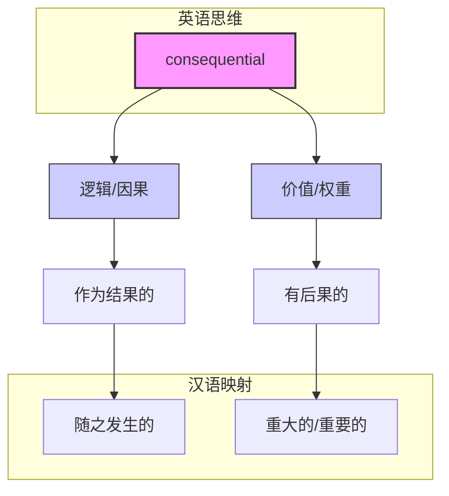

# consequential

> [!abstract] 核心概念
> **consequential** 的核心在于 **“后果 (consequence)”**。
> 1.  **逻辑上**：因为有后果，所以是 **“随之发生的”** (following as a result)。
> 2.  **价值上**：因为后果很严重/巨大，所以是 **“重要的”** (having important consequences)。

## 1. 基础信息

- **词性**: Adjective
- **音标**: /ˌkɒnsɪˈkwɛnʃəl/
- **基本释义**:
    - (逻辑/事件) 随之发生的，作为结果的
    - (价值/影响) 重要的，有深远影响的，重大的
    - (人/态度) 自以为是的 (较少用)

## 2. 词义演化

- **词源**: 源自拉丁语 *consequentia*，由 *con-* (with) + *sequi* (to follow) 组成。
- **演变逻辑**:
    - 最初指“紧随其后的” (following closely)。
    - 引申为逻辑上的“作为结果发生的” (following as an effect)。
    - 进一步引申：如果一个事情带来的结果很大，它就是“有后果的”，即 **“重要的”** (having significant consequences)。
    - 反义词 **inconsequential** (无关紧要的) 在现代英语中比 *consequential* 的“重要的”义项使用频率更高，反向强化了 *consequential* 代表“重要”的概念。

## 3. 概念图谱

## 4. 英汉对比特征

| 维度 | 英语 (Consequential) | 汉语 (随之发生的 vs 重要的) | 差异分析 |
| :--- | :--- | :--- | :--- |
| **语义范围** | **双重性**：既指“果”，也指“重” | **分离性**：通常用不同词汇表达 | 英语用同一个词表达“因果联系”和“重要性”，暗示了**重要性往往源于其后果**。 |
| **侧重点** | 侧重于**后果 (Consequence)** | 侧重于**价值 (Value)** | 汉语说“重要”强调本身价值；英语说 *consequential* 强调其引发的后果。 |
| **反义词** | *Inconsequential* (极常用) | *不重要的* / *琐碎的* | *Inconsequential* 是高频词，常用于指责某事琐碎；*Consequential* 作“重要的”讲时相对正式。 |

## 5. 典型场景与用法

### 场景 A：逻辑与法律 (Resultant)
指由某事引起的、随之而来的。
> "The **consequential** damages were far higher than the direct costs."
> **随之发生的**损害赔偿远高于直接成本。
> *(注：法律术语 consequential loss/damages 指间接损失)*

### 场景 B：重要性与决策 (Significant)
指事情影响深远，不能忽视。
> "This is a **consequential** decision that will shape the company's future for years."
> 这是一个**重大的**决定，将塑造公司未来数年的走向。

### 场景 C：否定用法 (Inconsequential)
指琐碎、微不足道（这是最常见的相关用法）。
> "Don't worry about **inconsequential** details; focus on the big picture."
> 别纠结那些**无关紧要的**细节，关注大局。

## 6. 深度洞察

1.  **"后果"即"分量"**：在英语思维中，一个东西之所以重要，往往是因为它有 **consequences**。如果一个行为没有后果，它就是 *inconsequential* (无关紧要的)。
2.  **法律特指**：在合同和法律语境中，*consequential* 通常特指“间接的但由因果关系导致的” (consequential damages)，这与“重要的”义项容易混淆，需注意上下文。
3.  **正式程度**：用 *consequential* 表示“重要”，比 *important* 更正式，比 *significant* 更强调“由于其后果而显得重要”。

## 7. 总结与记忆

### 💡 核心口诀
> **有果随之来，后果显分量。**
> **逻辑指发生，价值指重大。**

### 🌳 决策树
- 是指“由某事引起的”？ -> 译为 **“随之发生的”** (e.g., consequential loss)
- 是指“影响很大的”？ -> 译为 **“重大的 / 重要的”** (e.g., consequential decision)
- 是指“琐碎的”？ -> 用反义词 **inconsequential**
