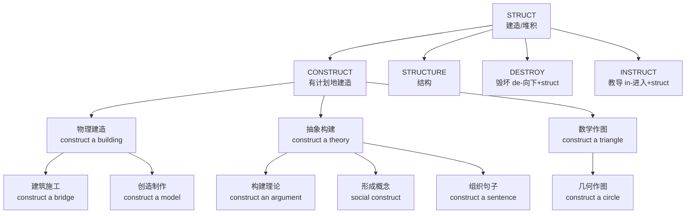

# construct

## 1. 基础信息 (Basic Info)

**音标**: /kənˈstrʌkt/ (v.) /ˈkɒnstrʌkt/ (n.)
**词性**: v. / n.

**英文定义**:
- v. to build or make something such as a building, bridge, or road
- v. to form something by putting different things together
- v. to draw a geometric figure
- n. an idea or theory containing various conceptual elements

**中文翻译**: 建造、建设；构建、组成；构想、概念

---

## 2. 词源与演变 (Etymology & Evolution)

- **拉丁语**: *construere* = *con-* (一起) + *struere* (堆积、建造)
- **词根**: *struct* = 建造/结构 (同根词: structure, instruct, destroy)
- **演变**: 物理"建造" → 抽象"构建理论/概念" → 数学"作图"

---

## 3. 核心概念图谱 (Concept Graph)



---

## 4. 扩展词汇 (Vocabulary Expansion)

### 近义词 (Synonyms)

| 单词 | 含义 | 与 construct 的区别 |
|------|------|-------------------|
| **build** | 建造 | 最常用，泛指建造，construct 更强调"有计划/系统的建造" |
| **make** | 制作 | 最宽泛，construct 强调"从零开始组装/构建" |
| **create** | 创造 | 强调"原创性"，construct 强调"按设计组装" |
| **assemble** | 组装 | 强调"把零件拼在一起"，construct 强调"整体构建过程" |
| **erect** | 竖立 | 强调"使直立"，常用于建筑物 |
| **fabricate** | 制造 | 可指"编造谎言"，construct 更中性 |

### 反义词 (Antonyms)
- destroy (毁坏)
- demolish (拆除)
- dismantle (拆卸)
- deconstruct (解构)

### 派生词 (Derivatives)
- **construction** n. 建造；建筑业；解释
- **constructor** n. 建造者；构造函数
- **constructive** adj. 建设性的；积极的
- **reconstruct** v. 重建；重现

---

## 5. 搭配与用法 (Collocations & Usage)

### 高频搭配 (Collocations)

| 类型 | 搭配 | 例句 |
|------|------|------|
| **动词+名词** | construct a building | They constructed a new office building downtown. |
| | construct a bridge | The engineers constructed a suspension bridge. |
| | construct a theory | He constructed a compelling theory about evolution. |
| | construct an argument | Lawyers need to construct solid arguments. |
| | construct a sentence | Children learn to construct complex sentences. |
| **形容词+名词** | social construct | Gender is often viewed as a social construct. |
| | theoretical construct | Time is a theoretical construct in physics. |
| **介词搭配** | under construction | The highway is under construction. |

### 典型例句 (Examples)

1. **建筑场景**: *It took two years to construct the skyscraper.* (建造这座摩天大楼花了两年时间)
2. **学术场景**: *She constructed a new framework for analyzing data.* (她构建了一个分析数据的新框架)
3. **日常场景**: *Let's construct a plan before we start.* (开始前我们先制定一个计划)
4. **数学场景**: *Use a compass to construct a perfect circle.* (用圆规画一个完美的圆)
5. **社会学**: *Race is a social construct, not a biological fact.* (种族是社会建构，不是生物学事实)

---

## 6. 易混淆点与辨析 (Analysis & Confusing Points)

### construct vs build
- **construct**: 正式、有计划、系统性
  - *They constructed a dam to control flooding.* (工程性质)
- **build**: 通用、口语化
  - *He built a treehouse for his kids.* (日常性质)

### construct vs create
- **construct**: 按设计组装/构建
  - *Construct a model from LEGO bricks.* (按说明书组装)
- **create**: 从无到有创造
  - *Create a masterpiece from imagination.* (原创创作)

### construct vs fabricate
- **construct**: 中性，指实际建造
- **fabricate**: 可指"编造/伪造"，带负面含义
  - *He fabricated evidence to support his claim.* (伪造证据)

### 发音变化
- 动词: /kənˈstrʌkt/ (重音在第二音节)
- 名词: /ˈkɒnstrʌkt/ (重音在第一音节)

---

## 7. 总结与记忆 (Summary & Memory)

### 口诀 (Mnemonic)
> **"Con-一起 struct-堆，有计划地建起来"**
> 
> **"动词重音在后，名词重音在前"**

### 决策树 (Decision Tree)
```
需要表达"建造/构建"时：
├── 是正式/工程/学术场合？→ 用 construct
│   └── 是建筑/桥梁？→ construct
│   └── 是理论/论点？→ construct
│   └── 是几何作图？→ construct
├── 是日常口语？→ 用 build
├── 是强调原创创造？→ 用 create
├── 是组装零件？→ 用 assemble
└── 是负面/伪造含义？→ 用 fabricate
```

### 同根词家族
```
STRUCT = 建造/结构
├── construct (v.) 建造
├── structure (n.) 结构
├── instruct (v.) 教导 (in-进入 + struct = 把知识建进去)
├── destroy (v.) 毁坏 (de-向下 + struct = 拆毁)
├── reconstruct (v.) 重建 (re-重新)
└── infrastructure (n.) 基础设施 (infra-下面)
```
