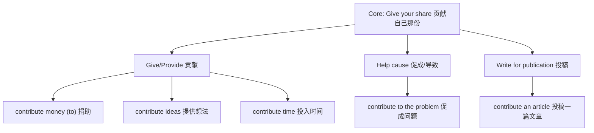

contribute :: 
<!--ID: 1771725387956-->

# contribute

## 1. 基础信息 (Basic Info)

- **词性**: Verb
- **音标**: /kənˈtrɪbjuːt/
- **释义**:
    - **v.** 贡献（时间/金钱/想法）(give, provide, or add something)
    - **v.** 促成，导致 (help to cause something)
    - **v.** 投稿，撰稿 (write for a publication)

## 2. 词源与演变 (Etymology & Evolution)

- **词源**: 源自拉丁语 *contribuere*：*con-* (together) + *tribuere* (to assign, allot, give)。
- **核心逻辑**: **"Give together"（把自己的那份放进共同池子里）**。
- **演变路径**:
    - 从“分配/给出一份” -> “为共同目标出一份力” -> **贡献**。
    - 进一步抽象：一个因素“把自己的那份因果力量”放进结果里 -> **促成/导致**。
    - 媒体语境：把文章“交付/投递”给刊物 -> **投稿**。

## 3. 核心概念图谱 (Concept Graph)

## 4. 扩展词汇 (Vocabulary Expansion)

### 近义词 (Synonyms)
- **Contribute**: 强调“共同池子/共同目标”，语气中性偏积极。
- **Donate**: 强调“捐赠”（多指金钱/物资），对象通常是机构/慈善。
- **Give**: 最通用，信息量最少。
- **Chip in**: 口语，强调“大家凑一凑/出一份”。
- **Provide**: 强调“提供（所需资源）”，不一定有“共同贡献”的含义。

### 反义词 (Antonyms)
- **Withhold**: 扣住不给，保留不提供。
- **Take**: 只拿不出（语义上对立，不是严格反义）。
- **Deter** (在“促成”义项上): 阻止/抑制（倾向相反）。

### 派生词 (Derivatives)
- **Contribution** (n.): 贡献；捐款；稿件/投稿。
- **Contributor** (n.): 贡献者；撰稿人。
- **Contributory** (adj.): 促成的；起作用的（较正式，常见于 *contributory factors*）。

## 5. 搭配与用法 (Collocations & Usage)

### 高频搭配 (Collocations)
- **contribute to + N**: 促成/导致；也可指“为…做贡献”。
    - *contribute to success*（促成成功/为成功贡献）
    - *contribute to the problem*（导致问题）
- **contribute + N**:
    - *contribute money/time/effort*（捐钱/投入时间/付出努力）
    - *contribute an article*（投稿）
- **be a contributing factor**: 是一个促成因素（报告/论文高频）。

### 典型例句 (Examples)
- **协作/团队 (Work)**:
    > "Everyone is encouraged to **contribute ideas** during the meeting."
    > 会议期间鼓励每个人**贡献想法**。
- **因果/分析 (Cause)**:
    > "Stress and lack of sleep can **contribute to** poor decision-making."
    > 压力和睡眠不足会**导致/促成**糟糕的决策。
- **出版/媒体 (Publishing)**:
    > "She **contributes** regularly to several tech magazines."
    > 她定期为几家科技杂志**撰稿**。
- **捐助/公益 (Donation)**:
    > "Many people **contributed** to the relief fund."
    > 许多人为救助基金**捐款**。

## 6. 易混淆点与辨析 (Analysis & Confusing Points)

- **Contribute vs. Donate**:
    - *Donate* 更像“给出去就结束”，侧重慈善与无偿捐赠。
    - *Contribute* 更像“加入共同目标”，可以是钱、时间、想法、文章，也可以是“促成某结果”。
- **Contribute to 的双面性**:
    - 可正可负：*contribute to success*（正） vs *contribute to the crisis*（负）。
    - 写作时若要避免歧义，可用：
        - 正向：*help improve / support / advance*
        - 负向：*lead to / result in / fuel*

## 7. 总结与记忆 (Summary & Memory)

### 💡 口诀 (Mnemonic)
> **Con- 一起，tribute 给份，**
> **出一份力进共同池。**
> **既可捐助也可投稿，**
> **还能“促成”结果成。**

### 🌳 决策树 (Decision Tree)
- 指出钱/出力/出主意？ -> **contribute (money/time/ideas)**。
- 指“导致/促成某结果”？ -> **contribute to + result**。
- 指“给杂志写文章”？ -> **contribute (to) a publication / contribute an article**。
