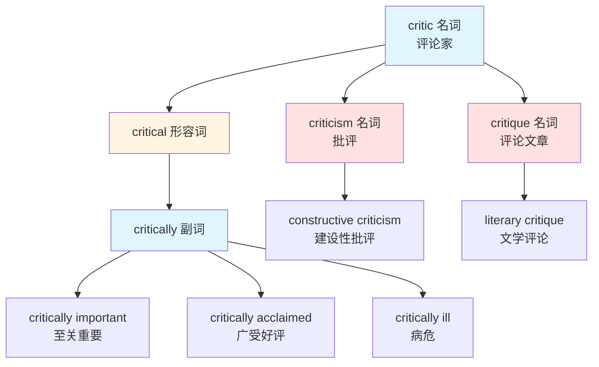
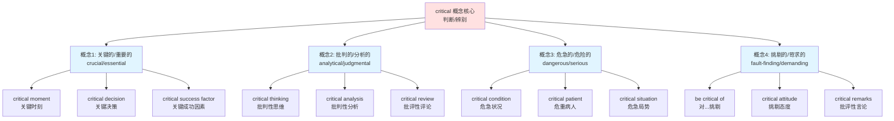

# critical

## 基础信息

| 项目 | 内容 |
|------|------|
| **英文** | critical /ˈkrɪtɪkl/ |
| **词性** | 形容词 |
| **中文对应** | 关键的、批判的、危急的、挑剔的 |

## 概念分析

### 一词多义（核心特征）

**critical** 是一个典型的一词多义形容词，包含 4 个主要概念分支：

1. **关键的/重要的**（crucial, essential）
   - 指决定性的、不可或缺的
   - 强调对结果有重大影响

2. **批判的/批评的**（critical, judgmental）
   - 指进行分析和评价的
   - 强调理性判断和审视

3. **危急的/危险的**（dangerous, serious）
   - 指处于危险状态的
   - 强调严重性和紧迫性

4. **挑剔的/爱批评的**（fault-finding）
   - 指容易发现缺点的
   - 带有负面情绪色彩

### 词族关系



### 概念分支图谱



## 英汉对比

| 维度 | 英语特征 | 汉语特征 |
|------|----------|----------|
| **词汇统一性** | 一个词覆盖多个相关概念 | 需要不同词汇区分（关键的/批判的/危急的） |
| **词源联系** | 所有含义都源自"判断/辨别" | 不同词汇间无形式联系 |
| **使用频率** | critical 是高频学术词汇 | 分散在多个词汇中 |
| **褒贬色彩** | 中性（学术/专业）为主 | 分散词汇中有褒有贬 |

**核心差异**：
- 英语 **critical** 通过"判断"这一核心概念，将"关键决策、批判思维、危急状况、挑剔态度"统一在一个词下
- 汉语需要用**关键的**（重要）、**批判的**（思维）、**危急的**（状况）、**挑剔的**（态度）分别表达
- 英语体现了词源的概念统一性（krit = 判断），汉语体现了实用的分类性

## 实际应用

### 场景 1：关键决策（重要）

**英文**：
> "This is a critical moment for our company."
> （这对我们公司来说是关键时刻。）

**分析**：
- critical = 关键的、决定性的
- 强调对结果有重大影响
- 中性或正面色彩

**对比**：
> "Success depends on critical factors."
> （成功取决于关键因素。）
> - 强调不可或缺性

---

### 场景 2：批判性思维（学术）

**英文**：
> "Students should develop critical thinking skills."
> （学生应该培养批判性思维能力。）

**分析**：
- critical thinking = 批判性思维（学术术语）
- 指理性分析、独立思考的能力
- 不等于"批评别人"，而是"审视观点"

**对比**：
> "A critical analysis of the policy."
> （对这项政策的批判性分析。）
> - 学术语境，指深入分析

---

### 场景 3：危急状况（医疗/紧急）

**英文**：
> "The patient remains in critical condition."
> （病人仍处于危急状况。）

**分析**：
- critical condition = 危急状况（医学术语）
- 指生命垂危的状态
- 强调严重性和紧迫性

**对比**：
> "The situation is critical."
> （局势危急。）
> - 强调危险程度

---

### 场景 4：挑剔态度（负面）

**英文**：
> "He is very critical of his colleagues."
> （他对同事很挑剔。）

**分析**：
- be critical of = 对...挑剔/苛求
- 带有负面情绪色彩
- 指容易发现缺点

**对比**：
> "Don't be so critical."
> （别那么挑剔。）
> - 口语中常用

---

### 场景 5：学术评论（中性）

**英文**：
> "The book received critical acclaim."
> （这本书广受好评。）

**分析**：
- critical acclaim = 评论界的赞誉
- critical 这里的含义是"评论界的"
- 中性或正面色彩

**对比**：
> "A critical review of the novel."
> （对这部小说的评论。）
> - 学术语境，指评价和分析

---

### 场景 6：副词用法

**英文**：
> "Time is running critically low."
> （时间极其紧张。）

**分析**：
- critically low = 极其低、危急地低
- critically 作为副词，表示"严重地"或"极度地"
- 强调程度

**对比**：
> "She is critically ill."
> （她病危。）
> - 医疗语境专用表达

## 深度洞察

### 1. 词源统一性的典型案例

**critical 完美体现了英语词源的概念统一性**：

```
希腊语词根：krit（判断、决定）
    ↓
kritikos（能够判断的）
    ↓
critical（形容词）
    ↓
分支含义：
├─ 关键的（需要判断的）→ critical decision
├─ 批判的（进行判断的）→ critical thinking
├─ 危急的（需要紧急判断的）→ critical condition
└─ 挑剔的（总是做判断的）→ critical attitude
```

**所有含义都围绕"判断"这一核心概念**：
- 关键时刻 → 需要**判断**的时刻
- 批判性思维 → 进行**判断**的思维方式
- 危急状况 → 需要**紧急判断**的状况
- 挑剔态度 → 总是在**做判断**的态度

### 2. 语境决定含义的机制

**critical 的含义高度依赖语境和搭配**：

| 搭配 | 含义 | 色彩 |
|------|------|------|
| **critical thinking** | 批判性思维 | 正面（学术） |
| **critical condition** | 危急状况 | 中性（医疗） |
| **critical moment** | 关键时刻 | 中性（通用） |
| **critical acclaim** | 评论界好评 | 正面（媒体） |
| **be critical of** | 挑剔、批评 | 负面（人际） |
| **critically ill** | 病危 | 中性（医疗） |

**关键要点**：
- 学术语境（thinking, analysis）→ 批判性的（正面）
- 医疗语境（condition, ill）→ 危急的（中性）
- 商业语境（decision, factor）→ 关键的（中性/正面）
- 人际语境（be critical of）→ 挑剔的（负面）

### 3. 批判性 ≠ 批评

**critical 最重要的误用**：

❌ **错误理解**：
> "Critical thinking = 批评别人的思维"

✅ **正确理解**：
> "Critical thinking = 独立判断、理性分析的思维"

**关键差异**：
- **批判性**（critical）：基于证据的分析，寻找真相
- **批评**（criticizing）：基于情绪的指责，寻找缺点

**批判性思维的特征**：
- 质疑假设
- 检验证据
- 分析逻辑
- 考虑多元视角
- 独立判断

这不是"挑错"，而是"求真"。

## 关键要点

### 翻译决策树

```
遇到 critical
│
├─ 出现在 thinking/analysis/review 中？
│   └─ 是 → 批判性的（学术分析）
│
├─ 出现在 condition/patient/ill 中？
│   └─ 是 → 危急的（医疗语境）
│
├─ 出现在 moment/decision/factor 中？
│   └─ 是 → 关键的、重要的
│
├─ 出现在 be critical of 结构中？
│   └─ 是 → 挑剔的、爱批评的
│
├─ 出现在 acclaim/reception 中？
│   └─ 是 → 评论界的
│
└─ 作为副词 critically？
    └─ 是 → 极度地、危急地
```

### 记忆口诀

```
Critical 一词多义强，
关键危急和批判。
Thinking 思维要批判，
Condition 危急在床边。
Moment 关键不能忘，
Acclaim 好评满堂传。
Be critical of 挑剔看，
语境决定答案现。
```

### 常见错误清单

| 错误 | 正确 | 原因 |
|------|------|------|
| Critical thinking = 批评思维 | **批判性**思维 | critical ≠ criticizing |
| He is critical = 他很关键 | 看语境 | 可能是"挑剔" |
| Critical condition = 关键状况 | **危急**状况 | 医疗术语固定含义 |
| A critical man = 关键人物 | **挑剔的**人 | be critical of 的省略 |

## 词源与演变

### 词根追踪

```
Proto-Indo-European: *krei-（筛分、辨别）
    ↓
Ancient Greek: krinein（判断、决定）
    ↓
Greek: kritikos（能够判断的）
    ↓
Latin: criticus
    ↓
Middle English: critic/critical
    ↓
Modern English: critical
```

### 同源词汇

- **critic**（评论家）← 名词形式
- **criticism**（批评）← 动作名词
- **critique**（评论文章）← 法语借词
- **criticize**（批评）← 动词形式
- **hypocritical**（虚伪的）← hypo（在下面）+ critical

### 词义演变

1. **古希腊时期**：kritikos = 能够判断、能够分辨
2. **罗马时期**：criticus = 评论家、批评家
3. **中世纪英语**：critical = 医学上的"危急"
4. **现代英语**：critical = 关键的 + 批判的 + 危急的 + 挑剔的

---

## 相关概念

- [[Crucial]]（关键的）
- [[Essential]]（必要的）
- [[Judgmental]]（爱评判的）
- [[Dangerous]]（危险的）
- [[Analysis]]（分析）

## 延伸学习

### 同义词对比

| critical | 同义词 | 细微差异 |
|----------|--------|----------|
| 关键的 | crucial | 更强调"决定性" |
| 关键的 | essential | 更强调"必要性" |
| 关键的 | vital | 更强调"生死攸关" |
| 批判的 | analytical | 更强调"分析性" |
| 危急的 | dangerous | 更强调"危险" |
| 挑剔的 | judgmental | 更强调"主观判断" |

### 学术写作必备搭配

**正面/中性**：
- critical thinking（批判性思维）
- critical analysis（批判性分析）
- critical examination（批判性审视）
- critical approach（批判性方法）
- critical perspective（批判性视角）

**医疗/紧急**：
- critical condition（危急状况）
- critically ill（病危）
- critical care（重症监护）
- critical moment（关键时刻）
- critical situation（危急局势）

**商业/管理**：
- critical success factor（关键成功因素）
- critical path（关键路径）
- critical resource（关键资源）
- critical mass（临界规模）

### 常见短语

- **be critical of**：对...挑剔/批评
- **be critical to**：对...至关重要
- **critically acclaimed**：广受好评
- **at a critical juncture**：在关键时刻
- **of critical importance**：至关重要的
