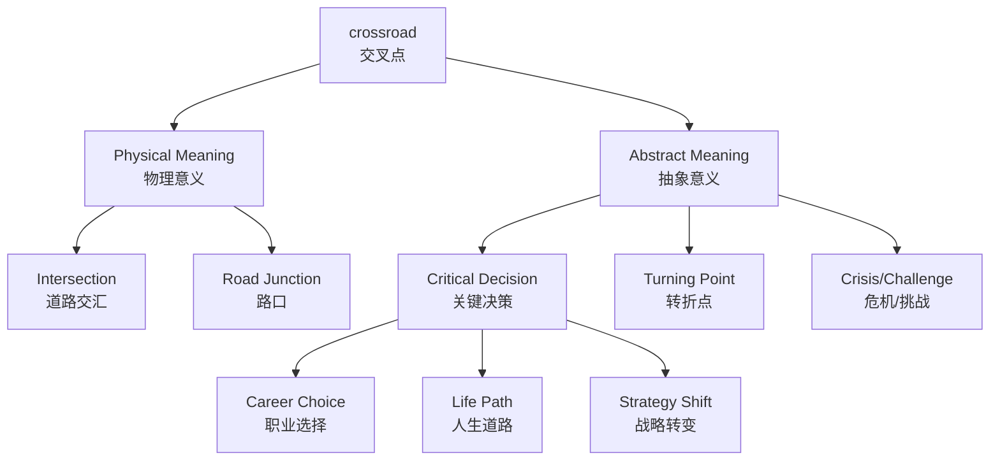

# crossroad

## 1. 基础信息 (Basic Info)

| 属性 | 内容 |
|------|------|
| **音标** | /ˈkrɒsrəʊd/ (英) /ˈkrɔːsroʊd/ (美) |
| **词性** | n. 名词 |
| **复数形式** | crossroads |
| **英文释义** | ① A place where two or more roads meet and cross each other<br>② A point at which a crucial decision must be made that will have far-reaching consequences |
| **中文释义** | ① 十字路口，交叉路口<br>② 转折点，关键时刻，重大抉择时刻 |

---

## 2. 词源与演变 (Etymology & Evolution)

- **词根构成**: cross (交叉) + road (道路)
- **起源**: 古英语时期，由两个独立词汇组合而成
- **演变**: 
  - 最初仅指物理意义上的道路交叉点
  - 14世纪开始引申为"重要抉择时刻"的比喻义
  - 常与 "at a crossroads" 搭配使用，表示处于人生的关键转折点

---

## 3. 核心概念图谱 (Concept Graph)



---

## 4. 扩展词汇 (Vocabulary Expansion)

### 近义词 (Synonyms)

| 词汇 | 含义侧重 | 使用场景 |
|------|----------|----------|
| **intersection** | 道路/线条的交叉点 | 交通、数学、几何 |
| **junction** | 连接点，枢纽 | 铁路、公路、管道 |
| **turning point** | 转折点 | 历史、人生、事件 |
| **watershed** | 分水岭 | 历史、政治、科学 |
| **crisis** | 危机，关键时刻 | 商业、政治、个人 |
| **pivotal moment** | 关键时刻 | 正式、书面语 |

**辨析**:
- **crossroad vs intersection**: crossroad 更常用于比喻义（人生抉择），intersection 更偏向物理交叉点
- **crossroad vs turning point**: turning point 强调变化的结果，crossroad 强调需要做出选择的状态
- **crossroad vs watershed**: watershed 强调前后截然不同，crossroad 强调选择的必要性

### 反义词 (Antonyms)

- **straight path** (直路) — 没有分岔，无需选择
- **dead end** (死胡同) — 无路可走
- **certainty** (确定性) — 无需抉择

### 派生词 (Derivatives)

| 形式 | 词汇 | 含义 |
|------|------|------|
| 单数 | crossroad | 交叉路口 |
| 复数 | crossroads | 十字路口（常用复数形式） |
| 相关词 | cross | v./n. 交叉，穿过 |
| 相关词 | crossing | n. 十字路口，人行横道 |

---

## 5. 搭配与用法 (Collocations & Usage)

### 高频搭配 (Collocations)

| 搭配类型 | 搭配 | 含义 |
|----------|------|------|
| 介词搭配 | **at a crossroads** | 处于十字路口/转折点 |
| 介词搭配 | **come to a crossroads** | 来到十字路口 |
| 介词搭配 | **reach a crossroads** | 到达转折点 |
| 动词搭配 | **face a crossroads** | 面临抉择 |
| 动词搭配 | **stand at a crossroads** | 站在十字路口 |
| 形容词搭配 | **crucial crossroads** | 关键转折点 |
| 形容词搭配 | **important crossroads** | 重要抉择时刻 |

### 典型例句 (Examples)

**场景 1: 日常/交通**
> Turn left at the **crossroad** and you'll see the hospital.
> 在十字路口左转，你就会看到医院。

**场景 2: 商业/战略**
> The company is **at a crossroads** and must decide whether to expand overseas or focus on domestic markets.
> 公司正处于十字路口，必须决定是向海外扩张还是专注于国内市场。

**场景 3: 人生/职业**
> After graduation, I found myself **at a crossroads**, unsure whether to pursue further studies or start working.
> 毕业后，我发现自己处于人生的十字路口，不确定是继续深造还是开始工作。

**场景 4: 历史/政治**
> The nation stood **at a crossroads** between tradition and modernization.
> 这个国家站在传统与现代化的十字路口。

**场景 5: 文学/比喻**
> Life is a journey full of **crossroads**, each choice leading to a different destination.
> 人生是一段充满十字路口的旅程，每一个选择都通向不同的目的地。

---

## 6. 易混淆点与辨析 (Analysis & Confusing Points)

### 单复数使用

| 形式 | 用法 | 例句 |
|------|------|------|
| **crossroad** | 单数，较少使用 | a crossroad in the village |
| **crossroads** | 复数（更常用） | at a crossroads |

⚠️ **注意**: 即使表示"一个十字路口"，也常用复数形式 **crossroads**

### crossroad vs crossing

| 词汇 | 含义 | 例句 |
|------|------|------|
| **crossroad** | 道路交叉点，转折点 | at the crossroads of life |
| **crossing** | 人行横道，渡口 | pedestrian crossing, zebra crossing |

### 文化差异
- 西方文化中，crossroads 常与魔鬼、抉择的传说相关（如蓝调音乐起源传说）
- 中文"十字路口"也有类似比喻义，但不如英文常用

---

## 7. 总结与记忆 (Summary & Memory)

### 核心要点
- **crossroad** = 物理交叉点 + 人生转折点
- 常用复数形式 **crossroads**
- 固定搭配 **at a crossroads**（处于转折点）

### 记忆口诀 (Mnemonic)
> "Cross your roads, make your choice,
> At life's crossroads, find your voice."
> （穿越道路，做出选择，在人生的十字路口，找到你的声音。）

### 决策树 (Decision Tree)

```
需要表达"交叉路口"？
├── 物理道路交叉？
│   ├── 泛指交叉点 → intersection
│   └── 强调选择/转折 → crossroads
├── 人生/重大抉择？
│   ├── 强调选择状态 → at a crossroads
│   ├── 强调结果变化 → turning point
│   └── 强调前后不同 → watershed
└── 人行横道？
    └── crossing / pedestrian crossing
```

---

## 相关链接

- [[intersection]]
- [[turning point]]
- [[decision]]
- [[choice]]
