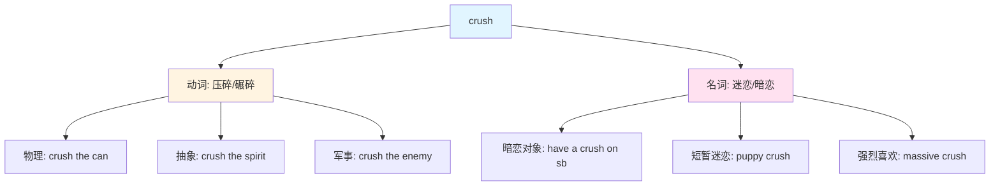

crush :: 
<!--ID: 1771329376122-->


# Crush

## 基础信息

| 项目 | 内容 |
|------|------|
| **英文** | crush /krʌʃ/ |
| **词性** | 动词 / 名词 |
| **核心中文对应** | 压碎、碾碎、迷恋、暗恋 |

## 词义演化

```
[古法语] croissir / cruisir (压碎、破碎)
        ↓
[中古英语] cruschen (14世纪，压碎)
        ↓
    ┌───┴───┐
    ↓       ↓
 物理义    情感义 (19世纪末俚语)
压碎/碾碎   迷恋/暗恋
```

**情感义的来源**：19世纪末美国俚语，隐喻"心被压碎/征服"的感觉，形容那种让人心跳加速、仿佛被"击垮"的强烈好感。

## 概念分析

### 1. 动词用法 - 物理压碎

| 含义  | 例句                              | 中文对应   |
| --- | ------------------------------- | ------ |
| 压碎  | Crush the garlic.               | 把大蒜压碎  |
| 碾碎  | The machine crushes rocks.      | 机器碾碎石头 |
| 挤压  | Don't crush the flowers.        | 别挤压花朵  |
| 镇压  | The army crushed the rebellion. | 军队镇压叛乱 |

### 2. 名词用法 - 情感迷恋

| 含义   | 例句                              | 中文对应   |
| ---- | ------------------------------- | ------ |
| 暗恋对象 | I have a crush on him.          | 我暗恋他   |
| 短暂迷恋 | It's just a schoolgirl crush.   | 只是少女心动 |
| 迷恋状态 | She has a crush on her teacher. | 她迷恋老师  |

## 关系图谱



## 英汉对比

| 特征 | 英语 | 汉语 |
|------|------|------|
| **概念分离** | 一个词涵盖两个领域 | 物理和情感用完全不同的词 |
| **隐喻固化** | "压碎"→"心动"已固化为独立含义 | 无此隐喻路径 |
| **词性灵活** | 动词/名词均可表达两种概念 | 物理用动词，情感用名词短语 |

## 实际应用

**场景 1：日常物理动作**
> "Can you crush these ice cubes for me?"
> 你能帮我把这些冰块压碎吗？

**场景 2：情感表达**
> "I've had a crush on her since high school."
> 我从高中起就暗恋她了。

**场景 3：抽象用法**
> "The defeat crushed his confidence."
> 这次失败击垮了他的信心。

## 核心习语与功能性用法

| 习语 | 含义 | 例句 |
|------|------|------|
| **have a crush on** | 暗恋某人 | She has a crush on her coworker. |
| **crush it** | 做得很棒 | You totally crushed it today! |
| **crushing blow** | 沉重打击 | The news was a crushing blow. |
| **crush on someone** | 迷恋某人 | He's crushing on the new girl. |

## 深度洞察

1. **隐喻的力量**：crush 的情感义完美展示了英语如何通过物理动作的隐喻来表达抽象情感——"心动"被体验为一种"被击垮"的感觉。

2. **概念边界差异**：英语 crush 的"暗恋"含义强调**短暂、强烈、单向**的情感；汉语"暗恋"更中性，不强调时间长度或强度。

3. **词性转换**：物理义的 crush 动词性强，情感义的 crush 名词性强（需搭配 have/get），体现了英语名词化的倾向。

## 关键要点

**翻译决策树**：
```
crush → ?
├─ 后面跟人名/人称代词 → 暗恋/迷恋
├─ 后面跟物体 → 压碎/碾碎
├─ 前面有 have/get → 暗恋对象
└─ 修饰 blow/defeat → 毁灭性的/沉重的
```

**记忆口诀**：
> "压碎"是动作，"暗恋"是心动；
> 物理情感两分离，英语一词全搞定。
