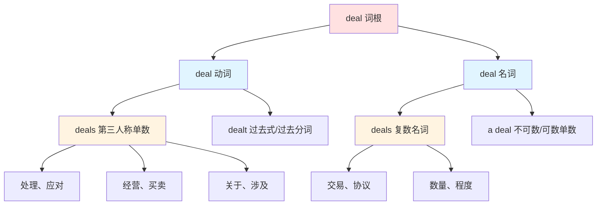
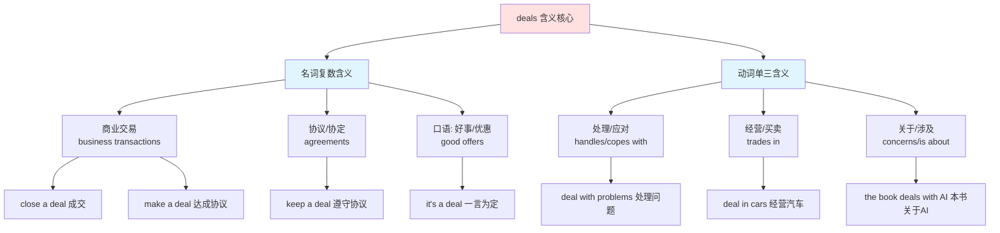

# deals

## 基础信息

| 项目 | 内容 |
|------|------|
| **英文** | deals /diːlz/ |
| **原形** | deal |
| **词性** | 名词复数 / 动词第三人称单数 |
| **中文对应** | 交易、协议、应对、分发 |

## 概念分析

### 词性与含义的双重性

**deals** 是 **deal** 的语法变体，具有两个完全不同的词性维度：

#### 1. 名词复数（deals = 交易/协议）
- business deals（商业交易）
- a great deal of（大量）
- close a deal（成交）

#### 2. 动词单三（deals = 处理/应对）
- he deals with problems（他处理问题）
- she deals in antiques（她经营古董）
- it deals with climate change（它涉及气候变化）

### 词性转换图谱



### 概念分支详解



## 英汉对比

| 维度 | 英语特征 | 汉语特征 |
|------|----------|----------|
| **词性统一性** | 同一词形可作动词/名词 | 需要不同词汇（交易 vs. 应对） |
| **复数表达** | deals 显性复数标记 | 隐含"多笔交易"之意 |
| **动词含义** | 一个词覆盖处理、经营、涉及 | 需要分别表达（应对、经营、关于） |
| **名词抽象性** | deal 可指抽象的"协议" | "协议"本身已是抽象名词 |

**核心差异**：
- 英语 **deals** 的含义完全由语法角色（词性）和语境决定
- 汉语需要通过不同的动词和名词来表达这些含义
- 英语的"一词多性"体现了语言的经济性

## 实际应用

### 场景 1：商业交易（名词复数）

**英文**：
> "We closed several deals this quarter."
> （我们本季度完成了几笔交易。）

**分析**：
- deals = 交易（复数）
- close a deal = 成交、达成交易
- 商业语境下的固定搭配

**对比**：
> "It's a deal!"
> （一言为定！）
> - 单数 a deal，表示"协议"或"同意"

---

### 场景 2：处理问题（动词单三）

**英文**：
> "He deals with difficult customers calmly."
> （他冷静地应对难缠的客户。）

**分析**：
- deals with = 处理、应对
- 第三人称单数动词形式
- 固定搭配：deal with = 应对、处理

**对比**：
> "How do you deal with stress?"
> （你如何应对压力？）
> - 疑问句用原形 deal

---

### 场景 3：经营业务（动词单三）

**英文**：
> "She deals in antique furniture."
> （她经营古董家具。）

**分析**：
- deals in = 经营、买卖
- 特指贸易、商业活动
- 介词 in 不可或缺

**对比**：
> "This shop deals in electronic products."
> （这家店经营电子产品。）
> - 强调商品类别

---

### 场景 4：涉及主题（动词单三）

**英文**：
> "This book deals with climate change."
> （这本书涉及气候变化主题。）

**分析**：
- deals with = 关于、讨论、涉及
- 常用于书籍、电影、文章的主题描述
- 等同于 "is about" 或 "discusses"

**对比**：
> "The movie deals with social issues."
> （这部电影探讨社会问题。）
> - 更正式的表达

---

### 场景 5：大量/很多（名词短语）

**英文**：
> "A great deal of money was spent."
> （花费了大量的钱。）

**分析**：
- a great deal of = 大量的、很多的
- 后接不可数名词
- 比 "a lot of" 更正式

**对比**：
> "He has a great deal of experience."
> （他有丰富的经验。）
> - 修饰抽象名词

---

### 场景 6：口语表达

**英文**：
> "What's the deal with this project?"
> （这个项目到底怎么回事？）

**分析**：
- what's the deal with = ...是怎么回事/什么情况
- 口语询问原因或状况
- 非正式用法

**对比**：
> "No big deal."
> （没什么大不了的。）
> - 表示不重要、没关系

## 深度洞察

### 1. 词性决定含义的典型案例

**deals 展示了英语词性的强大作用**：

同样的词根，不同的语法形式 = 完全不同的含义

```
deal（动词原形）→ 我处理问题
deals（动词单三）→ 他处理问题
dealt（过去式）→ 他处理了问题
deal（名词单数）→ 一笔交易
deals（名词复数）→ 几笔交易
```

**汉语没有这种机制**：

汉语必须使用**完全不同的词汇**来表达不同含义：

```
英语：deal（一个词根）+ 语法变化 = 多种含义
├─ deal（动词）→ 处理、应对
├─ deals（动词单三）→ 他处理、他经营
├─ dealt（过去式）→ 处理了
└─ deal（名词）→ 交易、协议

汉语：不同的词 = 不同的含义（无词形变化）
├─ 处理 → 动词
├─ 应对 → 动词
├─ 经营 → 动词
├─ 交易 → 名词
└─ 协议 → 名词
```

**关键差异**：

| 维度 | 英语 | 汉语 |
|------|------|------|
| **词形变化** | 有（-s, -ed, -ing） | 无 |
| **含义区分** | 语法 + 语境 | 词汇本身 |
| **学习负担** | 记一个词根 | 记多个独立词 |
| **灵活性** | 高（词性转换） | 低（需换词） |

**实际影响**：
- 英语学习者需要掌握语法规则来理解含义
- 汉语学习者需要记忆大量独立词汇
- 英语更"经济"（一个词多个用途）
- 汉语更"精确"（每个词含义明确）

### 2. 介词的关键作用

**deal/deals 的含义很大程度上由介词决定**：

| 搭配 | 含义 | 示例 |
|------|------|------|
| **deal with** | 处理、应对、关于 | deal with problems |
| **deal in** | 经营、买卖 | deal in cars |
| **a deal with** | 与...的协议 | make a deal with |

**关键要点**：
- 看到 **deals with** → 99% 是动词"处理/关于"
- 看到 **deals in** → 100% 是动词"经营"
- 看到 **big deals** → 名词"大事/交易"

### 3. 固定搭配的不可分割性

**deal/deals 的高频用法几乎都是固定搭配**：

✅ 必须整体记忆的搭配：
- close a deal（成交）
- make a deal（达成协议）
- deal with（处理）
- deal in（经营）
- a great deal of（大量）
- what's the deal（怎么回事）
- no big deal（没什么）

❌ 不能拆分或改动的错误：
- "close deal"（缺少 a）
- "deal with"（不能说 "deal to"）
- "great deal of"（缺少 a）

## 关键要点

### 翻译决策树

```
遇到 deals
│
├─ 前面有 a（a deals）？
│   └─ 是 → 语法错误，deal 通常不加 a
│
├─ 后面接 with？
│   └─ 是 → 处理/关于（动词）
│
├─ 后面接 in？
│   └─ 是 → 经营/买卖（动词）
│
├─ 前面有 the/a/this/these？
│   ├─ the deal → 这笔交易/这笔协议
│   ├─ a deal → 一笔交易
│   └─ these deals → 这些交易
│
├─ 出现在 "a great deal of" 中？
│   └─ 是 → 大量的（修饰不可数名词）
│
├─ 出现在 "it's a deal" 中？
│   └─ 是 → 一言为定/成交
│
├─ 出现在 "what's the deal" 中？
│   └─ 是 → 怎么回事（口语）
│
└─ 商业语境下的复数名词？
    └─ 是 → 交易、协议
```

### 记忆口诀

```
Deals 一词两性分，
动词名词要看真。
Deals with 处理和应对，
Deals in 经营最标准。
Close a deal 交易成，
Great deal 数量增。
What's the deal 怎么回，
No big deal 别担心。
```

### 常见错误清单

| 错误 | 正确 | 原因 |
|------|------|------|
| He deal with | He **deals** with | 第三人称要加 s |
| Close deal | Close **a** deal | 固定搭配，a 不可少 |
| Deal to problems | Deal **with** problems | 介词错误 |
| A deals with | **He/She** deals with | 需要主语 |
| Great deal of money | **A** great deal of | 固定搭配，a 不可少 |

## 语法变体全表

| 形式 | 词性 | 含义 | 示例 |
|------|------|------|------|
| **deal** | 动词原形 | 处理、分发 | I deal with it |
| **deals** | 动词单三 | 处理、经营 | She deals in art |
| **dealing** | 现在分词 | 正在处理 | I'm dealing with it |
| **dealt** | 过去式 | 处理了 | I dealt with it |
| **deal** | 名词单数 | 交易、协议 | Make a deal |
| **deals** | 名词复数 | 多笔交易 | Close two deals |
| **a great deal** | 名词短语 | 大量 | A great deal of time |

---

## 相关概念

- [[Transaction]]（交易）
- [[Agreement]]（协议）
- [[Handle]]（处理）
- [[Manage]]（管理）
- [[Negotiate]]（谈判）

## 延伸学习

### 同义词对比
- **Deal** vs. **Transaction**：deal 更口语化，transaction 更正式
- **Deal with** vs. **Handle**：deal with 强调应对过程，handle 强调处理能力
- **Deal in** vs. **Sell**：deal in 强调经营类别，sell 强调销售行为

### 商业英语常见搭配
- close a deal（成交）
- make a deal（达成协议）
- break a deal（违反协议）
- seal a deal（敲定交易）
- big deal（大人物/大事件）
- raw deal（不公平的待遇）
