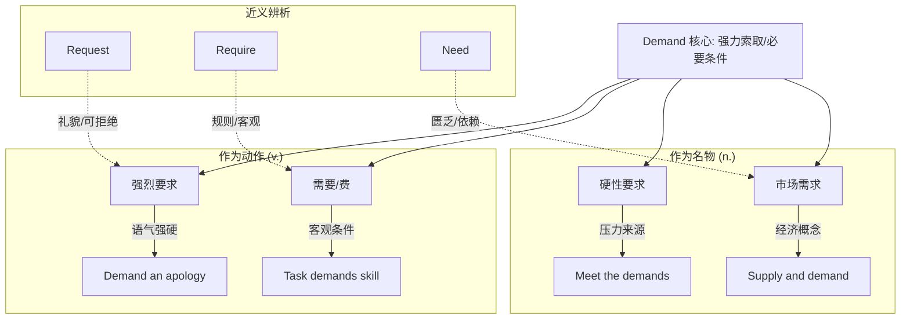

demand :: 
<!--ID: 1771404671281-->

# demand

## 1. 基础信息

*   **发音**: /dɪˈmænd/ (US), /dɪˈmɑːnd/ (UK)
*   **词性**: n. (名词) / v. (动词)
*   **核心含义**:
    *   n. (坚决的) 要求；(顾客的) 需求
    *   v. 强烈要求；需要 (技能、耐心等)

## 2. 词义演化

*   **词源**: 源自拉丁语 *demandare*。前缀 *de-* (from/completely 加强语气) + *mandare* (to commission/order 委托/命令)。
*   **演变逻辑**: 最初含义是“正式委托某人做某事” -> 演变为“以权威或权利去索取” -> 现代引申为“强烈的要求”以及经济学上的“购买意愿(需求)”。
*   **核心图式**: **自上而下的施压** 或 **迫切的索取**。

## 3. 概念分析

### 核心语义场

1.  **强硬的索取 (Strong Request)**: 不同于 *request* (礼貌请求)，*demand* 隐含着“如果不满足会有后果”或“我认为我有权得到”的意味。
    *   *I demand an explanation.* (我要求一个解释——没得商量)
2.  **客观的需要 (Objective Necessity)**: 主语通常是物或任务，表示某事对能力、资源的高要求。
    *   *This job demands patience.* (这份工作需要耐心。)
3.  **市场的拉力 (Market Force)**: 经济学概念，指消费者购买产品或服务的意愿和能力。
    *   *Supply and demand.* (供给与需求)

### 核心习语与功能搭配

*   **on demand**: 一经要求即刻提供；按需。(*video on demand* 视频点播)
*   **in demand**: 非常抢手，需求量大。(*Good programmers are in high demand.*)
*   **make demands on**: 对...提出要求；消耗(某人的)时间/精力。(*Children make heavy demands on their parents' time.*)

## 4. 关系图谱

## 5. 英汉对比特征

| 维度 | English (demand) | Chinese (要求/需求) | 差异分析 |
| :--- | :--- | :--- | :--- |
| **语气力度** | 强硬，带有权利感或命令口吻 | "要求"可软可硬，"需求"偏客观 | 英文 *demand* 比中文日常口语的“要求”更重，用错显得粗鲁。 |
| **词性灵活性** | 动词名词同形 | 动词多用"要求"，名词分化为"要求/需求" | 中文在经济领域严格区分"需求"(demand)与"要求"(requirement/request)。 |
| **主语限制** | 可人可物 (*Job demands...*) | "要求"主语通常是人/组织 | 中文说"工作要求耐心"是拟人化用法，不如英文自然。 |

## 6. 场景例句

### 场景 A：职场谈判 (Tone: Firm/Authoritative)
*   **English**: "We **demand** a 10% raise, or we walk out."
*   **Chinese**: "我们**强烈要求**加薪 10%，否则我们就罢工。"
*   **解析**: 这里体现了 *demand* 的谈判筹码属性，不是乞求，而是通牒。

### 场景 B：项目管理 (Tone: Objective)
*   **English**: "This project makes huge **demands** on our server infrastructure."
*   **Chinese**: "这个项目对我们的服务器基础设施提出了巨大的**挑战/负荷**。"
*   **解析**: *make demands on* 翻译为“提出要求”略显生硬，译为“带来负荷”或“考验”更地道。

### 场景 C：服务模式 (Tone: Modern/Business)
*   **English**: "We offer 24/7 support **on demand**."
*   **Chinese**: "我们提供全天候**按需**支持。"
*   **解析**: *on demand* 强调即时响应性，是现代服务业的高频词。

## 7. 深度洞察

1.  **"On demand" 的社会契约**: *On demand* 不仅仅是“按需”，它暗示了**控制权的转移**——从供应者决定何时提供，转变为消费者决定何时获取。这是现代“按需经济 (Gig Economy)”的核心逻辑。
2.  **Demand vs. Need**: *Need* 是“缺”，是匮乏状态；*Demand* 是“索”，是主动意愿及支付能力。如果你饿了(need food)，但没钱买，你在经济学上就没有形成有效需求(effective demand)。
3.  **礼貌陷阱**: 在日常英语中，对陌生人或上级**永远不要说** "I demand..."，除非你在维权或报警。想表达“我有一个要求”，请用 "I have a request" 或 "I would like to..."。

## 8. 关键要点 (Takeaways)

### 决策树：何时使用 demand？
*   是礼貌询问吗？ -> YES -> 使用 **Request** / **Ask for**
*   是规则规定的必要条件吗？ -> YES -> 使用 **Require** / **Requirement**
*   是没得商量、必须执行的吗？ -> YES -> 使用 **Demand**
*   是花钱买东西的意愿吗？ -> YES -> 使用 **Demand**

### 记忆口诀
**Demand** 强硬不商量，
**Supply** 对应在市场上。
**On demand** 随叫随到，
**In demand** 抢手难挡。
