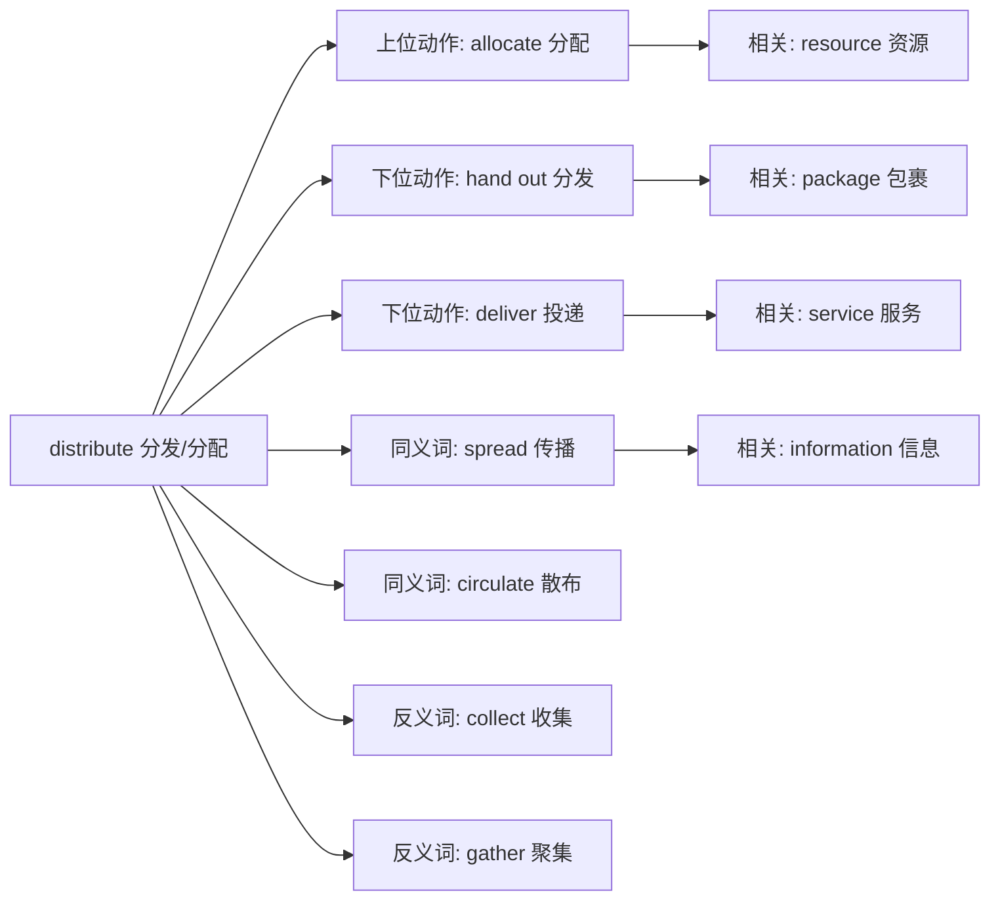

## distribute (分发/分配/分布)

**英文**：distribute [dɪˈstrɪbjuːt]
**中文**：分发 / 分配 / 分布 / 分销
**词性**：动词 (verb)
**词源**：dis- (分开) + tribute (给予) → 分开给予

---

## 概念分析

### 1. 一词多义 vs 一概念多词
- **英语**：distribute → 分发/分配/分布/分销
- **汉语**：分发 → distribute/hand out
- **汉语**：分配 → distribute/allocate
- **汉语**：分布 → distribute/spread
- **汉语**：分销 → distribute (商业)
- **分析**：英语一个词对应汉语多个概念，翻译不对称性明显，需根据语境选择

### 2. 上下义关系
- **上义词**：allocate (分配 - 更宽泛)
- **下义词**：hand out (分发), deliver (投递), dispense (配给)
- **汉语表达**：需要根据场景添加修饰词（资源分配、包裹分发、数据分布）

### 3. 同义词网络
- **英语同义词**：spread, circulate, disseminate, allocate
- **汉语近义词**：分发、分配、散布、传播
- **角度差异**：
  - distribute：强调分给多个接收者
  - spread：强调扩散、蔓延
  - allocate：强调按计划分配
  - circulate：强调循环传播

---

## 关系图谱



**关系分析：**
- **动作网络**：从宏观分配到具体分发的层级
- **同义扩展**：spread (传播), circulate (散布) - 不同场景
- **反义对比**：collect/gather - 完全相反的动作
- **相关概念**：resource, package, information, service

---

## 英汉对比

| 特征 | 英语 | 汉语 | 洞察 |
|------|------|------|------|
| **概念细分** | distribute (一词多义) | 分发/分配/分布/分销 (多词) | 汉语更精细，英语更概括 |
| **表达习惯** | 独立动词 | 独立动词 | 一一对应，需加语境 |
| **翻译对应** | 1 → 多概念 | 多词 → 1概念 | 翻译不对称性明显 |

**语言特征：**
- **静态 vs 动态**：英语动词化 vs 汉语动词化 - 一致
- **独立 vs 组合**：英语独立词汇 vs 汉语独立词汇 - 一致
- **精细度**：汉语通过不同词汇区分，英语通过语境区分

---

## 实际应用

### 场景 1：资源分配
**英文**：The manager will distribute resources among the teams.
**中文**：经理将在各团队间分配资源。
**分析**：此处 distribute 指按计划分配资源，对应"分配"

### 场景 2：包裹分发
**英文**：The courier distributes packages to residents.
**中文**：快递员向居民分发包裹。
**分析**：此处 distribute 指物理分发，对应"分发"

### 场景 3：数据分布
**英文**：The data is distributed across multiple servers.
**中文**：数据分布在多个服务器上。
**分析**：此处 distribute 指分布状态，对应"分布"

### 场景 4：产品分销
**英文**：The company distributes its products through retailers.
**中文**：该公司通过零售商分销产品。
**分析**：此处 distribute 指商业分销，对应"分销"

**学习建议：**
- **记忆策略**：dis- (分开) + tribute (给予) = 分开给 → 分发/分配
- **使用注意**：根据宾语和语境选择正确中文翻译
- **关联词汇**：distribution (n.), distributor (n.), distributive (adj.)

---

## 深度洞察

### 1. 语言特征
英语通过一个动词表达多个相关概念，汉语通过不同词汇精确区分。这体现了英语的"概括性"和汉语的"精确性"特征。

### 2. 概念映射规律
distribute 的多义性源于"分开给予"的核心概念在不同场景的应用：
- **物理场景**：分发包裹、食物
- **抽象场景**：分配资源、任务
- **自然场景**：分布数据、物种
- **商业场景**：分销产品

### 3. 学习策略建议
1. **词根记忆**：dis-分开 + tribute-给予 = 分开给
2. **语境判断**：看宾语类型决定翻译
3. **对比学习**：与 allocate, hand out, spread 对比
4. **搭配积累**：distribute + 资源/包裹/数据/产品

---

## 关键要点总结

### 核心概念解释
- **基本含义**：分开给予 → 分发/分配/分布/分销
- **词源结构**：dis- (分开) + tribute (给予)
- **多义特征**：物理动作 vs 抽象概念

### 翻译决策树
```
distribute
├─ 宾语是资源/任务 → 分配 (allocate)
├─ 宾语是物品/包裹 → 分发 (hand out)
├─ 宾语是数据/信息 → 分布 (spread)
├─ 宾语是产品/商品 → 分销 (commercial)
└─ 不确定时 → 分发（最通用）
```

### 常见错误避免
1. ❌ 混淆 distribute 和 distribution (名词)
2. ❌ 忽略宾语类型导致翻译错误
3. ❌ 与 allocate 完全等同 (allocate 更强调计划性)
4. ❌ 在商业语境中误用为"分发"而非"分销"

### 记忆口诀
"dis-分开 + tribute-给予 = 分开给 → 分发/分配"

**快速判断**：看到 distribute，先看宾语：
- 资源/任务？→ 分配
- 包裹/物品？→ 分发
- 数据/信息？→ 分布
- 产品/商品？→ 分销

---

## 相关词汇扩展

### 同根词
- **distribution** (n.)：分发，分配，分布
- **distributor** (n.)：分销商，分配器
- **distributive** (adj.)：分发的，分配的
- **redistribute** (v.)：重新分配

### 近义词对比
| 词汇 | 侧重点 | 常见搭配 |
|------|--------|----------|
| **distribute** | 分给多个接收者 | distribute resources, distribute packages |
| **allocate** | 按计划分配 | allocate budget, allocate time |
| **hand out** | 具体分发动作 | hand out flyers, hand out papers |
| **spread** | 扩散、蔓延 | spread information, spread disease |
| **circulate** | 循环传播 | circulate documents, circulate news |

### 反义词
- **collect**：收集
- **gather**：聚集
- **accumulate**：积累
- **receive**：接收

### 常用搭配
- **distribute resources**：分配资源
- **distribute packages**：分发包裹
- **distribute information**：传播信息
- **distribute evenly**：平均分配
- **distribute widely**：广泛分发

---

## 学习要点检查

- [ ] 理解 distribute 的核心含义（分开给予）
- [ ] 能根据宾语选择正确中文翻译
- [ ] 掌握词根词缀构成 (dis- + tribute)
- [ ] 能区分 distribute 和 allocate
- [ ] 了解相关名词形式 (distribution, distributor)
- [ ] 能在不同场景正确使用
- [ ] 理解与反义词的对比关系

---

**主题**：[[Vocabulary]] [[English learning]] [[Chinese learning]] [[Business]]
**难度**：中级
**领域**：通用/商业/计算机/物流
