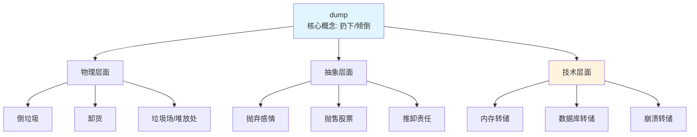

# dump

## 1. 基础信息

**音标**: /dʌmp/
**词性**: v. / n.

**英文定义**:
- **v.**: To unload or empty out (something); to get rid of something unwanted; to copy data from one location to another
- **n.**: A place where waste is deposited; a copy of data stored in a computer's memory

**中文翻译**:
- **v.**: 倾倒、抛弃、转储（数据）、抛售
- **n.**: 垃圾场、转储（数据）、临时存放处

---

## 2. 词源与演变

**词源**: Middle English *dumpen* (to throw down)

**核心逻辑**:
```
原始含义: 扔下、倒下
    ↓
物理层面: 倾倒垃圾、货物
    ↓
抽象层面: 抛弃（感情/关系/股票）
    ↓
技术层面: 数据转储（计算机）
```

**演变路径**:
1. **14世纪**: 原始含义 - 扔下重物
2. **19世纪**: 垃圾场
3. **20世纪**: 抛售股票、军事术语
4. **20世纪后期**: 计算机数据转储

---

## 3. 核心概念图谱



---

## 4. 扩展词汇

### 近义词

| 词汇 | 细微差别 | 侧重点 |
|------|---------|--------|
| **dump** | 强调"倒掉、抛弃" | 通用，可用于物理和抽象 |
| **discard** | 强调"丢弃不再需要的" | 有选择性的丢弃 |
| **dispose** | 强调"处理掉" | 正式，强调过程 |
| **scrap** | 强调"废弃" | 彻底放弃，不再使用 |
| **jettison** | 强调"抛弃负担" | 为了减轻负担而抛弃 |
| **unload** | 强调"卸下" | 物理卸载，也可指摆脱负担 |
| **offload** | 强调"转移" | 转移给他人或别处 |

### 反义词

- **load** - 装载
- **collect** - 收集
- **preserve** - 保存
- **retain** - 保留
- **accumulate** - 积累

### 派生词

| 词性 | 单词 | 含义 |
|------|------|------|
| **n.** | dumper | 倾倒者、垃圾车 |
| **n.** | dumping | 倾倒、倾销 |
| **adj.** | dumpish | 沮丧的、沉闷的 |
| **n.** | dumpsite | 垃圾场 |

---

## 5. 搭配与用法

### 高频搭配

**动词 + dump**:
- **dump garbage/waste** - 倾倒垃圾
- **dump data** - 转储数据
- **dump stocks** - 抛售股票
- **dump someone** - 甩掉某人
- **dump information** - 输出信息

**形容词 + dump**:
- **garbage dump** - 垃圾场
- **rubbish dump** - 垃圾堆
- **memory dump** - 内存转储
- **core dump** - 核心转储
- **toxic dump** - 有毒废物场

**介词搭配**:
- **dump on** - 推卸给...、倾诉给...
- **dump into** - 倒入...
- **dump at** - 在...抛售

### 典型例句

#### 1. 日常生活
```
Don't dump your problems on me.
别把你的问题都推给我。
```

#### 2. 商业/经济
```
The company dumped its excess inventory at a loss.
公司亏本抛售了过剩库存。
```

#### 3. 技术/计算机
```
The system created a memory dump before crashing.
系统在崩溃前创建了内存转储。
```

#### 4. 情感/关系
```
She dumped him after finding out he lied.
发现他撒谎后，她甩了他。
```

#### 5. 环境
```
Illegal dumping of toxic waste is a serious crime.
非法倾倒有毒废物是严重犯罪。
```

---

## 6. 易混淆点与辨析

### dump vs discard

| 维度 | dump | discard |
|------|------|---------|
| **语气** | 口语化，随意 | 正式 |
| **方式** | 粗暴地倒掉 | 有选择地丢弃 |
| **情感** | 可能有负面含义 | 中性 |
| **例句** | Dump the trash | Discard expired food |

**关键区别**:
- **dump** 更强调"倒掉"的动作
- **discard** 更强调"丢弃不再需要的东西"

### dump vs unload

| 维度 | dump | unload |
|------|------|---------|
| **侧重点** | 倒掉、抛弃 | 卸下、转移 |
| **方向** | 丢弃 | 转移 |
| **例句** | Dump the garbage | Unload the cargo |

**关键区别**:
- **dump** = 扔掉不要了
- **unload** = 从一处移到另一处

### dump 的多义性

| 含义 | 例句 | 场景 |
|------|------|------|
| **倾倒（物理）** | Dump the sand here | 建筑 |
| **抛弃（感情）** | She dumped him | 恋爱 |
| **抛售（商业）** | Dump stocks | 金融 |
| **转储（技术）** | Memory dump | 计算机 |

---

## 7. 总结与记忆

### 口诀

```
"Dump means dump, throw it away!
Garbage, boyfriend, stocks - all can be dumped today!
In computers, dump means copy data out,
Core dump, memory dump - that's what it's about!"
```

### 决策树

```
想表达"倒掉/抛弃"?
    ↓
物理层面（垃圾/货物）→ dump ✅
    ↓
抽象层面（感情/关系）→ dump ✅ (口语)
    ↓
商业层面（股票/商品）→ dump ✅
    ↓
技术层面（数据）→ dump ✅
    ↓
想表达"有选择地丢弃"→ discard ⚠️
    ↓
想表达"正式处理"→ dispose ⚠️
```

### 核心记忆

**Dump = 扔下 → 倒掉 → 抛弃 → 转储**

1. **原始**: 扔下重物
2. **物理**: 倒垃圾、卸货
3. **抽象**: 甩人、抛售
4. **技术**: 数据转储

**一词多义的记忆线索**:
- 所有含义都源自"扔下、倒下"这个核心动作
- 物理动作 → 抽象行为 → 技术术语

---

## 8. 延伸学习

### 计算机术语

**Core Dump (核心转储)**:
- 程序崩溃时的内存快照
- 用于调试和分析崩溃原因
- 文件格式: `.core`, `.dmp`

**Memory Dump (内存转储)**:
- 将内存内容保存到文件
- 用于安全分析、故障排除
- 常见工具: `gcore`, `dumpbin`

### 商业术语

**Dumping (倾销)**:
- 以低于成本的价格销售
- 国际贸易中的不公平竞争
- 可能面临反倾销税

### 文化习语

```
"Take a dump" - 上厕所（粗俗但常用）
"Dump on someone" - 向某人倾诉（负面）
"Down in the dumps" - 沮丧、情绪低落
```

---

## 🔗 相关词汇

- [[load]] - 装载
- [[discard]] - 丢弃
- [[dispose]] - 处置
- [[waste]] - 浪费/废物
- [[trash]] - 垃圾
- [[crash]] - 崩溃（与 dump 相关）

---

Created: 2026-02-25
Type: Vocabulary Analysis
Word: dump
Status: Complete
