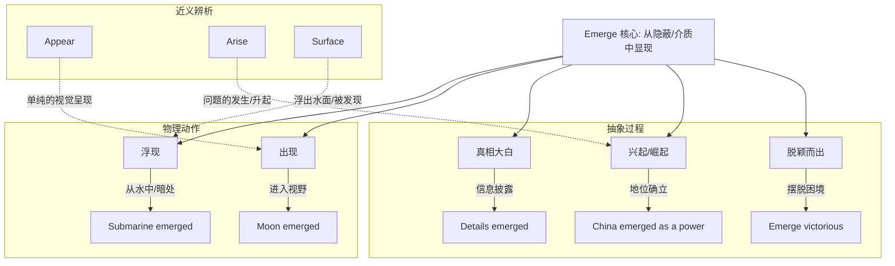

emerged :: 
<!--ID: 1771404671276-->

# emerged

## 1. 基础信息

*   **发音**: /ɪˈmɜːrdʒd/ (US), /ɪˈmɜːdʒd/ (UK)
*   **词性**: v. (动词过去式/过去分词)
*   **原形**: **emerge**
*   **核心含义**:
    *   (从隐蔽处或水中) 出现，浮现
    *   (事实、真相) 显露，暴露
    *   (作为幸存者或强者) 摆脱困境，脱颖而出

## 2. 词义演化

*   **词源**: 源自拉丁语 *emergere*。前缀 *e-* (out of 向外) + *mergere* (to dip, sink 浸入，沉没)。
*   **演变逻辑**: 字面意思是“从液体中升起” (rise out of liquid) -> 引申为“从隐蔽处出来” -> 抽象化为“真相大白”或“新事物兴起”。
*   **核心图式**: **破水而出** (Rising out of a medium) 或 **破茧成蝶** (Coming into view from concealment)。

## 3. 概念分析

### 核心语义场

1.  **物理浮现 (Physical Appearance)**: 从水下、黑暗中或遮蔽物后走出来。
    *   *The sun emerged from behind the clouds.* (太阳从云后钻了出来。)
2.  **真相显露 (Revelation)**: 秘密或事实被公之于众。
    *   *It emerged that he had lied.* (真相大白，他撒谎了。)
3.  **兴起与蜕变 (Rise & Evolution)**: 新产业、新领袖或新常态的形成；或者从困境中幸存并变强。
    *   *Emerging markets* (新兴市场)。
    *   *She emerged from the scandal stronger than ever.* (她从丑闻中走出，变得比以往更强大。)

### 核心习语与功能搭配

*   **emerge as**: 崭露头角成为... (通常指经过竞争或混乱后确立地位)。
    *   *He emerged as the leader.*
*   **emerge from**: 从...中走出 (常搭配困境、阴影、水面)。
*   **emerging technologies**: 新兴技术。

## 4. 关系图谱

## 5. 英汉对比特征

| 维度 | English (emerge) | Chinese (出现/兴起) | 差异分析 |
| :--- | :--- | :--- | :--- |
| **动态感** | 强调"从里向外"的过程 (Out process) | "出现"是结果导向，"兴起"专指事物发展 | *Emerge* 比 *Appear* 更强调过程感和背景(从某处出来)，不仅是"看到了"，而是"出来了"。 |
| **主语范围** | 极广 (物体、真相、国家、问题) | 需根据主语换词 (太阳出来，真相暴露，国家崛起) | 中文需要根据语境把 *emerge* 译为不同动词：浮现、暴露、涌现、崛起。 |
| **反义图式** | Submerge / Immerse (沉没/浸入) | 消失 / 隐没 | 词根 *merge* (沉) 构成了这组词的底层逻辑。 |

## 6. 场景例句

### 场景 A：新闻报道 (Tone: Formal/Objective)
*   **English**: "New details have **emerged** regarding the accident."
*   **Chinese**: "关于这起事故的新细节已经**浮出水面/被披露**。"
*   **解析**: 这里不能用 *appear*，*emerge* 暗示了这些细节之前是被隐藏或未知的。

### 场景 B：商业趋势 (Tone: Professional)
*   **English**: "AI has **emerged** as a key driver of economic growth."
*   **Chinese**: "人工智能已**崛起/崭露头角**成为经济增长的关键驱动力。"
*   **解析**: *emerge as* 强调了一种地位的确立 (Status establishment)。

### 场景 C：个人经历 (Tone: Narrative)
*   **English**: "He **emerged** from the room looking exhausted."
*   **Chinese**: "他从房间里**走出来**，看起来筋疲力尽。"
*   **解析**: 简单的物理动作，但强调了"从封闭空间到开放空间"的转换。

## 7. 深度洞察

1.  **"破壳"的隐喻**: *Emerge* 总是暗示着一个 **Pre-state** (前置状态)，这个状态通常是隐蔽的、混乱的或低级的 (如水下、云后、困境中、无名时)。动词的动作就是打破这个状态，进入一个新的、可见的、更高级的状态。
2.  **Appear vs. Emerge**:
    *   *Appear*: 忽然就在那里了 (Poof, it's there)。侧重视觉结果。
    *   *Emerge*: 慢慢显露出来的过程 (Coming out)。侧重来源和过程。
    *   *例*: 魔术师让兔子 *appear* (变出来)；潜水员从水中 *emerge* (浮出来)。
3.  **Emergency (紧急情况)**: 这个词和 *emerge* 同源，原意是"突然出现的情况" (unforeseen occurrence)，后来才特指"危急时刻"。

## 8. 关键要点 (Takeaways)

### 决策树：何时使用 emerge？
*   是从水里、雾里或遮蔽物后出来的吗？ -> YES -> 使用 **Emerge**
*   是秘密或真相被发现了吗？ -> YES -> 使用 **Emerge** (或 Surface)
*   是经过努力或混乱后确立了新地位吗？ -> YES -> 使用 **Emerge as**
*   是单纯的"看起来像"或"到场"？ -> YES -> 使用 **Appear**

### 记忆口诀
**Emerge** 词根是沉没，
加个 **E** 向外把头露。
真相**浮现**水出石，
英雄**崛起**乱世出。
困境走出变强者，
**Emerging** 市场是新途。
