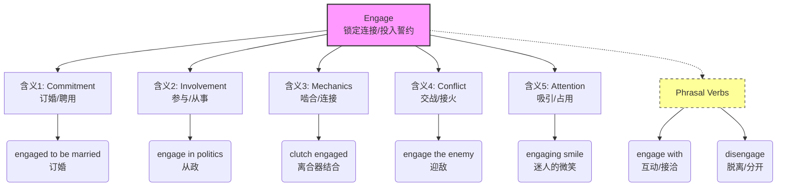

engage :: 
<!--ID: 1771404671242-->

# engage

> [!info] 基础信息
> - **音标**: /ɪnˈɡeɪdʒ/
> - **词性**: v.
> - **含义**: 参与；订婚；交战；啮合；吸引 (注意力)

## 词源演化 (Etymology)

源自法语 *engager*，由 **en-** (make/in) + **gage** (pledge/promise, 誓约/抵押品) 组成。
- **原始含义**: "Put under a pledge" (立下誓约/承诺)。
- **核心意象**: **锁定关系**。一旦 engage，你就被某种承诺、任务或机制“锁”住了，不再是自由身。
- **演变路径**: 承诺 (Pledge) → 投身其中 (Involve) → 锁定/啮合 (Interlock) → 吸引住 (Occupy)。

## 概念分析 (Concept Analysis)

### 1. 核心概念：锁定的连接 (Locked Connection)
Engage 的本质是**两个实体之间建立了一种积极的、紧密的、有约束力的连接**。
- **人与人**: 订婚 (engaged to be married) —— 誓约锁定了关系。
- **人与事**: 参与 (engage in) —— 承诺投入精力。
- **物与物**: 啮合 (gears engage) —— 机械部件咬合在一起。
- **军队**: 交战 (engage the enemy) —— 双方火力接触，进入战斗状态。

### 2. 多重含义映射

| 英语语境 (Context) | 汉语对应 (Chinese) | 逻辑联系 (Connection) |
| :--- | :--- | :--- |
| **Relationship** | **订婚** | 用誓言(gage)锁定终身 |
| **Activity/Work** | **从事 / 参与** | 投身其中，被事务锁定 |
| **Mechanics** | **啮合 / 挂挡** | 齿轮相互咬合，传递动力 |
| **Attention** | **吸引 / 占用** | 把注意力“钩住”了 |
| **Military** | **交战 / 接火** | 与敌人建立接触 (Lock horns with) |

## 关系图谱 (Relationship Graph)

## 英汉对比 (Comparative Analysis)

- **主动性 vs 被动性**: 
  - 英文 *engage* 强调主动的“投入”和“承诺” (pledge)。
  - 中文“参与”比较中性，而“订婚”、“交战”、“啮合”在中文里是完全不同的词，但在英文里都是 *engage* (建立连接)。
- **Engagement (名词)**:
  - 在商业中，*User Engagement* 翻译为“用户粘性”或“互动度”，指用户被产品“锁住/吸引”的程度。
  - *Rules of Engagement (ROE)*: 交战规则（军事），指在什么情况下可以开火（建立致命连接）。

## 场景应用 (Usage Scenarios)

### 1. 商业/社交 (Interaction)
> "We need to **engage with** our customers more effectively."
> 我们需要更有效地与客户**互动/建立联系**。

### 2. 机械操作 (Mechanics)
> "The gears failed to **engage**."
> 齿轮无法**啮合** (卡住了，没挂上)。

### 3. 注意力 (Attention)
> "The book didn't **engage** my interest."
> 这本书没能**引起**我的兴趣。

### 4. 状态描述 (Status)
> "The line is **engaged**." (British English)
> 电话**占线** (正被占用，Locked)。

## 深度洞察 (Deep Insights)

1.  **Engaged vs. Involved**:
    - **Involved**: 被卷入其中 (可能是被动的)。"He was involved in the accident."
    - **Engaged**: 主动投身并建立连接 (Active commitment)。"He is engaged in research."
2.  **Disengage**:
    - 军事术语“脱离接触”，或者心理学上的“抽离”。理解 *disengage* 有助于理解 *engage* 的“紧密连接”含义。
3.  **Engaging (形容词)**:
    - 形容人或物“迷人的/有吸引力的”。因为他们能 *engage* (锁住) 你的注意力。

## 关键要点 (Key Takeaways)

> [!tip] 决策树：Engage 的翻译
> - 是关于结婚吗？→ **订婚**
> - 是关于齿轮/离合器吗？→ **啮合/结合**
> - 是关于敌人吗？→ **交战**
> - 是关于话题/活动吗？→ **参与/从事** (in)
> - 是关于人际互动吗？→ **接洽/互动** (with)

> [!example] 记忆口诀
> **En-** 进入 **Gage** 誓约，
> 终身大事是**订婚**。
> 齿轮**啮合**传动力，
> 两军**交战**难脱身。
> 全身**投入**做某事，
> **吸引**目光聚精神。
