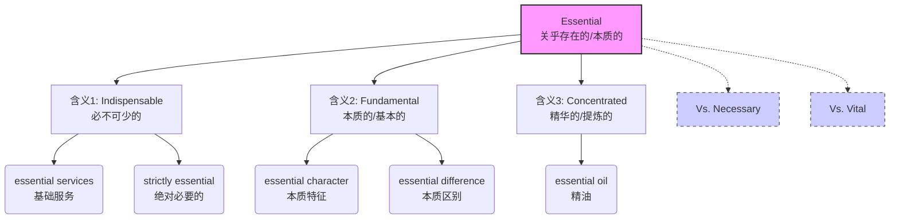

# essential

> [!info] 基础信息
> - **音标**: /ɪˈsenʃl/
> - **词性**: adj. / n.
> - **含义**: 必不可少的；本质的；基本的；精华的

## 词源演化 (Etymology)

源自拉丁语 *essentia* (essence, being)，词根是 *esse* (to be, 存在)。
- **esse** (存在) → **essentia** (存在的本质) → **essential** (关乎存在的)。
- **核心意象**: 事物的**灵魂**或**DNA**。如果没有它，这个事物就不再是它自己了。
- **演变路径**: 存在的本质 (Nature) → 极其重要的 (Important) → 必不可少的 (Necessary)。

## 概念分析 (Concept Analysis)

### 1. 核心概念：存在的基石 (The "Is-ness")
Essential 不仅仅是“需要”，而是关乎“存在”。
- **Internal (内)**: 指事物的**本质属性** (Nature/Character)。例如：自由是民主的 essential 属性。
- **External (外)**: 指为了维持存在而**不可或缺** (Indispensable)。例如：水是生命的 essential 需求。

### 2. 多重含义映射

| 英语语境 (Context) | 汉语对应 (Chinese) | 逻辑联系 (Connection) |
| :--- | :--- | :--- |
| **Requirements** | **必不可少的** | 缺了它就不存在了 (Necessary for existence) |
| **Philosophy/Nature** | **本质的 / 基本的** | 构成事物核心特性的 (Relating to essence) |
| **Chemistry/Oils** | **精华的 / 提炼的** | 从植物中提取的“灵魂” (Extract of essence) |

## 关系图谱 (Relationship Graph)

## 英汉对比 (Comparative Analysis)

- **必要性层级**:
  - **Necessary**: 达成某个结果所需要的（功能性）。"Fuel is necessary for driving."
  - **Vital**: 维持生命或生存所关键的（生死攸关）。"Heart is vital to life."
  - **Essential**: 构成事物本身或维持其存在所必须的（本体论）。"Trust is essential to friendship." (没有信任就算不上友谊)
- **Essential Oil (精油)**:
  - 中文叫“精油”，英文叫“本质油”。因为它提取了植物的“本质/灵魂” (essence)。

## 场景应用 (Usage Scenarios)

### 1. 强调不可或缺 (Requirement)
> "Experience is **essential** for this job."
> 这份工作**必须**有经验 (不仅仅是最好有，而是缺一不可)。

### 2. 描述本质 (Nature)
> "The **essential** problem is that we lack money."
> **根本**问题是我们没钱。

### 3. 虚拟语气 (Subjunctive)
> "It is **essential** that he **be** informed immediately."
> **必须**立即通知他 (注意 be 动词原型，强调命令/必要性)。

## 深度洞察 (Deep Insights)

1.  **Essentialism (专跃主义/本质主义)**:
    - 一种生活哲学：*Less but better*。只关注那些真正**essential** (核心) 的事情，剔除琐碎的 (trivial) 多数。
2.  **Essence vs. Accident (本质 vs. 偶性)**:
    - 哲学概念。**Essence** 是让你成为你的东西；**Accident** 是可以改变但不影响你本质的东西 (如发型、衣服)。
3.  **Non-essential**:
    - 在疫情期间常听到的词 (non-essential businesses)，指“非必要”商业。这不仅是不重要，而是指“暂停它们不会导致社会崩溃”。

## 关键要点 (Key Takeaways)

> [!tip] 决策树：Essential, Necessary, Vital?
> - 关乎生命存亡？→ **Vital**
> - 只是达成目标的条件？→ **Necessary**
> - 关乎事物存在或身份认同 (缺了就不叫那个东西了)？→ **Essential**
> - 是植物提取物？→ **Essential** (oil)

> [!example] 记忆口诀
> **Esse** 存在是词根，
> **Essential** 它是灵魂。
> 缺了它就变了样，
> **本质** **必要** 是一身。
> **精油** 也是它提取，
> 专跃主义求**根本**。
