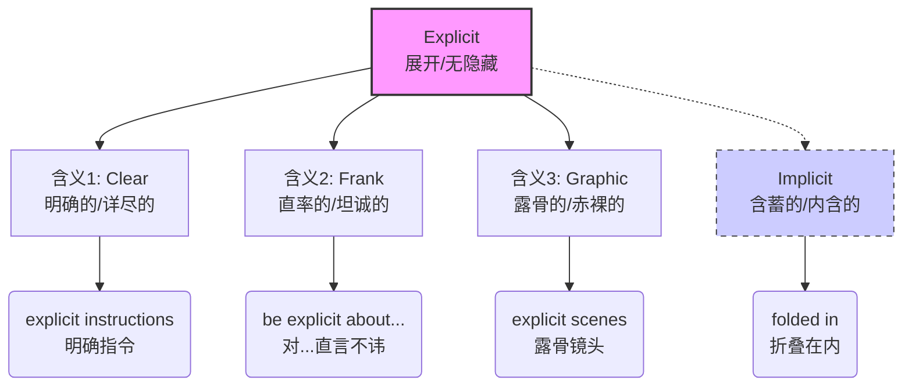

# explicit

> [!info] 基础信息
> - **音标**: /ɪkˈsplɪsɪt/
> - **词性**: adj.
> - **含义**: 明确的；清楚的；直率的；露骨的

## 词源演化 (Etymology)

源自拉丁语 *explicitus*，是 *explicare* 的过去分词。
- **ex-** (out, 出) + **plicare** (to fold, 折叠) = **unfold** (展开/摊开)。
- **核心意象**: 把折叠的东西展开，使其**一目了然**，没有任何隐藏或模糊之处。
- **演变路径**: 展开 (unfolded) → 清楚 (clear) → 直言不讳 (frank) → 露骨 (graphic)。

## 概念分析 (Concept Analysis)

### 1. 核心概念：无保留的展现 (Unfolding)
Explicit 的核心是“完全展示，不留想象空间”。这在不同语境下有不同侧重：
- **信息层面**: 表达得非常清楚，没有歧义 (clear and detailed)。
- **态度层面**: 坦率，不隐晦 (frank and open)。
- **内容层面**: (通常指性或暴力) 描绘得过于赤裸 (graphic)。

### 2. 对应关系 (Mapping)

| 英语语境 (Context) | 汉语对应 (Chinese) | 细微差别 (Nuance) |
| :--- | :--- | :--- |
| **Instructions/Rules** | **明确的** | 强调细节完整，不仅是“清楚”，更是“具体” |
| **Person/Attitude** | **直率的** | 强调不在此事上含糊其辞 |
| **Movies/Content** | **露骨的** | 强调展示了通常应该隐藏的内容 (taboo) |

## 关系图谱 (Relationship Graph)

## 英汉对比 (Comparative Analysis)

- **精确度 vs 概括度**: 
  - 中文“清楚”可以用在很多地方 (听清楚、看清楚、讲清楚)。
  - 英文 *explicit* 侧重于**表达方式**的“无遗漏”，而不是感官上的“清晰” (clear)。
  - *Explicit* implies "leaving nothing to the imagination" (不留想象空间).

- **情感色彩**:
  - 在描述**指示/合同**时，是褒义/中性 (避免误解)。
  - 在描述**电影/书刊**时，通常带有警示意味 (Parental Advisory: Explicit Content)。

## 场景应用 (Usage Scenarios)

### 1. 工作指令 (Professional)
> "Please be **explicit** about what you need from the design team."
> 请**明确**说明你需要设计团队做什么。(不要让他们猜)

### 2. 澄清误会 (Clarification)
> "I gave you **explicit** instructions not to touch that button!"
> 我给过你**极其明确的**指示，不要碰那个按钮！

### 3. 内容分级 (Media)
> "The movie contains **explicit** violence."
> 这部电影包含**露骨的**暴力画面。

## 深度洞察 (Deep Insights)

1.  **Explicit vs. Implicit**: 这一对词是逻辑和编程中的核心概念。
    - **Explicit**: 硬编码的、显式声明的、手动指定的。
    - **Implicit**: 默认的、隐式推断的、自动发生的。
2.  **Explicit Knowledge (显性知识)**: 可以写下来、编码、传递的知识 (文档、数据库)。
    - 相对的是 **Tacit Knowledge (隐性知识)**: 只能意会、依赖经验的知识。
3.  **语用陷阱**: 形容人 *explicit* 时，通常指其**言辞**直接，而不是性格外向。

## 关键要点 (Key Takeaways)

> [!tip] 决策树：什么时候用 Explicit?
> - 是指“含糊不清”的反面吗？→ 是 (Clear/Specific) → 用 **Explicit**
> - 是指“暗示”的反面吗？→ 是 (Direct/Stated) → 用 **Explicit**
> - 是指“少儿不宜”吗？→ 是 (Graphic) → 用 **Explicit**

> [!example] 记忆口诀
> **Ex-** 向外 **Plic-** 折，
> 摊开来讲没曲折。
> 指令明确不含糊，
> 画面露骨需负责。
