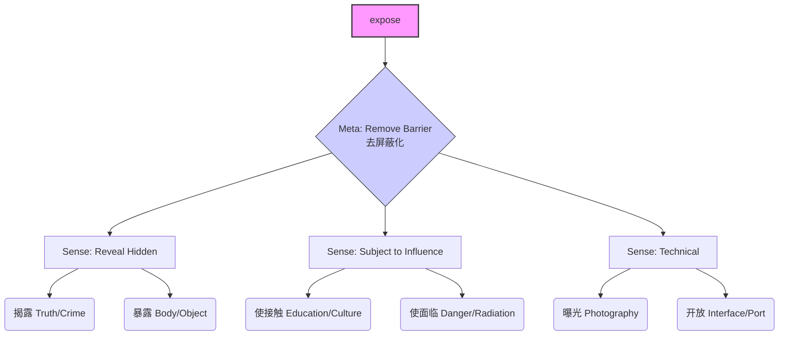

# expose

## 1. 基础信息 (Basic Info)

- **Word**: expose
- **Phonetics**: /ɪkˈspoʊz/
- **Part of Speech**: Verb
- **Core Meanings**: 暴露, 揭露, 使接触, 曝光

## 2. 词义演化 (Etymology & Evolution)

- **Origin**: Latin *exponere*
- **Composition**: *ex-* (out 向外) + *ponere* (to place 放置)
- **Evolution Path**:
  1.  **Literal**: To place outside (把东西放外面)
  2.  **Extension 1 (Risk)**: To leave without protection (放在外面 -> 失去保护 -> **暴露/面临危险**)
  3.  **Extension 2 (Visibility)**: To remove cover (拿掉遮盖 -> **揭露/显示**)
  4.  **Extension 3 (Influence)**: To allow to be seen/experienced (让人看到/经历 -> **使接触**)

## 3. 概念分析 (Conceptual Analysis)

English "expose" is a **Meta-Concept** of "Removing Barriers". Whether the barrier is physical (clothes), informational (secrets), or protective (shelter), removing it "exposes" the object.

| Context | English Concept | Chinese Mapping | Nuance |
| :--- | :--- | :--- | :--- |
| **Truth/Secrets** | Remove secrecy | **揭露 (jiē lù)** | Often implies a scandal or hidden bad thing |
| **Physical/Body** | Remove covering | **暴露 (bào lù)** | Neutral or negative (indecent exposure) |
| **Experience** | Remove isolation | **接触 (jiē chù)** | **Positive/Neutral**: Gaining knowledge/culture |
| **Danger/Risk** | Remove protection | **面临/遭受** | **Negative**: Vulnerability to harm |
| **Tech/Code** | Remove encapsulation | **公开/开放** | Making internal APIs available |

## 4. 关系图谱 (Relationship Graph)

## 5. 英汉对比 (Cross-Linguistic Comparison)

| Dimension | English "expose" | Chinese Equivalents |
| :--- | :--- | :--- |
| **Scope** | **Broad**: Covers ALL acts of "uncovering" or "subjecting to" | **Specific**: Strictly separates "revealing bad things" (揭露) from "learning new things" (接触) |
| **Valence** | **Neutral**: Meaning depends entirely on the object (art vs. virus) | **Valence-Coded**: 揭露 is usually for bad things; 接触 is usually neutral/good |
| **Agency** | Active transitive (Subject exposes Object) | Often passive structure (Object *is* exposed / Object *touches*) |

## 6. 语用场景 (Pragmatic Usage)

### Scene 1: Journalism & Truth (揭露)
> "The journalist **exposed** the corruption in the city council."
> *记者**揭露**了市议会的腐败。*
> (Barrier removed: Secrecy)

### Scene 2: Education & Growth (接触)
> "We want to **expose** our children to different cultures."
> *我们希望让孩子们**接触**不同的文化。*
> (Barrier removed: Ignorance/Isolation. Note: Translated as "touch/contact" in Chinese)

### Scene 3: Risk & Vulnerability (暴露/面临)
> "Do not **expose** the device to direct sunlight."
> *不要让设备**暴露**在直射阳光下。*
> (Barrier removed: Shade/Protection)

### Scene 4: Tech & Coding (开放/导出)
> "The module **exposes** a public API for data retrieval."
> *该模块**提供/开放**了一个用于数据检索的公共 API。*
> (Barrier removed: Encapsulation/Private Scope)

## 7. 深度洞察 (Deep Insights)

1.  **The "Contact" vs. "Reveal" Split**:
    In English, "I was exposed to Covid" and "I was exposed to Jazz music" use the same verb. In Chinese, this is impossible: one is "exposed to danger" (暴露于/感染), the other is "contacted" (接触). English focuses on the **mechanism** (barrier removal); Chinese focuses on the **outcome** (harm vs. gain).

2.  **Vulnerability as a Prerequisite for Growth**:
    The Human 3.0 context uses "expose" perfectly: to grow, you must "expose" yourself to feedback. You cannot "contact" (接触) growth without "exposing" (暴露) yourself to criticism. The word unifies vulnerability and opportunity.

3.  **Technical "Expose"**:
    In Docker or programming, "expose" means "making a port/function listen". It's not just "showing" it; it's making it **interactable**. This bridges the gap between "revealing" (showing it exists) and "contact" (allowing interaction).

## 8. 决策树 & 口诀 (Key Takeaways)

**Translation Decision Tree:**
- Is it a secret/scandal? → **揭露 (jiē lù)**
- Is it physical/visual? → **暴露 (bào lù)**
- Is it learning/experience? → **接触 (jiē chù)**
- Is it danger/risk? → **面临 (miàn lín) / 暴露于**
- Is it code/API? → **开放 (kāi fàng) / 导出**

**Memory Mnemonic:**
> **Expose** is to **Put Out** (ex-pose).
> Put out a secret (Scandal),
> Put out your skin (Sunburn),
> Put out your mind (Education).
