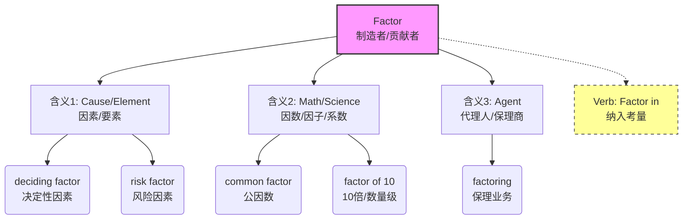

# factor

> [!info] 基础信息
> - **音标**: /ˈfæktər/
> - **词性**: n. / v.
> - **含义**: 因素；要素；因数；因子；(将…) 纳入考虑

## 词源演化 (Etymology)

源自拉丁语 *facere* (to do, to make)。
- **fac-** (做/制造) + **-tor** (者/人) = **Doer/Maker** (做事的人/制造者)。
- **原始含义**: 代办人、代理商 (agent) —— 代替别人“做事”的人。
- **演变路径**: 做事的人 (Doer) → 起作用的事物 (Contributor) → 促成结果的要素 (Element/Cause)。
- **同根词**: *factory* (制造的地方), *fact* (做成的事/事实), *manufacture* (手工制造).

## 概念分析 (Concept Analysis)

### 1. 核心概念：贡献者 (Contributor)
Factor 的核心逻辑是“**促成结果的其中一个部分**”。
- 无论是数学上的“因数”（相乘得出结果），还是生活中的“因素”（共同导致结局），它们都是 Result 的“制造参与者”。

### 2. 多重含义映射

| 英语语境 (Context) | 汉语对应 (Chinese) | 逻辑联系 (Connection) |
| :--- | :--- | :--- |
| **General/Causal** | **因素 / 要素** | 导致结果发生的一个原因 (A contributing cause) |
| **Mathematics** | **因数 / 因子** | 相乘得出积的数 (Maker of the product) |
| **Measurement** | **系数 / 倍数** | 衡量的标准或比率 (e.g., sun protection factor) |
| **Verb Phrase** | **把...计入** | *factor in/out* (把...作为因素算进去) |

## 关系图谱 (Relationship Graph)

## 英汉对比 (Comparative Analysis)

- **抽象 vs 具体**: 
  - 英文 *Factor* 统摄了“原因”、“部件”、“倍数”等多个概念，强调**功能性**（即“它起了作用”）。
  - 中文根据领域分化为“因素”（因果）、“因数”（数学）、“系数”（物理/比例），强调**属性**。
- **数量级表达**:
  - 英文常用 *increase by a factor of X* 来表示“增加了X倍”或“X倍的数量级”。
  - 中文直说“翻了X番”或“乘以X”。

## 场景应用 (Usage Scenarios)

### 1. 分析原因 (Analysis)
> "Cost was a **major factor** in our decision."
> 成本是我们决策的一个**主要因素**。

### 2. 动词短语 (Planning)
> "You need to **factor in** the travel time."
> 你需要把路途时间**算进去** (纳入考量)。

### 3. 数值倍增 (Measurement)
> "The demand has increased by a **factor of five**."
> 需求增长了**五倍**。

## 深度洞察 (Deep Insights)

1.  **Factor vs. Element vs. Component**:
    - **Element**: 基础的组成部分 (如化学元素)，强调**存在**。
    - **Component**: 机械或系统的组件，强调**结构**。
    - **Factor**: 动态的影响力量，强调**作用** (Active contributor)。
2.  **The "X Factor"**: 英语习语，指“未知的、不可预见的、但起决定作用的因素”（也是选秀节目名）。
3.  **Two-Factor Authentication (2FA)**: 双**因子**认证。这里的 factor 指“认证的方式/凭证类型”（你知道的+你拥有的）。

## 关键要点 (Key Takeaways)

> [!tip] 决策树：翻译 Factor
> - 是数学乘法吗？→ **因数**
> - 是导致结果的原因吗？→ **因素**
> - 是衡量防晒/安全的指标吗？→ **系数** (SPF = Sun Protection Factor)
> - 是动词吗？→ **考虑/计入** (Factor in)

> [!example] 记忆口诀
> **Fact-** 做事 **-or** 人，
> 促成结果是功臣。
> 数学**因数**乘积得，
> 决策**因素**要问询。
> **Factor in** 莫忘记，
> 全盘考量才安稳。
