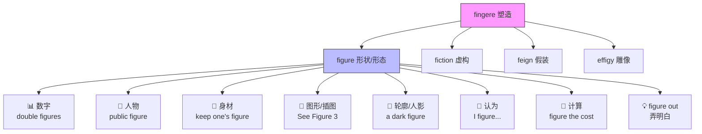

figure :: 
<!--ID: 1773069695080-->

# figure

## 1. 基础信息 (Basic Info)

| 项目 | 内容 |
|---|---|
| 音标 | 🇺🇸 /ˈfɪɡ.jɚ/　🇬🇧 /ˈfɪɡ.ə/ |
| 词性 | n. / v. |
| 核心义 | 由拉丁语"塑造、形成"引申：**一切被赋予形状的事物**——数字、人形、图形、轮廓 |

**名词义 (n.)**
1. **数字，数目** — a number, especially one that forms part of statistics. 数字，数目
2. **人物** — a person, especially one of importance or distinction. （重要）人物
3. **身材，体形** — the shape of a person's body. 身材，体形
4. **图表，图形** — a diagram or illustration in a book or article. 图表，插图
5. **轮廓，人影** — a person seen indistinctly or from a distance. 轮廓，人影

**动词义 (v.)**
1. **认为，估计** *(informal)* — to think or believe. 认为，料想
2. **计算** — to calculate an amount. 计算
3. **figure out** — to understand or solve something. 弄明白，想出

## 2. 词源与演变 (Etymology & Evolution)

**figure** 源自拉丁语 **figūra**（形状、外形、样子），词根为 **fingere**（塑造、捏造），同根词包括 **fiction**（虚构）、**feign**（假装）、**effigy**（雕像）。

演变路径：
- 拉丁语 *figūra*（形状、形态）→ 古法语 *figure* → 中古英语 *figure*
- 最初指"被塑造出来的形状"，后来引申为：
  - **外形** → 人的身材 / 远处的人影
  - **图形** → 几何图形 / 书中插图
  - **数字** → 阿拉伯数字的"形状"（如 1, 2, 3）
  - **人物** → 在社会中有"形象"的人
  - **动词"认为"** → 在脑中"勾勒"出想法

> 核心逻辑：**fingere（塑造）→ figūra（被塑造之物）→ 一切有形状的东西**

## 3. 核心概念图谱 (Concept Graph)



## 4. 扩展词汇 (Vocabulary Expansion)

### 近义词 (Synonyms)

| 义项 | 近义词 | 区别 |
|---|---|---|
| 数字 | **number** | number 是最通用的"数字"；figure 更常指统计数据中的数字，语体偏正式 |
| 数字 | **digit** | digit 专指 0-9 的单个数字（a six-digit number）；figure 可指多位数 |
| 人物 | **character** | character 侧重性格特征或小说人物；figure 侧重社会地位和影响力 |
| 人物 | **personality** | personality 强调个人魅力/知名度；figure 更中性，常与 public/political 搭配 |
| 身材 | **physique** | physique 强调肌肉和体格（偏男性）；figure 更通用，常形容女性身材曲线 |
| 身材 | **build** | build 偏客观描述体型（slim build）；figure 带有审美色彩 |
| 认为 | **reckon** | 两者都是口语化的"认为"；reckon 更偏英式/南方美式 |
| 认为 | **suppose** | suppose 语气更不确定；figure 暗示经过一定推理 |

### 反义词 (Antonyms)

- （数字义）**word**（文字，与数字相对：in figures vs. in words）
- （人物义）**nobody**（无名之辈，与重要人物相对）

### 派生词 (Derivatives)

| 词 | 词性 | 含义 |
|---|---|---|
| **figurative** | adj. | 比喻的，象征的（↔ literal） |
| **figuratively** | adv. | 比喻地 |
| **figurine** | n. | 小雕像，小塑像 |
| **figuration** | n. | 成形，形象化 |
| **disfigure** | v. | 毁容，使变丑（dis- = 破坏 + figure） |
| **configuration** | n. | 配置，构型（con- = 共同 + figure） |
| **prefigure** | v. | 预示（pre- = 提前 + figure） |

## 5. 搭配与用法 (Collocations & Usage)

### 高频搭配 (Collocations)

**名词搭配：**
- **public figure** — 公众人物
- **key/leading/major figure** — 关键/领军/重要人物
- **authority figure** — 权威人物
- **father figure** — 父亲般的人物
- **sales/profit figures** — 销售/利润数据
- **double/single figures** — 两位数/一位数
- **a slim/slender figure** — 苗条的身材
- **a shadowy/dark figure** — 一个模糊的/黑暗的人影
- **See Figure 1** — 见图1（学术写作）

**动词搭配：**
- **figure out** — 弄明白，想出办法
- **figure in** — 被包含在内，起作用
- **figure on** — 预料，打算（I didn't figure on the rain）
- **figure prominently** — 占据重要地位
- **go figure** *(口语)* — 真想不到，真搞不懂

### 典型例句 (Examples)

1. **商务/统计** — The company's revenue figures for Q4 exceeded expectations.（公司第四季度的收入数据超出预期。）
2. **日常口语** — I figure we should leave by 8 if we want to avoid traffic.（我觉得如果想避开堵车，我们应该8点出发。）
3. **学术写作** — As shown in **Figure 3**, the correlation between the two variables is significant.（如图3所示，两个变量之间的相关性显著。）
4. **人物描述** — She became a leading figure in the civil rights movement.（她成为民权运动中的领军人物。）
5. **口语短语** — I can't figure out how to set up this printer. — Go figure!（我搞不懂怎么装这台打印机。——真搞不懂！）

## 6. 易混淆点与辨析 (Analysis & Confusing Points)

### figure vs. number vs. digit

| 词 | 侧重 | 例句 |
|---|---|---|
| **figure** | 统计数据中的数字；也可指位数 | The unemployment figure rose to 5%. / a six-figure salary |
| **number** | 最通用的"数字/号码" | What's your phone number? |
| **digit** | 0-9 的单个数字 | Enter a 4-digit PIN code. |

> 口诀：**digit 是个位，number 最通用，figure 看数据**

### figure vs. shape vs. form

| 词 | 侧重 | 例句 |
|---|---|---|
| **figure** | 人的轮廓/身材；图表 | a tall figure in the doorway |
| **shape** | 几何形状；物体外形 | a heart shape |
| **form** | 形式、形态（更抽象） | in the form of a question |

### 英美发音差异

- 🇺🇸 美式 /ˈfɪɡ.jɚ/：第二音节有明显的 /j/ 滑音
- 🇬🇧 英式 /ˈfɪɡ.ə/：第二音节弱化为 schwa /ə/，无 /j/

> 注意：不要读成 /ˈfɪɡ.juːr/，没有长元音 /uː/。

## 7. 总结与记忆 (Summary & Memory)

### 口诀 (Mnemonic)

> **Figure 一词形为本：数字有形，人物有形，身材有形，图表有形，脑中成形便是"想"。**

### 决策树 (Decision Tree)

```
需要用 figure 吗？
├─ 说的是"数字/数据"？
│   ├─ 统计数据 → figure ✅ (sales figures)
│   ├─ 单个 0-9 → digit
│   └─ 通用数字/号码 → number
├─ 说的是"人物"？
│   ├─ 有社会影响力 → figure ✅ (public figure)
│   ├─ 强调性格/角色 → character
│   └─ 强调知名度 → personality / celebrity
├─ 说的是"身材"？
│   ├─ 通用/审美 → figure ✅ (keep one's figure)
│   └─ 强调体格/肌肉 → physique / build
├─ 说的是"图表"？
│   └─ 学术插图 → figure ✅ (See Figure 2)
└─ 说的是"认为/弄明白"？
    ├─ 口语"我觉得" → I figure... ✅
    └─ 解决问题 → figure out ✅
```
