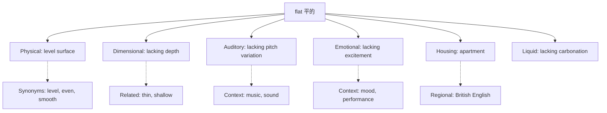

## Basic Info
- **English**: flat /flæt/
- **Chinese**: 平的 (píng de) / 扁平 (biǎn píng) / 公寓 (gōng yù)
- **Parts of Speech**: adjective, noun, adverb
- **Primary Meanings**: having a level surface; lacking volume; apartment (British)

## Semantic Evolution
The word "flat" derives from Old English "flætt" meaning "level, even, smooth". Originally describing physical surfaces, the meaning expanded metaphorically to describe sounds (lacking pitch variation), emotions (lacking intensity), and eventually to a type of housing (flat/apartment) due to the horizontal layout of such dwellings.

## Conceptual Analysis

### Polysemy (Multiple Related Meanings)
- **Physical**: having a level surface (flat ground)
- **Dimensional**: lacking thickness or depth (flat tire)
- **Auditory**: lacking variation in pitch (flat singing)
- **Emotional**: lacking enthusiasm or excitement (flat affect)
- **Spatial**: British term for apartment (one floor dwelling)
- **Linguistic**: lacking in flavor or taste (flat beer)

### Synonymy and Related Terms
- **Synonyms**: level, even, smooth, plane, flush
- **Antonyms**: curved, round, bumpy, uneven, rough

## Mermaid Relationship Graph

## Cross-linguistic Comparison Table
| Aspect | English "flat" | Chinese Equivalents | Notes |
|--------|----------------|-------------------|-------|
| **Conceptual Range** | 6+ distinct meanings | Requires different terms | English bundles multiple concepts |
| **Physical Meaning** | Level surface | 平的 (píng de) | Close correspondence |
| **Housing Term** | flat (British) | 公寓 (gōng yù) | Cultural/linguistic difference |
| **Flexibility** | High (context-dependent) | More specific terms | Chinese uses separate words |

## Usage Examples

1. **Physical Context**: "The surface of the table is completely flat." → "桌子表面完全平整。"
2. **Housing Context**: "They live in a nice flat in London." → "他们住在伦敦一套不错的公寓里。"
3. **Auditory Context**: "Her singing was a bit flat today." → "她今天唱歌有点走调。"

## Deep Insights

1. **Cultural/Linguistic Gap**: English "flat" as housing term reflects British architectural traditions, while Chinese "公寓" has no such regional specificity.
2. **Semantic Bundling**: English groups multiple concepts under "flat" that Chinese expresses with different words, showing different cognitive categorizations.
3. **Register Differences**: "Flat" as housing is distinctly British vs American "apartment", highlighting dialectal variations.

## Key Takeaways

### Decision Tree for Translation
- **If describing surface**: → 平的 (píng de)
- **If describing dimension**: → 扁平 (biǎn píng) 
- **If referring to housing (British)**: → 公寓 (gōng yù)
- **If describing sound**: → 走调 (zǒu diào) or context-specific

### Memory Mnemonic
**"Flat is multi-faceted flat"**: Remember that "flat" has multiple meanings centered around the core concept of "lacking variation or depth" - whether in surface, emotion, sound, or space.

## Etymology Derivation
- Old English "flætt" → Middle English "flatt" → Modern English "flat"
- Shows semantic expansion from purely physical to metaphorical domains
- Regional development for housing term (British English)