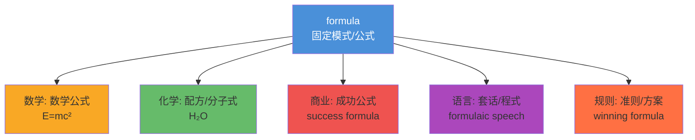

# Formula

## 1. 基础信息

| | |
|---|---|
| **音标** | /ˈfɔːrmjələ/ |
| **词性** | n. (复数: **formulas** 或 **formulae**) |
| **英文释义** | A mathematical relationship or rule expressed in symbols; a fixed form of words or procedure |
| **中文释义** | 公式；配方；方案；准则 |

## 2. 词源与演变

**拉丁语** *formula* → "小形式、模式"（*forma* 形式 + *-ula* 小称后缀）

**演变路径**：
- **罗马法**（公元2世纪）：法律诉讼中固定的程式化用语 → "form of words"
- **17世纪**：进入数学领域 → 数学公式（符号表达的关系）
- **现代**：扩展到化学配方、商业成功秘诀、人际关系法则

**核心意象**：把复杂的东西**浓缩成可复用的固定模式**。

## 3. 核心概念图谱



## 4. 扩展词汇

### 近义词辨析

| 词 | 核心差异 | 使用场景 |
|---|---|---|
| **formula** | 精确的符号表达或固定模式 | 数学/科学/标准流程 |
| **equation** | 含等号的数学关系式 | 数学方程（2x+3=7） |
| **recipe** | 制作某物的步骤清单 | 烹饪/非正式"秘诀" |
| **recipe for success** | 成功的秘诀 | 非正式商业语境 |
| **blueprint** | 蓝图，整体规划 | 建筑/战略规划 |
| **template** | 模板，可复用框架 | 文档/设计 |

### 反义词
- **ad-lib** (即兴发挥) — 与 fixed formula 相对

### 派生词
| 词 | 词性 | 含义 |
|---|---|---|
| **formulate** | v. | 系统阐述；制定（方案） |
| **formulation** | n. | 公式化；配方；表述方式 |
| **formulaic** | adj. | 刻板的；公式化的（带贬义） |
| **formulator** | n. | 制定者；配方师 |

## 5. 搭配与用法

### 高频搭配
- **动词 + formula**
  - develop / derive a formula（推导公式）
  - apply / use a formula（应用公式）
  - come up with a formula（想出方案）
  
- **形容词 + formula**
  - a magic / winning formula（成功秘诀）
  - a standard formula（标准公式）
  - a mathematical formula（数学公式）

### 典型例句

**📚 学术/数学**
> The *formula* for the area of a circle is πr².
> 圆的面积公式是 πr²。

**💼 商业**
> There's no *winning formula* for startup success.
> 创业成功没有万能公式。

**🧪 科学**
> The chemist spent years perfecting the *formula* for the new drug.
> 化学家花了数年完善新药的配方。

**🗣️ 日常（贬义）**
> His apologies are so *formulaic* — he just goes through the motions.
> 他的道歉太公式化了——只是走个过场。

**📝 写作**
> Critics argue that Hollywood films follow a predictable *formula*.
> 评论家认为好莱坞电影遵循一个可预测的套路。

## 6. 易混淆点与辨析

### formula vs equation
- **formula** = 通用公式（如 A = πr²），表达一般规律
- **equation** = 含等号的具体等式（如 2x + 3 = 7），需要求解
- *E=mc² 既是 formula 也是 equation，但 "quadratic formula"（求根公式）只是 formula*

### formula vs recipe
- **formula**：正式、精确、可量化（科学/数学/商业）
- **recipe**：非正式、步骤化（烹饪/口语化的"秘诀"）
- *✅ "What's the recipe for a happy marriage?" → 自然*
- *❌ "What's the formula for a happy marriage?" → 太学术*

### formulaic（⚠️ 贬义）
- "formulaic" = 缺乏创意的、机械的
- *formulaic response（套话回答）/ formulaic plot（套路剧情）*

### 复数形式
- **formulas**（常用，尤其在英语语境）
- **formulae**（拉丁复数，学术/正式语境）

## 7. 总结与记忆

### 🧠 口诀
> **form**（形式）+ **ula**（小）= 把复杂事物压缩成**小形式** = 公式

### 🌳 决策树

```
你要表达什么？
├─ 数学/科学中的符号关系 → formula
├─ 需要求解的等式 → equation  
├─ 做菜的步骤清单 → recipe
├─ 整体战略规划 → blueprint
└─ 批评某事缺乏创意 → formulaic
```

---
# Related
![[Backlinks.base]]
