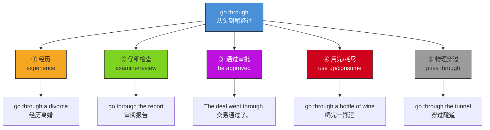

# go through

## 1. 基础信息 (Basic Info)

- **发音**: /ɡoʊ θruː/
- **词性**: phrasal verb（短语动词）
- **英文释义**:
  1. to experience something, especially something difficult or unpleasant
  2. to examine or search something carefully
  3. to be officially accepted or approved
  4. to use up or consume something completely
  5. to pass through a place or area
- **中文翻译**: 经历；仔细检查/审阅；通过（审批）；用完/耗尽；穿过

## 2. 词源与演变 (Etymology & Evolution)

**go** 源自古英语 *gān*（行走、移动），**through** 源自古英语 *þurh*（从一端到另一端）。两者组合的字面意义是"从一端走到另一端"，即**穿过**。

语义演变路径：
- **空间穿越**（物理穿过）→ **时间穿越**（经历某段时期）→ **过程穿越**（仔细检查每一部分）→ **资源穿越**（消耗殆尽）→ **制度穿越**（获得批准通过）

核心逻辑：所有义项都保留了"**从头到尾完整地经过**"这一底层概念——无论是经过一个地方、一段经历、一份文件，还是一笔资源。

## 3. 核心概念图谱 (Concept Graph)



## 4. 扩展词汇 (Vocabulary Expansion)

### 近义词 (Synonyms)

| 义项 | 近义词 | 区别 |
|------|--------|------|
| 经历 | **experience** | 中性词，go through 强调过程的艰难或漫长 |
| 经历 | **undergo** | 更正式，常用于医疗/法律语境（undergo surgery） |
| 经历 | **endure** | 强调忍受痛苦，语气更重 |
| 仔细检查 | **review** | review 更正式，go through 更口语化，暗示逐条过 |
| 仔细检查 | **examine** | examine 强调细致分析，go through 强调从头到尾过一遍 |
| 用完 | **use up** | 意思几乎相同，use up 更直接 |
| 用完 | **consume** | 更正式，常用于书面语 |
| 通过 | **be approved** | 更正式的表达，go through 更口语 |

### 反义词 (Antonyms)

- **avoid**（避免经历）— 与"经历"义相反
- **skip**（跳过）— 与"仔细检查"义相反
- **be rejected / fall through**（被否决/落空）— 与"通过审批"义相反
- **save / conserve**（节省/保存）— 与"用完"义相反

### 派生词与相关短语 (Derivatives & Related Phrases)

- **go through with**：坚持完成（尤指困难的事）— *She decided to go through with the operation.*
- **go-through** (n.)：（非正式）审查、检查过程
- **see through**：看穿；坚持到底（注意区分）
- **get through**：完成；度过；打通电话（近义但侧重不同）

## 5. 搭配与用法 (Collocations & Usage)

### 高频搭配 (Collocations)

**经历类**：go through a difficult time / a crisis / a phase / changes / a divorce / hardship / hell

**检查类**：go through the files / the documents / the details / the checklist / one's notes / the agenda

**审批类**：The deal / proposal / application / law went through.

**消耗类**：go through money / food / a tank of gas / batteries / three cups of coffee

### 典型例句 (Examples)

1. **日常**: *We've been going through a rough patch lately, but things are getting better.*
   我们最近经历了一段艰难时期，但情况正在好转。

2. **商务**: *Could you go through the contract one more time before we sign it?*
   签字之前你能再审阅一遍合同吗？

3. **商务**: *The merger finally went through after months of negotiation.*
   经过数月谈判，合并终于获批通过了。

4. **日常**: *My kids go through a pair of shoes every two months.*
   我的孩子们每两个月就穿坏一双鞋。

5. **学术**: *The author goes through each theory systematically, offering both evidence and critique.*
   作者系统地逐一审视每个理论，既提供证据也给出批评。

## 6. 易混淆点与辨析 (Analysis & Confusing Points)

### go through vs. get through

两者都有"经历/完成"之意，但侧重不同：
- **go through** 强调**过程本身**——经历了什么、检查了什么。
- **get through** 强调**结果**——成功度过、完成、或联系上某人。

> *She went through a lot of pain.* （她经历了很多痛苦——强调过程）
> *She got through the exam.* （她通过了考试——强调结果）

### go through vs. go over

两者都可表示"检查/审阅"：
- **go through** 暗示**逐条、从头到尾**地过一遍，更彻底。
- **go over** 可以是快速浏览，也可以是仔细检查，语义更宽泛。

> *Let me go through the list item by item.* （让我逐条过一遍清单）
> *Let's go over the main points quickly.* （我们快速过一下要点）

### go through vs. go through with

- **go through** 可以是被动经历（不一定是自愿的）。
- **go through with** 强调**下定决心去做**某件（通常困难或令人犹豫的）事。

> *He couldn't go through with the wedding.* （他无法下决心完成婚礼——主动放弃）
> *He went through a terrible wedding.* （他经历了一场糟糕的婚礼——被动经历）

## 7. 总结与记忆 (Summary & Memory)

### 口诀 (Mnemonic)

> **"从头走到尾，五义全覆盖：**
> **穿过是本义，经历苦与难，**
> **逐条来审查，资源用个完，**
> **审批若通过，go through 全包办。"**

### 决策树 (Decision Tree)

```
需要表达什么？
├── 物理上穿过某地 → go through (the park / the door)
├── 经历某事（尤其困难的事）→ go through (a hard time / changes)
│   └── 想强调"结果/成功度过"？→ 改用 get through
├── 仔细检查/审阅 → go through (the report / the files)
│   └── 只是快速浏览？→ 改用 go over
├── 用完/消耗 → go through (money / food)
│   └── 更正式？→ 改用 use up / consume
└── 获得批准通过 → go through (The deal went through.)
    └── 没通过/落空？→ 改用 fall through
```
