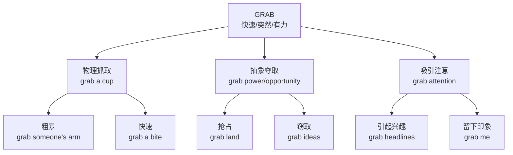

# grab

## 1. 基础信息 (Basic Info)

**音标**: /ɡræb/
**词性**: v. / n.

**英文定义**:
- v. to take hold of something or someone suddenly and roughly
- v. to get something quickly, especially in a way that is not polite or fair
- v. to attract attention or interest

**中文翻译**: 抓住、抓取；抢夺、夺取；吸引（注意力）

---

## 2. 词源与演变 (Etymology & Evolution)

- **来源**: 16世纪晚期，可能源自荷兰语/低地德语 *grabben*（抓取）
- **词根**: 拟声词，模拟快速抓取时的声音/动作
- **演变**: 从物理"抓取" → 抽象"夺取/抢占" → "吸引注意"

---

## 3. 核心概念图谱 (Concept Graph)



---

## 4. 扩展词汇 (Vocabulary Expansion)

### 近义词 (Synonyms)

| 单词 | 含义 | 与 grab 的区别 |
|------|------|---------------|
| **seize** | 抓住、夺取 | 更正式，强调"控制/占有"，常用于法律/军事 |
| **snatch** | 一把抓走 | 更强调"快速+偷窃感"，常带负面含义 |
| **grasp** | 紧握、理解 | 强调"握紧不放"，也可指理解 |
| **clutch** | 紧抓 | 强调"因恐惧/紧张而紧握" |
| **capture** | 捕获 | 强调"成功捕获"，常用于猎物/罪犯 |

### 反义词 (Antonyms)
- release (释放)
- let go (放手)
- drop (掉落)

### 派生词 (Derivatives)
- **grabber** n. 抓取者；吸引眼球的东西
- **grabbing** adj. 吸引人的

---

## 5. 搭配与用法 (Collocations & Usage)

### 高频搭配 (Collocations)

| 类型 | 搭配 | 例句 |
|------|------|------|
| **动词+名词** | grab a bite | Let's grab a bite before the movie. |
| | grab a drink | Wanna grab a drink after work? |
| | grab a seat | Grab a seat, I'll be right there. |
| **动词+抽象** | grab attention | The ad really grabs your attention. |
| | grab opportunity | You need to grab this opportunity. |
| | grab power | The military grabbed power in a coup. |
| **形容词+名词** | quick grab | It was just a quick grab and run. |
| | power grab | Critics called it a shameless power grab. |

### 典型例句 (Examples)

1. **日常场景**: *I grabbed my phone and ran out the door.* (我抓起手机就冲出门)
2. **商务场景**: *The headline grabbed investors' attention immediately.* (标题立即吸引了投资者的注意)
3. **负面含义**: *He tried to grab credit for my work.* (他试图抢夺我工作的功劳)
4. **口语表达**: *Grab me a coffee, will you?* (帮我拿杯咖啡好吗？)
5. **习语**: *How does that grab you?* (你觉得那个怎么样？)

---

## 6. 易混淆点与辨析 (Analysis & Confusing Points)

### grab vs snatch
- **grab**: 中性，可好可坏，强调"快速"
  - *He grabbed my hand to help me up.* (善意)
- **snatch**: 偏负面，强调"偷/抢"
  - *Someone snatched my bag and ran.* (恶意)

### grab vs grasp
- **grab**: 动作快，不一定握紧
  - *Grab the rope!* (快抓住绳子！)
- **grasp**: 紧紧握住，或指理解
  - *Grasp the concept* (理解这个概念)

### 文化差异
- 西方商务中 "grab a coffee" 是很自然的社交邀请
- 中文直译"抓咖啡"显得粗鲁，实际应理解为"喝一杯咖啡"

---

## 7. 总结与记忆 (Summary & Memory)

### 口诀 (Mnemonic)
> **"Grab 快，Grasp 紧，Snatch 偷，Seize 夺"**

### 决策树 (Decision Tree)
```
需要表达"抓取"时：
├── 是日常口语/随意场合？→ 用 grab
│   └── 是吃饭/饮料？→ grab a bite/drink
│   └── 是吸引注意？→ grab attention
├── 是正式/法律/军事？→ 用 seize
├── 是偷/抢（负面）？→ 用 snatch
└── 是紧握不放？→ 用 grasp
```
