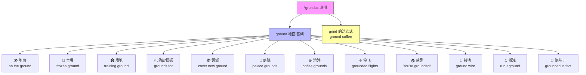

# ground

## 1. 基础信息 (Basic Info)

| 项目 | 内容 |
|---|---|
| 音标 | 🇺🇸 /ɡraʊnd/　🇬🇧 /ɡraʊnd/ |
| 词性 | n. / v. / adj. |
| 核心义 | 源自古英语"底部、基础"：**大地——一切事物的根基与起点** |

**名词义 (n.)**
1. **地面，地** — the solid surface of the earth. 地面
2. **土地，土壤** — soil; earth. 土壤
3. **场地，场所** — an area of land used for a particular purpose. 场地
4. **理由，根据** — a reason for doing or believing something. 理由，根据
5. **领域，范围** — an area of knowledge or discussion. 领域
6. **(pl.) grounds 庭院** — the land surrounding a large building. 庭院，场院
7. **(pl.) grounds 渣滓** — solid particles that sink to the bottom of a liquid. 渣，沉淀物（如 coffee grounds）

**动词义 (v.)**
1. **使停飞** — to prevent a pilot or aircraft from flying. 使停飞
2. **（家长）罚不准出门** *(informal)* — to punish a child by not allowing them to go out. 禁足
3. **使基于，以…为基础** — to base something on. 使基于
4. **接地，使接地** — to connect electrical equipment to the ground. 接地
5. **搁浅** — (of a ship) to run aground. 搁浅

**形容词义 (adj.)**
1. **磨碎的** — reduced to fine particles. 磨碎的（ground coffee, ground beef）
2. **地面的** — at ground level. 地面的

> ⚠️ 注意：**ground** 也是 **grind**（研磨）的过去式和过去分词。

## 2. 词源与演变 (Etymology & Evolution)

**ground** 源自古英语 **grund**（底部、基础、深渊），与古高地德语 *grunt*、古诺尔斯语 *grunnr*（底部）同源，原始日耳曼语词根为 ***grunduz**（底部、地基）。

演变路径：
- 原始日耳曼语 *grunduz*（底部）→ 古英语 *grund*（地面、底部、深渊）→ 中古英语 *ground*
- 核心语义从"底部"向外辐射：
  - **底部** → 地面（脚下的底部）→ 土壤
  - **底部** → 基础 → 理由/根据（论点的基础）
  - **地面** → 场地（特定用途的地面）→ 庭院
  - **地面** → 使落地 → 停飞 / 禁足 / 接地
  - **沉到底部** → 渣滓（coffee grounds）

> 核心逻辑：**grund（底部）→ 地面 → 基础 → 一切与"根基、落地"相关的含义**

## 3. 核心概念图谱 (Concept Graph)



## 4. 扩展词汇 (Vocabulary Expansion)

### 近义词 (Synonyms)

| 义项 | 近义词 | 区别 |
|---|---|---|
| 地面 | **floor** | floor 指室内地面；ground 指室外地面/大地 |
| 地面 | **earth** | earth 更强调泥土/土壤本身，或与"天"相对的"地" |
| 地面 | **land** | land 强调作为财产或地理概念的"土地"；ground 更具体指脚下的地面 |
| 土壤 | **soil** | soil 是农业/科学用语，指可种植的土壤；ground 更日常 |
| 理由 | **reason** | reason 最通用；grounds 更正式，常用于法律/官方语境（grounds for divorce） |
| 理由 | **basis** | basis 强调"基础"；grounds 强调"充分的理由" |
| 场地 | **field** | field 偏指开阔的田野或运动场；ground 更泛指特定用途的场地 |
| 领域 | **territory** | territory 有"领地"含义，暗示所有权；ground 更中性 |

### 反义词 (Antonyms)

- **sky / air**（天空 / 空中，与地面相对）
- **ceiling**（天花板，与 floor 相对时）
- **surface**（水面，与海底 ground 相对时）

### 派生词 (Derivatives)

| 词 | 词性 | 含义 |
|---|---|---|
| **grounded** | adj. | 脚踏实地的；被禁足的；停飞的 |
| **grounding** | n. | 基础训练；接地 |
| **groundless** | adj. | 无根据的（groundless fears） |
| **groundwork** | n. | 基础工作，准备工作 |
| **underground** | adj./n./adv. | 地下的；地铁；秘密地 |
| **background** | n. | 背景 |
| **foreground** | n. | 前景 |
| **playground** | n. | 操场，游乐场 |
| **groundbreaking** | adj. | 开创性的 |

## 5. 搭配与用法 (Collocations & Usage)

### 高频搭配 (Collocations)

**名词搭配：**
- **on the ground** — 在地面上；在实地（boots on the ground）
- **common ground** — 共同点，共识
- **middle ground** — 中间立场，折中
- **training/breeding ground** — 训练场/温床
- **grounds for** — ……的理由（grounds for concern/dismissal）
- **coffee grounds** — 咖啡渣
- **ground floor** — 一楼（英式）
- **ground level** — 地面层
- **ground rules** — 基本规则
- **ground zero** — 爆心投影点；起点

**动词搭配：**
- **gain/lose ground** — 取得/失去进展
- **cover ground** — 涉及范围；走过一段路
- **break new ground** — 开辟新天地
- **stand/hold one's ground** — 坚守立场
- **get off the ground** — （计划等）开始实施
- **hit the ground running** — 迅速进入状态
- **run into the ground** — 把……搞垮；过度使用

### 典型例句 (Examples)

1. **日常** — The kids were playing on the ground in the backyard.（孩子们在后院的地上玩耍。）
2. **商务** — We need to find common ground before the negotiation can move forward.（我们需要在谈判推进之前找到共识。）
3. **法律/正式** — The court found sufficient grounds for an appeal.（法院认定有充分的上诉理由。）
4. **口语/家庭** — You're grounded for a week — no phone, no going out!（你被禁足一周——不许用手机，不许出门！）
5. **学术/比喻** — Her research breaks new ground in the field of neuroscience.（她的研究在神经科学领域开辟了新天地。）

## 6. 易混淆点与辨析 (Analysis & Confusing Points)

### ground vs. floor vs. earth vs. land

| 词 | 侧重 | 典型场景 |
|---|---|---|
| **ground** | 室外地面；脚下的大地 | sit on the ground, fall to the ground |
| **floor** | 室内地面；楼层 | mop the floor, the 3rd floor |
| **earth** | 泥土/土壤；地球；与天相对 | dig the earth, down to earth |
| **land** | 土地（财产/地理）；陆地 | buy land, by land |

> 口诀：**ground 在外头，floor 在屋头，earth 是泥土，land 是地头（地产）**

### ground (n.) vs. ground (grind 的过去式)

这是两个完全不同的词源：
- **ground**（地面）← 古英语 *grund*（底部）
- **ground**（磨碎的）← **grind** 的过去式/过去分词，古英语 *grindan*

| 用法 | 例句 |
|---|---|
| ground = 地面 | The plane is on the **ground**. |
| ground = grind 过去式 | She **ground** the coffee beans this morning. |
| ground = 磨碎的 (adj.) | I need some **ground** pepper. |

### grounds for vs. reason for

- **grounds for** 更正式，常用于法律、官方场合：*grounds for termination*（解雇的理由）
- **reason for** 更通用日常：*the reason for being late*（迟到的原因）

## 7. 总结与记忆 (Summary & Memory)

### 口诀 (Mnemonic)

> **Ground 万物之根基：脚踩地面是 ground，理由根据也是 ground，磨成粉末还是 ground，禁足停飞落了 ground。**

### 决策树 (Decision Tree)

```
需要用 ground 吗？
├─ 说的是"地面/土地"？
│   ├─ 室外地面 → ground ✅ (on the ground)
│   ├─ 室内地面 → floor
│   ├─ 泥土/土壤 → ground / earth / soil
│   └─ 土地财产 → land
├─ 说的是"理由"？
│   ├─ 正式/法律 → grounds ✅ (grounds for appeal)
│   └─ 日常通用 → reason
├─ 说的是"场地"？
│   ├─ 特定用途场地 → ground ✅ (training ground)
│   └─ 开阔田野/球场 → field
├─ 说的是"磨碎的"？
│   └─ ground coffee / ground beef ✅ (来自 grind)
├─ 说的是"停飞/禁足"？
│   └─ grounded ✅ (flights grounded / you're grounded)
└─ 说的是"基于/扎实"？
    └─ grounded in ✅ (grounded in reality)
```
