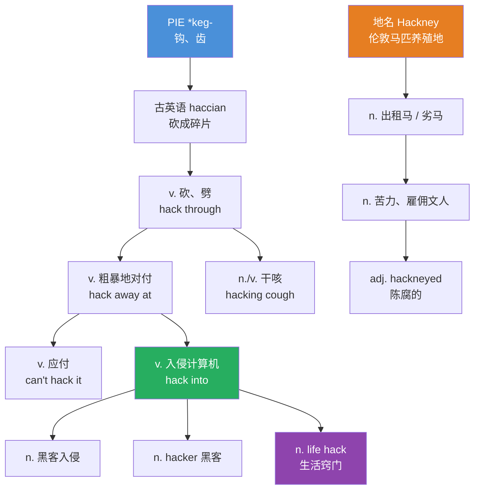

# hack

## 1. 基础信息 (Basic Info)

| 项目 | 内容 |
|---|---|
| **音标** | 英 /hæk/　美 /hæk/ |
| **词性** | v. / n. / adj. |
| **词形变化** | hacks, hacked, hacked, hacking |

### 英文释义与中文翻译

**动词 (v.)**
1. to cut something roughly or violently — 砍，劈，乱砍
2. to gain unauthorized access to a computer system — 入侵（计算机），黑入
3. to manage or cope with something *(informal)* — 应付，对付（常用于否定：can't hack it）
4. to cough in a short, dry way — 干咳

**名词 (n.)**
1. a rough cut or blow — 砍，劈
2. an act of computer hacking — 黑客入侵
3. a clever tip or shortcut *(modern informal)* — 窍门，妙招（如 life hack）
4. a writer who produces dull, unoriginal work — 雇佣文人，蹩脚作家
5. a taxi or a horse for hire — 出租马车；出租车

**形容词 (adj.)**
1. hired; unoriginal — 受雇的；平庸的（如 hack writer）

---

## 2. 词源与演变 (Etymology & Evolution)

**hack** 实际上是英语中**两个不同来源的词**汇合在同一拼写下的结果：

### 词源线索一：「砍」

源自古英语 *haccian*（砍成碎片），追溯至西日耳曼语 \**hakkon*，与德语 *hacken*、荷兰语 *hakken* 同源。更深层的原始印欧语词根为 \**keg-*（钩、齿），与 **hook**（钩）、**haggle**（讨价还价，原义为反复砍）、**hew**（砍伐）同源。这个词可能最初是对砍劈声音的拟声。

### 词源线索二：「雇佣马 / 雇佣文人」

缩写自 **hackney**，源自伦敦东北部的地名 Hackney。13世纪起，该地以养殖供出租的马匹闻名。由于出租马往往是老弱之马，hackney 逐渐引申为「劣马」→「苦力」→「受雇写手」→「平庸之作」。由此衍生出 **hackneyed**（陈腐的）。

### 现代科技义的诞生

1955年，MIT 技术模型铁路俱乐部（TMRC）的会议记录中首次出现了现代意义上的 "hack"——指对技术系统的创造性探索。后来逐渐分化为正面含义（巧妙的技术方案）和负面含义（非法入侵计算机）。近年来，"life hack"（生活窍门）的流行又赋予了它全新的日常含义。

**演变路径：**
> 砍劈（物理动作）→ 粗暴地对付 → 费力地应对 → 对技术系统动手脚 → 入侵计算机 / 巧妙的解决方案

---

## 3. 核心概念图谱 (Concept Graph)



---

## 4. 扩展词汇 (Vocabulary Expansion)

### 近义词 (Synonyms)

| 近义词 | 含义差异 |
|---|---|
| **chop** | 更整齐、有目的的砍（如 chop wood），hack 强调粗暴、无章法 |
| **slash** | 用刀刃横向划砍，hack 更偏向用力劈砍 |
| **hew** | 文学性更强，指用斧头砍伐（hew a tree），比 hack 更正式 |
| **breach** | 专指突破安全系统（breach a firewall），hack 更口语化且含义更广 |
| **crack** | 在计算机语境中指破解软件保护，hack 更侧重入侵系统 |
| **trick / tip** | 在 "life hack" 义项中的近义词，但 hack 暗示更巧妙、非常规的方法 |

### 反义词 (Antonyms)

| 反义词 | 说明 |
|---|---|
| **protect / secure** | 与「入侵」义相反 |
| **mend / repair** | 与「砍坏」义相反 |
| **master / expert** | 与「平庸的雇佣文人」义相反 |

### 派生词 (Derivatives)

| 派生词 | 词性 | 含义 |
|---|---|---|
| **hacker** | n. | 黑客；技术高手 |
| **hacking** | n./adj. | 黑客行为；（咳嗽）干咳的 |
| **hackable** | adj. | 可被入侵的 |
| **hacktivist** | n. | 黑客行动主义者（hack + activist） |
| **hackathon** | n. | 黑客马拉松（hack + marathon） |
| **hackney** | n. | 出租马车 |
| **hackneyed** | adj. | 陈腐的，老套的 |
| **hackerspace** | n. | 创客空间 |

---

## 5. 搭配与用法 (Collocations & Usage)

### 高频搭配 (Collocations)

**动词搭配：**
- hack into (a system / an account) — 入侵（系统/账户）
- hack away at (something) — 不断砍/不断努力
- hack through (the jungle / red tape) — 砍出一条路 / 突破繁文缛节
- hack off (a branch) — 砍掉
- hack it — 应付得了（常用否定：can't hack it）

**名词搭配：**
- life hack — 生活窍门
- security hack — 安全入侵
- hack job — 粗制滥造的活儿
- hack writer — 蹩脚作家
- hacking cough — 干咳

### 典型例句 (Examples)

1. **科技场景：** Someone hacked into the company's database and stole millions of customer records.
   *有人入侵了公司数据库，窃取了数百万客户记录。*

2. **日常口语：** I found a great life hack — use a binder clip to organize your cables.
   *我发现了一个超棒的生活窍门——用长尾夹整理你的数据线。*

3. **职场场景：** The workload is brutal. I don't think I can hack it much longer.
   *工作量太大了，我觉得我撑不了多久了。*

4. **户外/动作：** The explorers hacked their way through the dense undergrowth.
   *探险者们在茂密的灌木丛中砍出一条路。*

5. **贬义/文学：** He dismissed the author as a hack who churned out formulaic thrillers.
   *他把那位作者贬为一个批量生产套路惊悚小说的蹩脚写手。*

---

## 6. 易混淆点与辨析 (Analysis & Confusing Points)

### hack vs. crack vs. breach

这三个词在计算机安全领域经常混用，但有细微差别：**hack** 是最通用的说法，既可以指恶意入侵也可以指善意的技术探索（如 hackathon）；**crack** 特指破解密码或软件保护，带有明确的「破解」含义；**breach** 更正式，常用于新闻和法律语境，强调安全防线被突破的结果（data breach = 数据泄露）。

### hack 的褒贬色彩

hack 是一个典型的「语境决定褒贬」的词。在硅谷文化中，"That's a brilliant hack!" 是高度赞扬，意味着用巧妙的方式解决了问题；而 "hack writer" 或 "hack job" 则是明确的贬义，暗示平庸和粗糙。判断褒贬的关键在于：如果强调**创造性和巧妙**，则为褒义；如果强调**粗糙和雇佣性质**，则为贬义。

### hack 与 hew 的区别

两者都有「砍」的意思，但 **hew** 更正式、更文学化，常用于描述有目的的砍伐（hew timber），而 **hack** 强调动作的粗暴和随意（hack at the branches wildly）。

### 发音注意

hack /hæk/ 只有一个发音，不像 record 或 appropriate 那样因词性不同而变音。但要注意与 **hawk** /hɔːk/（鹰；叫卖）区分开来。

---

## 7. 总结与记忆 (Summary & Memory)

### 口诀 (Mnemonic)

> **砍劈是本义，入侵是引申；雇佣来自马，窍门最时新。**
> 
> 记住 hack 的四张面孔：斧头（砍）、键盘（入侵）、老马（雇佣）、灯泡（窍门）。

### 决策树 (Decision Tree)

```
需要表达什么含义？
├── 物理上的砍、劈 → hack (v.) "hack through the jungle"
├── 入侵计算机系统 → hack into "hack into a server"
├── 应付、对付 → hack it "I can't hack it"
├── 巧妙的窍门/方法 → hack (n.) "life hack"
├── 平庸的受雇写手 → hack (n./adj.) "a hack writer"
└── 干咳 → hacking cough
```
