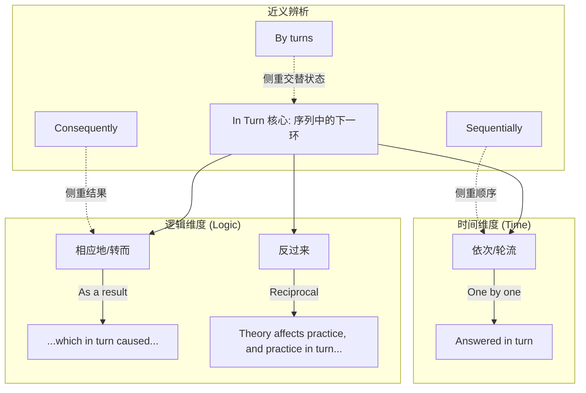

in-turn :: 
<!--ID: 1771404671273-->

# in turn

## 1. 基础信息

*   **发音**: /ɪn tɜːrn/
*   **词性**: ad. (副词短语)
*   **核心含义**:
    *   **依次，轮流** (One after the other in a particular order)
    *   **相应地，转而** (As a result of something in a series of events)

## 2. 词义演化

*   **词源**: 源自 *turn* (转动，次序)。
*   **演变逻辑**:
    1.  最初指“在轮到的次序中” (in the order of succession) -> **轮流/依次**。
    2.  引申为事件链条中的“下一环” (A导致B，B导致C) -> **相应地/转而**。
*   **核心图式**: **多米诺骨牌** (Domino Effect) 或 **排队接力** (Relay)。

## 3. 概念分析

### 核心语义场

1.  **线性次序 (Sequential Order)**: 强调一个接一个，有秩序地进行。
    *   *The children were examined in turn.* (孩子们**依次**接受了检查。)
2.  **因果链条 (Causal Chain)**: 强调连锁反应，通常用于描述 A -> B -> C 的过程，重点在于 B 对 C 的影响是 A 对 B 影响的**后续结果**。
    *   *Stress causes poor sleep, which **in turn** causes more stress.* (压力导致睡眠差，而睡眠差**反过来/相应地**又导致压力更大。)

### 易混淆辨析

*   **by turns**: 轮流地，交替地 (强调 A-B-A-B 的快速切换，如 *He went cold and hot by turns* 一会儿冷一会儿热)。
*   **take turns**: (动词短语) 轮流做某事 (*We took turns driving* 我们轮流开车)。
*   **in return**: 作为回报/交换 (*I helped him, and he helped me in return*)。

## 4. 关系图谱

## 5. 英汉对比特征

| 维度 | English (in turn) | Chinese (依次/相应地) | 差异分析 |
| :--- | :--- | :--- | :--- |
| **语义覆盖** | 兼顾"次序"和"因果" | 需分词表达 | 看到 *in turn* 必须根据上下文判断是"排队"还是"逻辑推导"。 |
| **句法位置** | 灵活 (句末或插入语) | "依次"在动词前，"相应地"在句首/分句首 | 英文常作插入语：*, which in turn,* (这相应地...)。 |
| **逻辑连接** | 强连接 (暗示链式反应) | "反过来"带有反向意味 | 中文的"反过来"有时暗示方向相反，而 *in turn* 仅暗示次序相承。 |

## 6. 场景例句

### 场景 A：流程描述 (Tone: Descriptive)
*   **English**: "Each student stood up and introduced themselves **in turn**."
*   **Chinese**: "每个学生**依次**站起来自我介绍。"
*   **解析**: 这里的 *in turn* 等同于 *one after another*。

### 场景 B：学术/逻辑推导 (Tone: Academic/Formal)
*   **English**: "The reduction in costs led to lower prices, which **in turn** stimulated demand."
*   **Chinese**: "成本的降低导致了价格下降，这**进而/相应地**刺激了需求。"
*   **解析**: 这是 *in turn* 最高频的高级用法，用于构建严密的逻辑链 (A->B->C)。

### 场景 C：相互作用 (Tone: Analytical)
*   **English**: "Theory informs practice, and practice, **in turn**, refines theory."
*   **Chinese**: "理论指导实践，而实践**反过来**又完善理论。"
*   **解析**: 此时翻译为“反过来”最贴切，体现了双向的互动。

## 7. 深度洞察

1.  **"链式反应"标记词**: 在阅读长难句时，*in turn* 是一个极其重要的路标。它告诉你前面的事情 (A) 导致了中间的事情 (B)，而现在的重点是 B 接着导致了 (C)。它是连接 B 和 C 的桥梁。
2.  **In turn vs. By turns**:
    *   *In turn*: A finished, then B, then C. (线性)
    *   *By turns*: A, then B, then A, then B. (循环交替)
3.  **写作提分点**: 在描述流程或因果关系时，用 *, which in turn,* 替代简单的 *and then* 或 *so*，会使句子逻辑更加紧凑和高级。

## 8. 关键要点 (Takeaways)

### 决策树：何时使用 in turn？
*   是大家排队一个接一个做吗？ -> YES -> **依次 (Sequentially)**
*   是 A 导致 B，B 接着导致 C 吗？ -> YES -> **进而/相应地 (As a result)**
*   是 A 影响 B，B 又回馈影响 A 吗？ -> YES -> **反过来 (Reciprocally)**

### 记忆口诀
**In turn** 含义分两半，
**依次**排队不混乱。
因果链条它来串，
**进而**导致下一环。
理论实践互为伴，
**反过来**说也一般。
