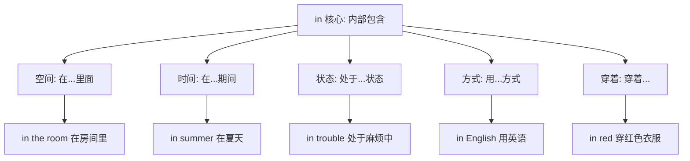
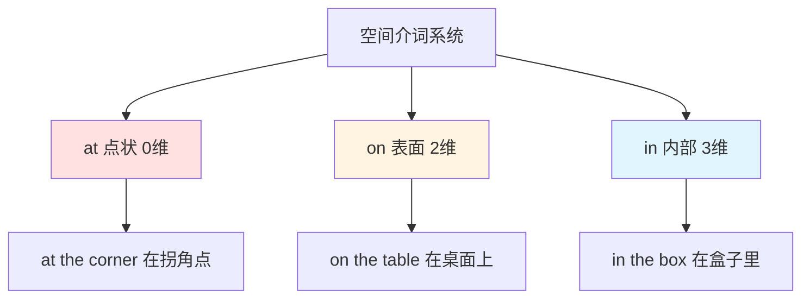
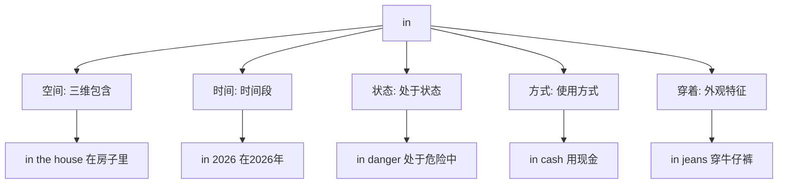
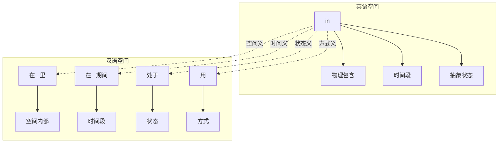

in :: 
<!--ID: 1769502992467-->

# in

## 基础信息

**英文**：in  
**音标**：/ɪn/ (英美通用)  
**中文**：在...里；在...期间；用...方式  
**词性**：介词 (preposition)

---

## 词义演化

**词源起源**：  
源自古英语 *in*，原始日耳曼语 *in*（在...内部），印欧语系 *en*（在...里）。最初表示物理空间的内部包含关系，后通过隐喻扩展到时间段、抽象状态、方式领域等。

**意义演变路径**：
1. **物理包含**（公元前5世纪）：表示三维空间的内部关系  
   → *in the box*, *in the room*
2. **时间段**（古英语时期）：从空间包含隐喻到时间包含  
   → *in summer*, *in 2026*
3. **状态领域**（中古英语时期）：表示处于某种状态或领域  
   → *in trouble*, *in love*, *in business*
4. **方式手段**（16世纪）：表示使用的方式或媒介  
   → *in English*, *in cash*, *in writing*
5. **穿着外观**（17世纪）：表示穿着或外观特征  
   → *in red*, *in uniform*, *in glasses*

---

## 概念分析

### 一词多义（Polysemy）

**核心概念**：内部包含（三维空间）  
**语义扩展**：



### 核心习语与功能性用法

| 习语 | 字面义 | 功能义 | 例句 |
|------|--------|--------|------|
| **in time** | 在时间里 | 及时 | *We arrived in time for the show.* |
| **in case** | 在情况里 | 以防万一 | *Take an umbrella in case it rains.* |
| **in charge** | 在负责里 | 负责/主管 | *Who's in charge here?* |
| **in common** | 在共同里 | 共同的 | *We have a lot in common.* |
| **in fact** | 在事实里 | 实际上 | *In fact, I agree with you.* |
| **in short** | 在短里 | 简而言之 | *In short, we need more time.* |

### 上下义关系

**上义词**：preposition（介词）  
**同类词**：
- **at**：点状定位（at the corner）
- **on**：接触表面（on the table）
- **inside**：强调内部（inside the box，更具体）

**语义对比**：
- **in** 强调三维包含（*in the room* - 在房间内部空间）
- **on** 强调接触表面（*on the wall* - 在墙面上）
- **at** 强调精确点位（*at the door* - 在门这个点）

---

## 关系图谱

### 介词网络：三维空间系统



### 多义词概念分支



### 双语映射：in vs 在



---

## 英汉对比

| 维度 | 英语 in | 汉语对应 |
|------|---------|----------|
| **概念范围** | 单一词汇覆盖空间/时间/状态/方式/穿着 | 需要多个词汇：在...里/在...期间/处于/用/穿着 |
| **空间维度** | 强调三维内部包含（in the room = 房间内部空间） | 汉语用"里"或方位词补充（房间里/屋子里） |
| **时间跨度** | 用于较长时间段（in summer, in 2026） | 汉语可省略介词（2026年/夏天） |
| **状态表达** | 固化为状态短语（in trouble, in love） | 汉语用动词或形容词（陷入麻烦/恋爱中） |

---

## 实际应用

### 场景 1：空间包含

**英文**：*The keys are in the drawer.*  
**中文**：钥匙在抽屉里。  
**分析**：*in* 表示三维内部包含，汉语用"在...里"对应。

### 场景 2：时间段

**英文**：*I'll finish this project in two weeks.*  
**中文**：我会在两周内完成这个项目。  
**分析**：*in* 表示时间段，汉语用"在...内"或"...后"。

### 场景 3：状态领域

**英文**：*She's in charge of the marketing department.*  
**中文**：她负责市场部。  
**分析**：*in charge* 是固化习语，表示负责状态，汉语用动词"负责"。

### 场景 4：方式手段

**英文**：*Please write your answer in pen, not pencil.*  
**中文**：请用钢笔写答案，不要用铅笔。  
**分析**：*in* 表示使用的工具方式，汉语用"用"对应。

### 场景 5：穿着外观

**英文**：*The woman in the red dress is my sister.*  
**中文**：穿红裙子的那个女人是我姐姐。  
**分析**：*in* 表示穿着，汉语用"穿"对应，需要调整语序。

### 场景 6：in time vs on time

**英文**：*We arrived in time for the meeting.* (及时赶到)  
**对比**：*We arrived on time.* (准时到达)  
**中文**：我们及时赶到了会议。/ 我们准时到达。  
**分析**：*in time* = 及时（赶上），*on time* = 准时（不早不晚）。

### 场景 7：在职业里，表示从事什么职业
**英文**：He is in IT.  She is in fashion. He is  in the army.

---

## 深度洞察

### 核心要点

1. **三维空间的隐喻扩展**  
   *in* 的核心是"三维内部包含"，从物理空间（in the box）扩展到时间段（in summer）、抽象状态（in trouble）、方式领域（in English）。这种扩展将各种概念"容器化"，体现了英语的隐喻认知模式。

2. **at/on/in 的维度递进**  
   - **at**：零维点（at the station - 车站这个点）
   - **on**：二维面（on the table - 桌面这个面）
   - **in**：三维体（in the room - 房间这个空间）  
   这种维度递进在汉语中需要通过不同方位词实现（处/上/里）。

3. **状态容器化的认知模式**  
   英语将抽象状态概念化为"容器"（in love = 在爱情里，in trouble = 在麻烦里），汉语则倾向于用动词或形容词直接表达状态（恋爱中、陷入麻烦），体现了不同的认知框架。

---

## 关键要点

### 翻译决策树

```
in + 名词/时间
├─ 物理空间？
│  ├─ 三维容器 → 在...里（in the box → 在盒子里）
│  ├─ 建筑物 → 在（in the house → 在房子里）
│  └─ 地理区域 → 在（in China → 在中国）
├─ 时间表达？
│  ├─ 年/月/季节 → 在（in 2026 → 在2026年）
│  ├─ 时间段 → 在...内（in two weeks → 两周内）
│  └─ 早中晚 → 在（in the morning → 在早上）
├─ 状态领域？
│  ├─ in trouble → 陷入麻烦
│  ├─ in love → 恋爱中
│  ├─ in charge → 负责
│  └─ in business → 从事商业
├─ 方式手段？
│  ├─ 语言 → in English → 用英语
│  ├─ 工具 → in pen → 用钢笔
│  └─ 形式 → in writing → 以书面形式
├─ 穿着外观？
│  ├─ 颜色 → in red → 穿红色
│  ├─ 服装 → in uniform → 穿制服
│  └─ 配饰 → in glasses → 戴眼镜
└─ 固定习语？
   ├─ in time → 及时
   ├─ in case → 以防万一
   ├─ in fact → 实际上
   ├─ in short → 简而言之
   └─ in common → 共同的
```

### 记忆口诀

**"里含时段,态式着装"**

- **里含**：内部包含是核心（in the room）
- **时段**：时间段表达（in summer, in 2026）
- **态**：状态领域（in trouble, in charge）
- **式**：方式手段（in English, in cash）
- **着装**：穿着外观（in red, in uniform）

---

## 使用建议

### 学习策略

1. **掌握"容器"核心概念**：理解 *in* 强调三维内部包含的本质
2. **对比 at/on/in 维度**：通过点/面/体模型区分（0维/2维/3维）
3. **记忆高频搭配**：*in time*, *in charge*, *in fact* 等固定用法
4. **注意时间用法**：*in* 用于较长时间段，*at* 用于精确时刻，*on* 用于具体日期

### 常见错误

❌ **错误**：*I'll see you on two hours.*  
✅ **正确**：*I'll see you in two hours.*  
**说明**：表示"...之后"用 *in*，不用 *on*。

❌ **错误**：*She's wearing on red.*  
✅ **正确**：*She's wearing red.* 或 *She's in red.*  
**说明**：表示穿着颜色用 *in* 或直接用动词 *wear*。

❌ **错误**：*I arrived in time.* (想表达"准时")  
✅ **正确**：*I arrived on time.*  
**说明**：*in time* = 及时（赶上），*on time* = 准时（不早不晚）。

❌ **错误**：*He's good in math.*  
✅ **正确**：*He's good at math.*  
**说明**：表示擅长用 *good at*，不用 *in*。

❌ **错误**：*in Monday*  
✅ **正确**：*on Monday*  
**说明**：具体日期用 *on*，月份/年份用 *in*（in May, in 2026）。

---

## 扩展阅读

**相关词汇**：
- [[at]] - 点状定位关系
- [[on]] - 接触表面关系
- [[inside]] - 强调内部（更具体）
- [[into]] - 进入动作

**对比分析**：
- [[at-on-in]] - 三维空间介词系统
- [[in-into]] - 静态位置 vs 动态进入
- [[in-time-on-time]] - 及时 vs 准时

**主题链接**：
- [[Prepositions]] - 介词系统
- [[Container Metaphor]] - 容器隐喻
- [[Time Expressions]] - 时间表达