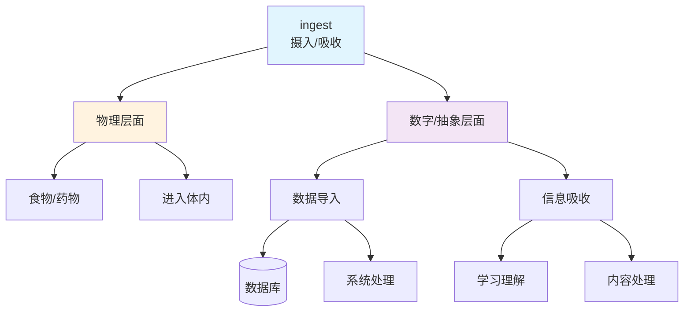

# ingest

## 1. 基础信息 (Basic Info)

| 属性 | 内容 |
|------|------|
| **音标** | /ɪnˈdʒest/ |
| **词性** | verb (transitive) |
| **英文释义** | 1. to take food, drink, or another substance into the body <br> 2. to absorb information or data into a system |
| **中文释义** | 1. 摄入；吞下（食物、药物等） <br> 2. 吸收（信息）；导入（数据） |

---

## 2. 词源与演变 (Etymology & Evolution)

| 阶段 | 说明 |
|------|------|
| **拉丁语源** | *ingerere* = "to carry in, throw in" |
| **词根拆解** | *in-* (into) + *gerere* (to carry, bear) |
| **演变路径** | Latin *ingerere* → *ingestion-* (noun) → English *ingest* (c. 1600) |
| **语义扩展** | 原指物理上的"吞入"，后扩展到信息/数据的"导入吸收"（计算机时代） |

**同源词家族**:
- *gest-* (carry): **digest** (消化), **suggest** (建议→带出想法), **congest** (充血→堆积), **register** (登记→记录下来)

---

## 3. 核心概念图谱 (Concept Graph)



---

## 4. 扩展词汇 (Vocabulary Expansion)

### 近义词 (Synonyms)

| 词汇 | 细微差别 | 适用场景 |
|------|----------|----------|
| **consume** | 更强调"消耗"或"用尽" | 能源、资源、大量使用 |
| **absorb** | 强调"完全吸收、内化" | 知识、信息、液体 |
| **take in** | 最口语化，泛指"接收" | 日常对话、信息接收 |
| **swallow** | 字面"吞咽"，也可比喻"忍受" | 生理动作、勉强接受 |
| **digest** | 强调"消化理解"过程 | 信息处理、深度学习 |
| **import** | 计算机术语，"导入数据" | 软件、数据库操作 |

### 反义词 (Antonyms)

| 词汇 | 含义 |
|------|------|
| **excrete** | 排泄；排出体外 |
| **expel** | 驱逐；排出 |
| **eject** | 喷射；弹出 |
| **export** | 导出（数据） |
| **excrete** | 排泄（生物） |

### 派生词 (Derivatives)

| 词性 | 词汇 | 含义 |
|------|------|------|
| **n.** | **ingestion** | 摄入；吸收 |
| **n.** | **ingestor** | 摄入者；数据导入程序 |
| **adj.** | **ingestible** | 可摄入的；可食用的 |
| **adv.** | — | — |

---

## 5. 搭配与用法 (Collocations & Usage)

### 高频搭配 (Collocations)

| 类型 | 搭配 | 例句 |
|------|------|------|
| **v. + n.** | ingest food/nutrients | Patients must **ingest nutrients** through an IV. |
| **v. + n.** | ingest data/information | The system **ingests millions of records** daily. |
| **v. + n.** | ingest toxins/poison | If you **ingest poison**, call emergency immediately. |
| **adv. + v.** | safely ingest | Not all substances can be **safely ingested**. |
| **v. + prep.** | ingest into | The pipeline **ingests data into** the warehouse. |

### 典型例句 (Examples)

**🩺 Medical / Science**
> The patient had **ingested** a toxic substance before arriving at the hospital.

**💻 Technology / Data**
> Our ETL pipeline **ingests** streaming data from multiple sources and stores it in the data lake.

**📚 Academic / Learning**
> Students are expected to **ingest** large amounts of reading material each week.

**🍽️ Daily / Casual**
> How much caffeine did you **ingest** this morning? You seem jittery.

**⚠️ Warning / Instruction**
> Do not **ingest**. For external use only.

---

## 6. 易混淆点与辨析 (Analysis & Confusing Points)

### ingest vs. consume

| 维度 | ingest | consume |
|------|--------|---------|
| **核心含义** | 强调"进入体内"的动作 | 强调"消耗、用完"的结果 |
| **语体** | 偏正式、技术性 | 通用、日常 |
| **典型场景** | 医学、科技、数据 | 能源、资源、商业 |
| **例句** | The body **ingests** nutrients. | The factory **consumes** electricity. |

### ingest vs. digest

| 维度 | ingest | digest |
|------|--------|--------|
| **过程阶段** | 第一步：摄入 | 第二步：消化分解 |
| **比喻用法** | 数据导入 | 信息理解 |
| **例句** | First **ingest** the raw data. | Then **digest** and analyze it. |

### ingest vs. import (Computing)

- **ingest**: 强调"接收并准备处理"（streaming, real-time）
- **import**: 强调"从外部载入"（file-based, batch）

---

## 7. 总结与记忆 (Summary & Memory)

### 口诀 (Mnemonic)

> **"In-Jest: 摄入是消化前奏"**
>
> - **In-** = 进入
> - **-gest** = 携带（同 *digest* 消化、*congest* 充血）
> - 想象：食物先被 **ingest**（带入体内），再被 **digest**（消化）

### 决策树 (Decision Tree)

```
需要表达"摄入/吸收"？

├─ 生理层面（食物/药物）
│   ├─ 正式/医学语境 → ingest ✓
│   └─ 口语/日常语境 → take in / swallow
│
├─ 数据/技术层面
│   ├─ 强调"实时接收" → ingest ✓
│   └─ 强调"批量导入" → import / load
│
└─ 信息/知识层面
    ├─ 强调"快速接收" → ingest ✓
    └─ 强调"深度理解" → absorb / digest
```

---

# Related

![[Backlinks.base]]
