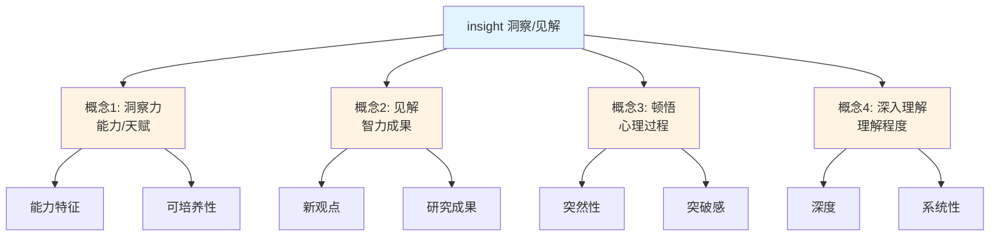
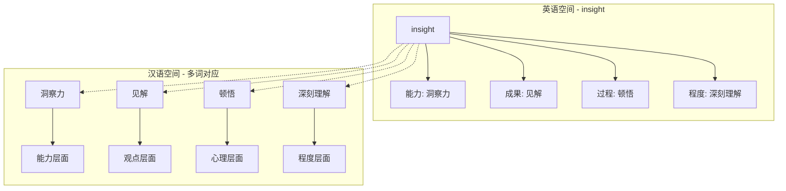

# insight

## 📖 基础信息

**英音** `/ˈɪnsaɪt/` | **美音** `/ˈɪnsaɪt/`

**词性**: 名词（可数/不可数）

**中文对应**:
- 洞察力 (能力)
- 见解 (观点)
- 顿悟 (领悟)
- 深入理解 (理解程度)

---

## 🌱 词义演化

**词源**: insight = in (into) + sight (vision)

**原始含义** (16世纪): "inner sight" - 内在视力，心灵之眼

**演变路径**:
```
1600s: 心灵视觉 (mental vision)
  ↓
1800s: 理解力 (power of understanding)
  ↓
1900s: 心理学术语 - 顿悟 (psychological breakthrough)
  ↓
现代: 多义融合 - 能力+观点+领悟
```

---

## 🔍 概念分析

### 一词多义映射

| 英文概念 | 中文对应 | 侧重点 | 示例 |
|---------|---------|--------|------|
| **洞察力** | 洞察力 | 能力/天赋 | She has great insight into human behavior. |
| **见解** | 见解/观点 | 智力成果 | The book provides new insights into AI. |
| **顿悟** | 顿悟/领悟 | 心理过程 | He had a sudden insight. |
| **深入理解** | 深刻理解 | 理解深度 | gain insight into the problem |

### 上下义关系

```
上义词：understanding (理解)
  ↓
核心词：insight (洞察/见解)
  ↓
下义词：
- intuition (直觉)
- perception (感知)
- realization (领悟)
- epiphany (顿悟)
```

### 同义词对比

| 同义词 | 差异点 | 使用场景 |
|--------|--------|---------|
| **perception** | 强调感知能力 | 感官、认知 |
| **intuition** | 强调本能、非理性 | 决策、判断 |
| **wisdom** | 强调经验和积累 | 人生哲理 |
| **understanding** | 强调理解程度 | 知识、概念 |

---

## 🔗 关系图谱



### 双语映射对比



---

## 🌏 英汉对比

| 维度 | 英语 | 汉语 | 差异洞察 |
|------|------|------|----------|
| **词汇结构** | 单一词汇 insight | 需拆分为 洞察力/见解/顿悟 | 英语更抽象概括 |
| **语法性质** | 可数/不可数灵活 | 多为抽象名词 | 英语更灵活 |
| **使用频率** | 高频词（学术/商业） | 洞察力较低频 | 英语更普及 |
| **搭配习惯** | gain/provide/have insight | 获得/提供/具有洞察力 | 搭配模式相似 |
| **文化色彩** | 中性，可量化（insights） | 偏正式，抽象 | 英语更实用主义 |

---

## 💬 实际应用

### 场景 1: 学术研究 (见解)

**英文**: "This research provides **new insights** into climate change."
**中文**: "这项研究为气候变化提供了**新见解**。"

**分析**:
- insights (复数) = 研究成果、发现
- 强调智力产出，不是能力

---

### 场景 2: 商业分析 (洞察)

**英文**: "We need **consumer insights** to improve our product."
**中文**: "我们需要**消费者洞察**来改进产品。"

**分析**:
- consumer insights = 消费者深度理解
- 商业语境常用复数形式

---

### 场景 3: 个人成长 (顿悟)

**英文**: "She had a **sudden insight** about her career path."
**中文**: "她对职业道路**突然顿悟**了。"

**分析**:
- sudden insight = 突然领悟
- 强调心理过程的突破性

---

### 场景 4: 能力评价 (洞察力)

**英文**: "He has **great insight** into market trends."
**中文**: "他对市场趋势有**很强的洞察力**。"

**分析**:
- great insight = 强大的洞察力
- 不可数形式，表示能力

---

## 🎯 深度洞察

### 1. 概念边界：一词多义 vs 多词对应

**英语思维**: insight 作为容器词，承载 4 个相关概念
- **优点**: 表达简洁，概念连接紧密
- **缺点**: 需要语境消歧义

**汉语思维**: 每个概念独立成词
- **优点**: 语义精确，不易混淆
- **缺点**: 词汇量大，表达相对冗长

**核心差异**: 英语用**抽象层级**统一概念，汉语用**具体词汇**区分概念

---

### 2. 语法特征：可数性灵活切换

**可数用法** (insights):
- "new insights" = 新见解（强调数量、成果）
- "consumer insights" = 消费者洞察（商业术语）

**不可数用法** (insight):
- "great insight" = 强洞察力（强调能力、程度）
- "provide insight" = 提供理解（抽象概念）

**汉语对应**: 不区分可数性，需通过上下文判断

---

### 3. 语用文化：学术 vs 日常

**学术语境**:
- "research insights" (研究发现)
- "theoretical insights" (理论洞见)
- **语体**: 正式、客观

**商业语境**:
- "market insights" (市场洞察)
- "customer insights" (客户洞察)
- **语体**: 实用、行动导向

**日常语境**:
- "personal insight" (个人领悟)
- "have an insight" (有顿悟)
- **语体**: 非正式、主观

**汉语倾向**: 多用于正式/学术场合，日常使用频率低

---

## 📝 关键要点

### 翻译决策树

```
遇到 insight 时：

1. 检查语境 → 是能力还是成果？
   ├─ 能力 → "洞察力" (She has great insight)
   └─ 成果 → 继续

2. 检查可数性 → 单数还是复数？
   ├─ 复数 insights → "见解/洞察" (new insights)
   └─ 单数 insight → 继续

3. 检查动词搭配 → 突然性？
   ├─ had/gained + insight → "顿悟/领悟" (sudden insight)
   └─ provide/offer + insight → "深入理解" (provide insight)
```

### 记忆口诀

```
insight 一词四义记，
洞察力来见解提。
顿悟领悟心有得，
深入理解理自明。

复数 insights 成果显，
单数 insight 能力见。
sudden insight 顿悟时，
provide insight 理解深。
```

---

## 🔖 常见搭配

### 动词 + insight

| 搭配 | 中文 | 例句 |
|------|------|------|
| **gain insight** | 获得理解 | gain insight into the problem |
| **provide insight** | 提供见解 | This data provides valuable insights. |
| **have insight** | 具有洞察力 | She has deep insight into human nature. |
| **offer insight** | 提供洞察 | The report offers new insights. |
| **lack insight** | 缺乏洞察 | He lacks insight into his own behavior. |

### 形容词 + insight

| 搭配 | 中文 | 例句 |
|------|------|------|
| **deep insight** | 深刻洞察 | deep insight into the market |
| **valuable insight** | 有价值的见解 | provide valuable insights |
| **new insight** | 新见解 | gain new insights |
| **sudden insight** | 突然顿悟 | have a sudden insight |
| **fresh insight** | 新鲜视角 | offer fresh insights |

### 介词搭配

| 搭配 | 中文 | 例句 |
|------|------|------|
| **insight into** | 对...的洞察 | insight into consumer behavior |
| **insight about** | 关于...的见解 | insights about the future |
| **insight on** | 对...的理解 | provide insight on the issue |

---

## 📚 扩展阅读

### 相关概念

- **Intuition** - 直觉（本能、非理性）
- **Perception** - 感知（感官、认知）
- **Wisdom** - 智慧（经验、积累）
- **Epiphany** - 顿悟（突然领悟）
- **Realization** - 领悟（认知过程）

### 词族扩展

```
insight (n.)
  ├─ insightful (adj.) - 有洞察力的
  ├─ insightfully (adv.) - 有洞察力地
  └─ self-insight (n.) - 自我认知
```

---

## 🎓 学习建议

1. **语境识别**: 通过搭配词判断具体含义
2. **复数注意**: insights 多指成果，insight 多指能力
3. **动词搭配**: gain/provide/have insight 记忆常用组合
4. **避免直译**: 不要总是翻译成"洞察力"，根据语境选择

---

**创建时间**: 2026-02-20
**分析工具**: dict skill
**词性**: 名词
**映射类型**: 一词多义 → 洞察力/见解/顿悟/理解
