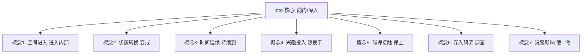
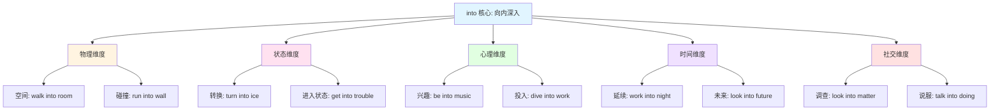
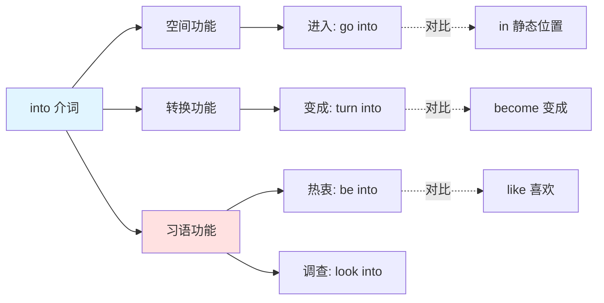
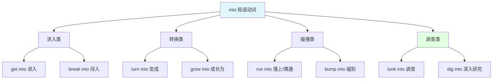

into :: 
<!--ID: 1769507345395-->

# into

## 基础信息

- **英文**：into /ˈɪntuː/ 或 /ˈɪntə/
- **中文**：进入、变成、深入、热衷于、撞上
- **词性**：介词 (Preposition)

## 词义演化

**词源起源**：
- 古英语 "intō"，由 "in"（在内）+ "to"（向、到）组合而成
- 字面意思：向内部移动（movement toward the inside）
- 印欧语系词根 *en-（在内）+ *de-（向、到）

**意义演变路径**：
1. **空间进入阶段**（古英语）：physical entry（物理进入）→ "go into the house"（进入房子）
2. **状态转换阶段**（中古英语）：transformation（转变）→ "turn into ice"（变成冰）
3. **时间延续阶段**（近代英语）：continuation（延续）→ "work into the night"（工作到深夜）
4. **心理投入阶段**（现代英语）：interest/enthusiasm（兴趣）→ "be into music"（热衷音乐）
5. **碰撞接触阶段**（现代英语）：collision（碰撞）→ "run into a wall"（撞上墙）
6. **深入研究阶段**（现代英语）：investigation（深入）→ "look into the matter"（调查此事）

**核心转变**：从 "物理空间的向内运动" 扩展至 "状态转换、心理投入、深入探究" 等抽象维度。

## 概念分析

### 一词多义



### 核心义项

| 义项 | 英文概念 | 中文对应 | 例句 |
|------|----------|----------|------|
| **空间进入** | movement inward | 进入、到...里 | Walk into the room（走进房间） |
| **状态转换** | transformation | 变成、转化为 | Turn into a butterfly（变成蝴蝶） |
| **时间延续** | continuation | 持续到、进入 | Work into the night（工作到深夜） |
| **兴趣投入** | interest/enthusiasm | 热衷于、喜欢 | I'm into jazz（我喜欢爵士乐） |
| **碰撞接触** | collision | 撞上、碰到 | Run into a tree（撞上树） |
| **深入研究** | investigation | 调查、研究 | Look into the problem（调查问题） |
| **说服影响** | persuasion | 说服...做 | Talk him into it（说服他做） |

### 核心习语与功能性用法

**社交/功能性用法**：
- **"be into something"** = 热衷于、喜欢（口语，表达兴趣爱好）
- **"get into trouble"** = 陷入麻烦（固定搭配）
- **"get into the habit"** = 养成习惯
- **"fit into"** = 适应、融入（社交场景）
- **"break into"** = 闯入、突然开始（如 break into laughter 突然大笑）

**隐喻固化**：
- **"look into"** = 调查、研究（不是字面 "向内看"）
- **"run into"** = 偶遇、遇到（问题/人）
- **"talk someone into"** = 说服某人做某事
- **"turn into"** = 变成（状态转换）
- **"bump into"** = 偶遇（非故意碰撞）
- **"dive into"** = 全身心投入（隐喻深入）

**情感色彩**：
- **中性**：go into（进入）、turn into（变成）
- **正面**：be into（热衷）、get into（进入状态）
- **负面**：get into trouble（陷入麻烦）、run into problems（遇到问题）

### 同义词对比

| 词汇 | 核心差异 | 使用场景 |
|------|----------|----------|
| **into** | 强调向内运动、转换 | 所有 "进入/转变" 场景 |
| **in** | 强调静态位置（在内部） | in the room（在房间里） |
| **to** | 强调方向（朝向） | go to school（去学校） |
| **inside** | 强调内部空间 | inside the box（在盒子里面） |
| **within** | 强调范围内（较正式） | within the city（在城市范围内） |

### 反义词

| 词汇 | 关系 | 示例 |
|------|------|------|
| **out of** | 方向相反 | go into（进入）↔ go out of（离开） |
| **from** | 起点相反 | into the future（进入未来）↔ from the past（来自过去） |

## 关系图谱

### 多义词概念分支



### 介词功能网络



### 短语动词网络（Phrasal Verbs with into）



## 英汉对比

| 维度 | 英语 into | 汉语对应 |
|------|-----------|----------|
| **概念范围** | 单一介词涵盖 7+ 概念 | 需 6+ 词汇分别表达（进/成/到/爱/撞/钻） |
| **语法功能** | 介词，后接名词/动名词 | 需动词/介词/补语混合表达 |
| **短语动词** | 形成 30+ 短语动词（look into, run into） | 需完整动词短语翻译 |

**核心差异**：
- **英语特征**：into 是 "向内运动核心词"，表达 "从外到内" 的动态过程
- **汉语特征**：根据具体运动类型选择精确动词（进入/变成/撞上/深入）
- **翻译挑战**：短语动词（look into = 调查）和习语（be into = 喜欢）需整体记忆

## 实际应用

### 场景 1：空间进入（物理运动）

**英文**：She walked **into** the classroom.  
**中文**：她**走进**教室。  
**分析**：into 表示从外部进入内部的空间运动，汉语用 "进" 或 "进入"。

### 场景 2：状态转换

**英文**：The water turned **into** ice.  
**中文**：水**变成**了冰。  
**分析**：into 表示状态转换，汉语用 "变成" 或 "转化为"。

### 场景 3：时间延续

**英文**：We worked **into** the night to finish the project.  
**中文**：我们工作**到**深夜才完成项目。  
**分析**：into 表示时间延续，汉语用 "到" 或 "直到"。

### 场景 4：兴趣投入（习语）

**英文**：I'm really **into** photography these days.  
**中文**：我最近很**热衷于**摄影。  
**分析**：习语 "be into" 表示对某事感兴趣、热衷，不能直译为 "进入摄影"。

### 场景 5：碰撞接触

**英文**：He ran **into** a lamppost while texting.  
**中文**：他发短信时**撞上**了路灯杆。  
**分析**：into 表示碰撞，汉语用 "撞上" 或 "撞到"。

### 场景 6：偶遇（习语）

**英文**：I ran **into** an old friend at the mall.  
**中文**：我在商场**偶遇**了一位老朋友。  
**分析**：短语动词 "run into" 可表示偶遇（非字面碰撞），汉语用 "偶遇" 或 "碰到"。

### 场景 7：深入调查（习语）

**英文**：The police are looking **into** the case.  
**中文**：警方正在**调查**此案。  
**分析**：短语动词 "look into" 表示调查、研究，不能直译为 "向内看案件"。

### 场景 8：说服影响

**英文**：She talked me **into** buying the expensive watch.  
**中文**：她**说服**我买了那块昂贵的手表。  
**分析**：短语动词 "talk someone into" 表示说服某人做某事，into 表示 "使进入某种行为状态"。

### 场景 9：陷入困境（固定搭配）

**英文**：He got **into** trouble for cheating on the exam.  
**中文**：他因考试作弊**陷入**麻烦。  
**分析**：固定搭配 "get into trouble" 表示陷入麻烦，into 表示进入负面状态。

## 深度洞察

### 核心要点

1. **"向内运动" 的多维度扩展**  
   into 的核心语义是 "从外到内的动态运动"，这种运动可以是：物理的（走进房间）、状态的（变成冰）、心理的（热衷音乐）、时间的（工作到深夜）。英语用单一介词统一表达，汉语则需根据具体维度选择不同动词。

2. **从具体到抽象的隐喻映射**  
   into 的演变体现了 "空间隐喻" 的认知机制：物理进入（walk into）→ 状态进入（get into trouble）→ 心理进入（be into music）→ 认知进入（look into problem）。这种从具体到抽象的映射在英语介词系统中极为常见。

3. **短语动词的固化与多义性**  
   into 形成 30+ 短语动词，部分保留字面意义（go into = 进入），部分已固化为独立语义（look into = 调查，run into = 偶遇）。学习者需警惕：同一短语动词可能有多重含义（run into = 撞上 / 偶遇 / 遇到问题）。

## 关键要点

### 翻译决策树

```
遇到 into 时：
├─ 是否为短语动词？
│  ├─ 是 → 查固定搭配
│  │  ├─ look into（调查）
│  │  ├─ run into（撞上/偶遇）
│  │  ├─ turn into（变成）
│  │  ├─ get into（进入/陷入）
│  │  └─ break into（闯入/突然开始）
│  └─ 否 → 继续判断
├─ 是否为习语？
│  ├─ 是 → be into（热衷）/ talk into（说服）
│  └─ 否 → 继续判断
├─ 描述物理运动？
│  ├─ 是 → 进入（walk into room）
│  └─ 否 → 继续判断
├─ 描述状态转换？
│  ├─ 是 → 变成（turn into ice）
│  └─ 否 → 继续判断
├─ 描述时间延续？
│  ├─ 是 → 到、持续到（work into night）
│  └─ 否 → 继续判断
├─ 描述碰撞？
│  ├─ 是 → 撞上（run into wall）
│  └─ 否 → 深入、投入（dive into work）
```

### 记忆口诀

**"进变到，爱撞钻，短语习语细分辨"**

- **进**：空间进入（walk into）
- **变**：状态转换（turn into）
- **到**：时间延续（work into night）
- **爱**：兴趣投入（be into music）
- **撞**：碰撞接触（run into）
- **钻**：深入研究（look into）
- **短语**：look into（调查）、run into（偶遇）
- **习语**：be into（热衷）、get into trouble（陷入麻烦）

### 学习者常见错误

| 错误类型 | 错误示例 | 正确表达 | 原因 |
|----------|----------|----------|------|
| **习语直译** | be into = 进入...里面 | 热衷于、喜欢 | 忽略固化搭配 |
| **短语动词直译** | look into = 向内看 | 调查、研究 | 未识别固化语义 |
| **多义混淆** | run into = 跑进 | 撞上/偶遇 | 忽略语境差异 |
| **状态转换遗漏** | turn into = 转向内部 | 变成 | 未识别转换义 |
| **in/into 混淆** | He is into the room | He is in the room | 混淆动态/静态 |

### 高频短语动词速查

| 短语动词 | 中文 | 例句 |
|----------|------|------|
| **get into** | 进入、陷入、养成 | Get into the car（上车） |
| **look into** | 调查、研究 | Look into the matter（调查此事） |
| **run into** | 撞上、偶遇、遇到 | Run into problems（遇到问题） |
| **turn into** | 变成、转化为 | Turn into a pumpkin（变成南瓜） |
| **break into** | 闯入、突然开始 | Break into laughter（突然大笑） |
| **bump into** | 碰到、偶遇 | Bump into a friend（偶遇朋友） |
| **dive into** | 跳入、全身心投入 | Dive into work（投入工作） |
| **talk into** | 说服...做 | Talk him into it（说服他） |
| **fit into** | 适应、融入 | Fit into the team（融入团队） |
| **grow into** | 成长为、逐渐适应 | Grow into the role（适应角色） |

### in vs into 关键区别

| 对比 | in（静态） | into（动态） |
|------|-----------|-------------|
| **位置** | He is **in** the room（他在房间里） | He walked **into** the room（他走进房间） |
| **状态** | She is **in** trouble（她处于麻烦中） | She got **into** trouble（她陷入麻烦） |
| **兴趣** | ❌ 不用 in | I'm **into** jazz（我喜欢爵士） |

**记忆要点**：in = 静态位置，into = 动态进入

---

**生成时间**：2026-01-27  
**主题标签**：[[Vocabulary]] [[Preposition]] [[Phrasal Verbs]] [[Cross-linguistic Analysis]]  
**相关词汇**：[[in]] [[to]] [[out of]] [[inside]] [[within]] [[with]] [[off]]