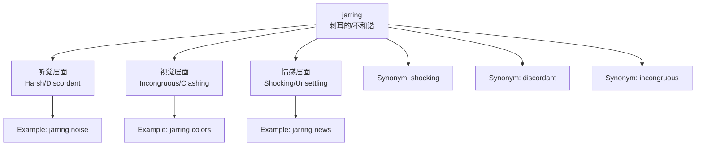

# jarring

## 1. 基础信息 (Basic Info)

**Pronunciation**: /ˈdʒɑːrɪŋ/ (UK), /ˈdʒɑːrɪŋ/ (US)

**Part of Speech**: adjective, present participle of *jar* (verb)

**English Definitions**:
1. **Causing a strong, unpleasant shock or surprise** - unexpected and disturbing
2. **Harsh or discordant in sound or appearance** - lacking harmony
3. **Incongruous** - not fitting well with the surroundings

**Chinese Translations**:
- 刺耳的，刺眼的
- 不和谐的，不协调的
- 令人震惊的，突如其来的

---

## 2. 词源与演变 (Etymology & Evolution)

**Origin**: From *jar* (verb, late 16th century) - "to make a harsh sound"

**Root Logic**:
- Original meaning: To cause a harsh, rattling sound
- Evolution: From physical vibration → metaphorical discord/shock
- Semantic shift: From auditory (sound) → visual/emotional (unpleasant contrast)

**Meaning Shifts**:
1. **16th century**: Physical shaking/rattling (literal)
2. **17th-18th century**: Discordant sounds (auditory)
3. **Modern**: Extended to visual, emotional, and conceptual discord (metaphorical)

---

## 3. 核心概念图谱 (Concept Graph)



---

## 4. 扩展词汇 (Vocabulary Expansion)

### 近义词 (Synonyms)

| Word | Nuance | Example |
|------|--------|---------|
| **shocking** | Emphasizes emotional impact, moral outrage | "The news was shocking" |
| **startling** | Sudden surprise, brief in duration | "A startling discovery" |
| **discordant** | Specifically about lack of harmony (sound/concept) | "Discordant opinions" |
| **dissonant** | Musical origin, extended to ideas | "Cognitive dissonance" |
| **incongruous** | Out of place, not fitting | "An incongruous remark" |
| **jolting** | Physical or emotional shock | "A jolting experience" |
| **clashing** | Conflict between elements | "Clashing colors" |

### 反义词 (Antonyms)

- **harmonious** - 和谐的
- **soothing** - 抚慰的
- **pleasing** - 令人愉悦的
- **congruous** - 协调的
- **compatible** - 兼容的

### 派生词 (Derivatives)

- **jar** (verb) - 发出刺耳声，震动
- **jar** (noun) - 刺耳声，震动
- **jarringly** (adverb) - 刺耳地，不和谐地

---

## 5. 搭配与用法 (Collocations & Usage)

### 高频搭配 (Collocations)

**Verb + jarring**:
- find something jarring
- experience something jarring

**Adjective + Noun**:
- jarring contrast
- jarring experience
- jarring sound
- jarring note
- jarring effect
- jarring revelation

**Adverb + jarring**:
- particularly jarring
- somewhat jarring
- jarringly different

### 典型例句 (Examples)

**Business Context**:
> "The sudden change in policy was **jarring** for employees who had grown accustomed to the old system."

**Daily Life**:
> "The bright pink wall against the gray concrete was **jarring** to the eye."

**Academic/Writing**:
> "The author's use of modern slang in a period novel creates a **jarring** anachronism."

**News/Media**:
> "The documentary presents a **jarring** contrast between wealth and poverty in the city."

**Creative Work**:
> "The transition between scenes was **jarring**, disrupting the film's narrative flow."

---

## 6. 易混淆点与辨析 (Analysis & Confusing Points)

### jarring vs. shocking

| Aspect | jarring | shocking |
|--------|---------|----------|
| **Focus** | Discord, lack of harmony | Moral outrage, disbelief |
| **Duration** | Can be ongoing | Usually brief reaction |
| **Context** | Often aesthetic/conceptual | Often ethical/emotional |
| **Example** | "The color scheme is jarring" | "The corruption was shocking" |

### jarring vs. discordant

- **discordant**: Specifically about lack of harmony (music, opinions)
- **jarring**: Broader - can apply to visuals, emotions, sounds
- **Usage**: "Discordant notes" vs "Jarring colors" (both correct, but discordant more common in music)

### jarring vs. incongruous

- **incongruous**: Out of place, not fitting (neutral)
- **jarring**: Out of place + unpleasant/shocking (negative)
- **Nuance**: Something can be incongruous without being jarring

### Pronunciation Note

- No pronunciation change between meanings
- Always stress first syllable: /ˈdʒɑːrɪŋ/

---

## 7. 总结与记忆 (Summary & Memory)

### 口诀 (Mnemonic)

**"Jar rings like a bell, but not as well"**
- *jar* = 刺耳声
- *ring* = 声音
- Not harmonious → jarring

**Alternative**:
**"JAR = Jolts And Rattles"**
- Jolts = shock
- And = connects
- Rattles = discord

### 决策树 (Decision Tree)

```
Is it about harmony/fit?
├─ Yes → Is it unpleasant?
│   ├─ Yes → jarring
│   └─ No → incongruous (neutral)
└─ No → Is it about moral/ethical shock?
    ├─ Yes → shocking
    └─ No → surprising/startling
```

### Quick Decision Guide

Choose **jarring** when:
- ✅ Describing unpleasant contrast (visual/auditory/conceptual)
- ✅ Something doesn't fit AND creates discomfort
- ✅ The focus is on disharmony

Choose **shocking** when:
- ✅ Describing moral outrage or disbelief
- ✅ The focus is on surprise rather than discord

Choose **incongruous** when:
- ✅ Describing something out of place (neutral observation)
- ✅ No emotional reaction implied

---

## Related Concepts

- **Cognitive Dissonance** - mental discomfort from conflicting beliefs
- **Aesthetic Clash** - visual disharmony
- **Tonal Inconsistency** - in writing/art

---

#flashcard 

Q: What does "jarring" mean?
A: Causing a strong, unpleasant shock or surprise; harsh or discordant in sound or appearance; incongruous.

Q: Give an example of "jarring" in a sentence.
A: "The bright neon sign against the historic building was jarring to the eye."

Q: What's the difference between "jarring" and "shocking"?
A: "Jarring" emphasizes discord and lack of harmony, while "shocking" emphasizes moral outrage or disbelief.
