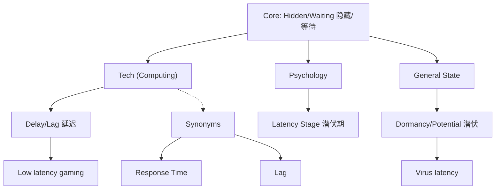

# latency

## 1. 基础信息 (Basic Info)

- **词性**: Noun
- **音标**: /ˈleɪtnsi/
- **释义**:
    - **n. (计算机/技术)**: 延迟，反应时间 (等待数据传输的时间)
    - **n. (通用)**: 潜伏，潜在状态 (state of existing but not yet being developed or manifest)
    - **n. (心理学)**: 潜伏期 (latency stage)

## 2. 词源与演变 (Etymology & Evolution)

- **词源**: 源自拉丁语 *latere* (to lie hidden, be concealed) -> *latent-* (hidden)。
- **核心逻辑**: **"Hidden state/interval" (隐藏的状态或间隔)**。
- **演变路径**:
    - 最初指“隐藏、潜伏”的状态 (State of being hidden)。
    - 引申为“存在但尚未显现” (Dormancy)。
    - **计算机领域借用**: 指发出指令到收到响应之间那段“看不见的等待时间” -> **延迟 (Delay)**。

## 3. 核心概念图谱 (Concept Graph)

## 4. 扩展词汇 (Vocabulary Expansion)

### 近义词 (Synonyms)
- **Delay**: 最通用，指任何形式的推迟或延误。
- **Lag**: 侧重于（尤指网络或电子设备反应）迟钝、滞后，通常带有负面含义。(*Video lag*)
- **Response time**: 响应时间，中性词，指从请求到响应的时长。
- **Dormancy**: 休眠，潜伏 (生物/病毒)。

### 反义词 (Antonyms)
- **Immediacy**: 即时性。
- **Responsiveness**: 响应能力 (反应快)。
- **Real-time**: 实时 (零延迟)。

### 派生词 (Derivatives)
- **Latent** (adj.): 潜在的，潜伏的。(*Latent talent*, *Latent virus*)

## 5. 搭配与用法 (Collocations & Usage)

### 高频搭配 (Collocations)
- **Adj. + Latency**:
    - *low/high latency* (低/高延迟)
    - *zero latency* (零延迟)
    - *network latency* (网络延迟)
- **Verb + Latency**:
    - *reduce/minimize latency* (降低延迟)
    - *experience latency* (遇到延迟)
- **Phrases**:
    - *latency period* (潜伏期)

### 典型例句 (Examples)
- **计算机/网络 (Tech)**:
    > "Gamers need a connection with **low latency** to avoid lag."
    > 玩家需要**低延迟**的网络连接以避免卡顿。
- **生物/医学 (Biology)**:
    > "The virus has a long period of **latency** before symptoms appear."
    > 这种病毒在症状出现前有很长的**潜伏期**。
- **通用 (General)**:
    > "We must reduce the **latency** between idea and execution."
    > 我们必须减少从想法到执行之间的**滞后期**。

## 6. 易混淆点与辨析 (Analysis & Confusing Points)

- **Latency vs. Lag**:
    - **Latency** (延迟) 是物理客观存在的度量 (Measured in ms)，任何网络都有 latency。
    - **Lag** (卡顿) 是用户的主观感受 (Effect)，通常是由于 latency 过高导致的现象。
    - *High latency causes lag.* (高延迟导致卡顿。)
- **Latency vs. Bandwidth**:
    - **Bandwidth** (带宽) 是路有多宽 (How much data)。
    - **Latency** (延迟) 是车跑得有多快 (How fast data travels)。
    - *你可以有高带宽但高延迟（路很宽但车堵着不动）。*

## 7. 总结与记忆 (Summary & Memory)

### 💡 口诀 (Mnemonic)
> **Latent 本意是潜伏，**
> **看不见的在埋伏。**
> **网络传输指延迟，**
> **路宽带宽速 Latency。**

### 🌳 决策树 (Decision Tree)
- 指网络/响应速度？ -> **Latency** (客观数据) 或 **Lag** (主观卡顿)。
- 指病毒/才能未爆发？ -> **Dormancy** 或 **Latent** (adj.)。
- 指普通的推迟？ -> **Delay**。
