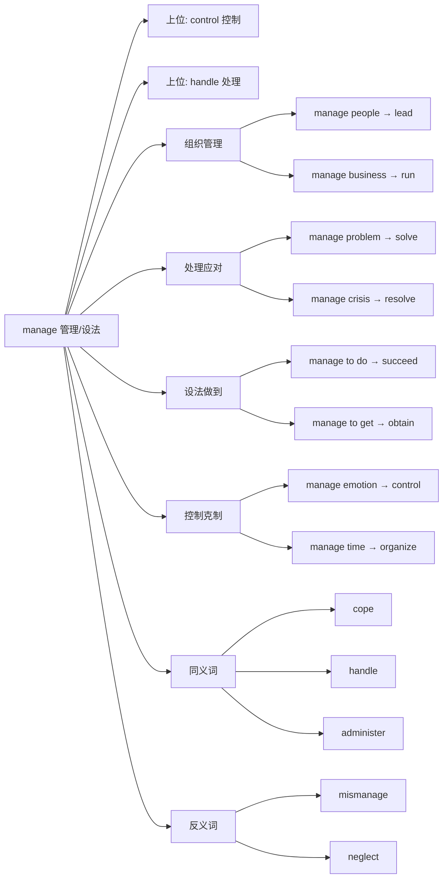

## 基础信息

**英文**：manage
**音标**：/ˈmænɪdʒ/
**中文**：管理、经营、处理、设法做到
**词性**：动词 (verb)

---

## 概念分析

### 一词多义（核心特征）

`manage` 是一个典型的**一词多义**动词，涵盖多个相关但不同的概念：

1. **管理/经营** (organize & run)
   - 管理组织、团队、业务
   - 例：manage a company, manage a team

2. **处理/应对** (handle & deal with)
   - 处理情况、问题、危机
   - 例：manage a crisis, manage difficult situations

3. **设法做到** (succeed in doing)
   - 克服困难完成某事
   - 例：manage to finish, manage to arrive on time

4. **控制/克制** (control & regulate)
   - 控制情绪、时间、资源
   - 例：manage anger, manage time

### 同义词网络
- **组织管理**：run, direct, govern, administer, operate
- **处理应对**：handle, deal with, cope with, tackle
- **成功达成**：succeed in, achieve, accomplish
- **控制调节**：control, regulate, oversee

---

## 关系图谱



---

## 英汉对比

| 维度 | 英语 (manage) | 汉语对应 |
|------|---------------|----------|
| **概念范围** | 单一动词涵盖4种场景 | 需要4个不同词汇区分 |
| **静态/动态** | 动态动作，强调过程 | 动词化表达 |
| **独立/组合** | 独立词汇，灵活搭配 | 需要语境补充 |

**核心洞察**：
- **英语概括性**：用一个词表达"控制局面并达成目标"的综合能力
- **汉语精确性**：根据场景细分为"管理/处理/设法/控制"等不同词汇
- **隐含挑战**：`manage` 暗示存在困难或复杂性，不是简单的"做"

---

## 实际应用

### 场景 1：组织管理
```markdown
She **manages** a team of 20 software engineers.
→ 她**管理**一个20人的软件工程师团队。

The CEO **manages** the entire company.
→ CEO **经营**整个公司。
```

### 场景 2：资源管理
```markdown
We need to **manage** our budget carefully.
→ 我们需要仔细**管理**预算。

He **manages** his time very efficiently.
→ 他**管理**时间非常高效。
```

### 场景 3：情况处理
```markdown
The fire department **managed** the crisis well.
→ 消防部门很好地**处理**了这次危机。

How do you **manage** such difficult customers?
→ 你是如何**应对**这种难缠的客户的？
```

### 场景 4：设法做到（困难）
```markdown
I **managed** to finish the project on time.
→ 我**设法**按时完成了项目。

We **managed** to get tickets for the concert.
→ 我们**设法**弄到了演唱会的票。

He couldn't **manage** to wake up early.
→ 他**没能**设法早起。
```

### 场景 5：情绪控制
```markdown
She can't **manage** her anger.
→ 她无法**控制**自己的愤怒。

Learn to **manage** stress in daily life.
→ 学会**管理**日常生活中的压力。
```

---

## 深度洞察

### 1. 能力导向 (Capability-Oriented)
`manage` 不仅仅是"做"，而是强调**有能力成功地做到**。
- "I did it" = 我做了（中性）
- "I managed to do it" = 我克服困难做到了（强调能力）

### 2. 隐含挑战 (Implied Difficulty)
使用 `manage` 时，通常暗示：
- 存在约束条件（时间、资源、难度）
- 需要技巧或努力
- 结果不确定但最终成功

### 3. 控制与平衡 (Control & Balance)
核心概念是**在约束下维持平衡并达成目标**：
- 管理：平衡多方需求
- 处理：平衡风险与收益
- 设法：平衡困难与目标

---

## 关键要点

### 翻译决策树
```
要表达"管理/处理/设法"时：
├─ 管理组织/团队/资源？ → manage (管理)
├─ 处理困难/危机/问题？ → manage (处理)
├─ 设法完成困难的事？ → manage to do (设法做到)
└─ 控制情绪/时间？ → manage (控制/管理)
```

### 使用口诀
```
Manage 一词多义广，
管理处理设法想。
隐含挑战要记住，
能力导向是核心。
```

### 常见错误
❌ **错误**：I managed the homework.
✅ **正确**：I did the homework. (作业不难，不用"设法")

❌ **错误**：He managed a company. (想表达"经营")
✅ **正确**：He runs a company. (更常用)

❌ **错误**：I managed to go. (想表达"打算去")
✅ **正确**：I planned to go. (manage to 强调克服困难)

### 记忆技巧
- **M**ake **A** **N**ice **G**oal, **E**xecute → 设定好目标并执行（管理）
- **M**anage = **M**ake **A** **N**ew **G**oal **E**veryday → 每天设定新目标（管理）

---

## 相关链接

- **同义词**：[[run]], [[handle]], [[cope]], [[administer]]
- **反义词**：[[mismanage]], [[neglect]]
- **上位概念**：[[control]], [[govern]]
- **主题**：[[Vocabulary]], [[English Verbs]]
- **对比**：[[manage vs run]], [[manage vs handle]]

---

**创建时间**：2026-01-05
**最后更新**：2026-01-05
**笔记类型**：词汇分析笔记
