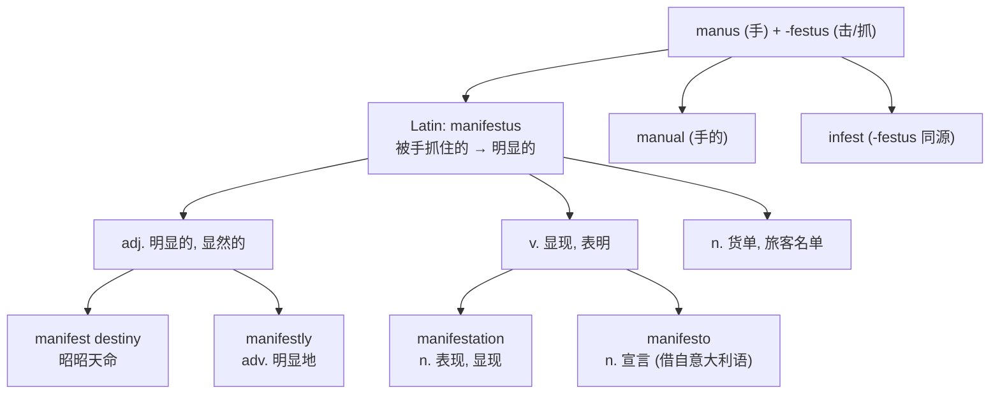

# manifest

## 1. 基础信息 (Basic Info)

**音标**：英 /ˈmænɪfest/ 美 /ˈmænɪfest/

**词性与释义**：

- **adj.** clearly revealed; obvious; evident — 明显的，显然的
- **v.** to show or demonstrate plainly; to display — 显现，表明，证明
- **n.** a list of passengers or cargo on a ship or aircraft — 载货单，旅客名单

> **注意**：用户查询的 **manifests** 可以是动词第三人称单数形式，也可以是名词复数形式。

---

## 2. 词源与演变 (Etymology & Evolution)

**起源**：14世纪经由古法语 *manifest* 进入英语，直接源自拉丁语 **manifestus**（清晰的、明显的、当场抓住的）。

**词根拆解**：
- **manus**（手）— 同源词：manual, manipulate, manuscript
- ***-festus**（被击打的、被抓住的）— 同源词：infest

**语义演变逻辑**：
拉丁语 *manifestus* 的字面意义是"被手抓住的"（caught by hand），即"可以触摸到的、实实在在的"，由此引申为"显而易见的、明白无误的"。14世纪进入英语后，先作形容词使用，随后扩展为动词"使显现"和名词"货物清单"（船运中需要明确列出的物品）。

**重要文化概念**：*Manifest Destiny*（昭昭天命）— 19世纪美国扩张主义的核心理念，由 John O'Sullivan 于1845年提出。

---

## 3. 核心概念图谱 (Concept Graph)



---

## 4. 扩展词汇 (Vocabulary Expansion)

### 近义词 (Synonyms)

| 近义词 | 差异说明 |
|--------|---------|
| **obvious** | 最通用，日常口语和书面均可，语气较中性 |
| **evident** | 偏正式，强调有证据支撑的明显 |
| **apparent** | 可含"表面上看起来"的意味，有时暗示实际可能不同 |
| **patent** | 非常正式，强调"公然的、毫不掩饰的"，常用于法律语境 |
| **palpable** | 强调"可触知的"，与 manifest 词源最接近，形容几乎能感受到的程度 |
| **overt** | 强调"公开的、不隐藏的"，与 covert 相对 |

### 反义词 (Antonyms)

- **hidden** — 隐藏的
- **concealed** — 被遮蔽的
- **latent** — 潜在的、潜伏的
- **obscure** — 模糊的、晦涩的

### 派生词 (Derivatives)

| 派生词 | 词性 | 含义 |
|--------|------|------|
| **manifestation** | n. | 表现形式；显现；（鬼魂）显灵 |
| **manifestly** | adv. | 明显地，显然地 |
| **manifesto** | n. | 宣言，声明（借自意大利语） |

---

## 5. 搭配与用法 (Collocations & Usage)

### 高频搭配 (Collocations)

**形容词用法**：
- manifest destiny — 昭昭天命
- manifest injustice / manifest error — 明显的不公正 / 明显的错误
- become manifest — 变得明显

**动词用法**：
- manifest itself (in/as) — （以某种形式）显现出来
- manifest symptoms / signs — 表现出症状/迹象
- manifest concern / interest — 表现出关切/兴趣

**名词用法**：
- cargo manifest — 货物清单
- passenger manifest — 旅客名单
- flight manifest — 航班清单
- shipping manifest — 运输清单

### 典型例句 (Examples)

1. **正式/学术**：The disease may not *manifest* itself for several years after initial infection.（该疾病在初次感染后可能数年都不会显现出来。）

2. **商务/法律**：The court found a *manifest* error in the original judgment.（法院发现原判决存在明显错误。）

3. **日常**：His frustration was *manifest* in the way he slammed the door.（他摔门的方式明显表现出了他的沮丧。）

4. **航运/航空**：All passengers must be listed on the flight *manifest* before departure.（所有旅客必须在起飞前登记在航班旅客名单上。）

5. **IT/技术**：The app's *manifest* file declares the permissions it requires.（应用的清单文件声明了它所需的权限。）

---

## 6. 易混淆点与辨析 (Analysis & Confusing Points)

### manifest vs. obvious vs. evident

三者都表示"明显的"，但语域和侧重不同。*Manifest* 最为正式，常见于法律、学术和文学语境，暗示"无需论证即可看出"；*obvious* 最通用，口语书面皆宜；*evident* 介于两者之间，强调"有证据可循"。

### manifest (v.) vs. demonstrate vs. reveal

*Manifest* 作动词时强调"自然地显现出来"，主语常是抽象事物（如疾病、情绪）；*demonstrate* 强调"主动展示或证明"；*reveal* 强调"揭露之前隐藏的东西"。

### 名词 manifest vs. manifesto

*Manifest* 作名词是"货物/旅客清单"，纯粹是实务性列表；*manifesto* 是"宣言、声明"，表达政治或艺术立场。两者虽同源，但含义完全不同。

### IT 语境中的 manifest

在软件开发中，*manifest* 指配置清单文件（如 Android 的 `AndroidManifest.xml`、Web App 的 `manifest.json`），声明应用的元数据和权限。这一用法延续了"货物清单"的核心语义——列出所有必要信息。

---

## 7. 总结与记忆 (Summary & Memory)

### 口诀 (Mnemonic)

> **"手（mani-）抓（-fest）现行 → 明摆着的"**
> 想象一个小偷被人一把抓住（caught by hand），罪行**显而易见**——这就是 manifest 的词源画面。

### 决策树 (Decision Tree)

```
需要表达"明显的"？
├── 日常口语 → obvious
├── 正式/书面，有证据 → evident
├── 非常正式/法律/文学 → manifest
└── 强调可感知/触知 → palpable

需要表达"显现"？
├── 事物自然显现 → manifest (itself)
├── 主动展示/证明 → demonstrate
└── 揭露隐藏之物 → reveal

需要表达"清单"？
├── 货物/旅客名单 → manifest
├── 政治/艺术宣言 → manifesto
└── 软件配置文件 → manifest (file)
```
