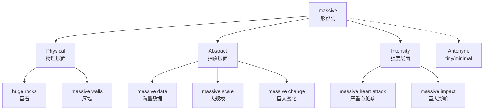

# massive

## 1. 基础信息 (Basic Info)

**Pronunciation**: `/ˈmæsɪv/`
**Part of Speech**: Adjective
**Frequency**: ⭐⭐⭐⭐ (Common)

**English Definitions**:
1. **Extremely large in size, amount, or number** (强调体量、数量)
2. **Heavy, solid, and large** (强调厚重、结实)
3. **Very serious, severe, or powerful** (强调程度、强度)

**Chinese Translations**:
- 巨大的，大范围的
- 厚重的，结实的
- 严重的，强烈的

---

## 2. 词源与演变 (Etymology & Evolution)

**Origin**: Late Middle English (15th century)
- From Latin **massa** (lump, mass) + **-ive** (adjective suffix)
- Root: Greek **maza** (barley cake, kneaded dough)

**Root Logic**:
- **mass-** = 块，团，堆积 → mass (质量，大量)
- **-ive** = 形容词后缀 → "having the quality of"

**Meaning Evolution**:
```
15th: "forming a large mass" (物理上的厚重)
   ↓
18th: "large in scale/amount" (抽象的大规模)
   ↓
20th+: "extreme, severe, powerful" (程度上的强烈)
```

**Key Insight**: 从"物理重量"→"数量规模"→"抽象强度"的语义扩展

---

## 3. 核心概念图谱 (Concept Graph)



---

## 4. 扩展词汇 (Vocabulary Expansion)

### 近义词 (Synonyms)

| Word | Nuance | Example |
|------|--------|---------|
| **huge** | 通用，强调体积或数量 | a huge building |
| **enormous** | 超乎寻常的大，略正式 | enormous profits |
| **vast** | 强调范围广阔（空间/抽象） | vast territory |
| **immense** | 无法测量的大，强调程度 | immense power |
| **colossal** | 极其巨大，常用于宏伟事物 | colossal statue |
| **gigantic** | 巨大，略带夸张 | gigantic waves |

**massive vs. huge**:
- **massive**: 强调"厚重"、"结实"、"有分量"
- **huge**: 仅强调"大"，无厚重感
- ✅ a massive wall (厚重的墙)
- ✅ a huge wall (很大的墙)

**massive vs. vast**:
- **massive**: 强调数量、重量、强度
- **vast**: 强调空间范围、面积
- ✅ massive data (海量数据)
- ✅ vast ocean (广阔海洋)

### 反义词 (Antonyms)
- **tiny** (极小的)
- **minimal** (最小的)
- **negligible** (可忽略的)
- **modest** (适度的)

### 派生词 (Derivatives)
- **mass** (n. 质量，大量)
- **massively** (adv. 大规模地，极大地)
- **massiveness** (n. 巨大，厚重)

---

## 5. 搭配与用法 (Collocations & Usage)

### 高频搭配 (Collocations)

**Verb + massive**:
- suffer a **massive heart attack** (突发严重心脏病)
- make a **massive impact** (产生巨大影响)
- cause **massive damage** (造成巨大破坏)

**massive + Noun**:
- **massive scale** (大规模)
- **massive amount** (大量)
- **massive change** (巨大变化)
- **massive data** (海量数据)
- **massive effort** (巨大努力)
- **massive success** (巨大成功)

**Adverb + massive**:
- **truly massive** (真正巨大的)
- **potentially massive** (潜在巨大的)

### 典型例句 (Examples)

**1. Business Context (商业场景)**
> The company invested a **massive amount** of money in AI research.
> 公司在 AI 研究上投入了巨额资金。

**2. Technology Context (技术场景)**
> We're dealing with **massive datasets** that require distributed computing.
> 我们在处理需要分布式计算的海量数据集。

**3. Health Context (健康场景)**
> He suffered a **massive stroke** and was rushed to the hospital.
> 他突发严重中风，被紧急送往医院。

**4. Daily Life (日常生活)**
> The concert was a **massive success**, with over 50,000 attendees.
> 音乐会取得了巨大成功，有超过 5 万人参加。

**5. Academic/Formal (学术/正式)**
> The **massive influx** of refugees created humanitarian challenges.
> 难民的大量涌入造成了人道主义挑战。

---

## 6. 易混淆点与辨析 (Analysis & Confusing Points)

### massive vs. huge vs. enormous

| Word | 核心特征 | 典型场景 | 语气 |
|------|---------|---------|------|
| **massive** | 厚重、结实、强烈 | 建筑、数据、疾病 | ⭐⭐⭐⭐ |
| **huge** | 简单的大，通用 | 体积、数量 | ⭐⭐⭐ |
| **enormous** | 超乎寻常，略正式 | 利润、规模 | ⭐⭐⭐⭐ |

**关键区别**:
- **massive** 有"厚重感"和"强度感"
- **huge** 最通用，无特殊色彩
- **enormous** 强调"超出正常范围"

**示例对比**:
- ✅ a **massive** oak table (厚重的橡木桌子 - 强调结实)
- ✅ a **huge** table (很大的桌子 - 仅强调大小)
- ✅ an **enormous** banquet table (巨大的宴会桌 - 强调超出常规)

### massive vs. extensive

- **massive**: 强调数量、强度、影响
- **extensive**: 强调范围、覆盖面
- ✅ **massive** data (海量数据 - 强调数量)
- ✅ **extensive** research (广泛研究 - 强调范围)

### 发音注意
- **massive**: `/ˈmæsɪv/` (重音在第一音节)
- **passive**: `/ˈpæsɪv/` (被动)
- 不要混淆这两个词！

---

## 7. 总结与记忆 (Summary & Memory)

### 口诀 (Mnemonic)

**"Mass 是块，ive 是形容词 → 像块一样大 = 厚重巨大"**

记忆要点：
1. **物理**: 厚重的 (massive walls)
2. **数量**: 大量的 (massive data)
3. **强度**: 严重的 (massive impact)

### 决策树 (Decision Tree)

```
想要表达"大"的概念？
├─ 强调"厚重/结实"？
│  └─ ✅ massive (a massive rock)
│
├─ 强调"超乎寻常"？
│  └─ ✅ enormous (enormous profits)
│
├─ 强调"空间广阔"？
│  └─ ✅ vast (vast ocean)
│
├─ 强调"无法测量"？
│  └─ ✅ immense (immense power)
│
└─ 仅表达"大"，通用？
   └─ ✅ huge (a huge building)
```

### 快速记忆卡片

**正面**: massive
**背面**:
- 巨大的，厚重的
- massive data (海量数据)
- massive impact (巨大影响)
- Antonym: tiny

---

# Related
![[Backlinks.base]]
